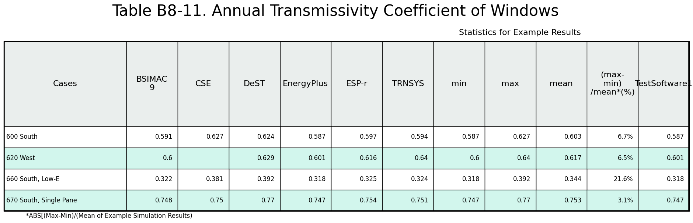
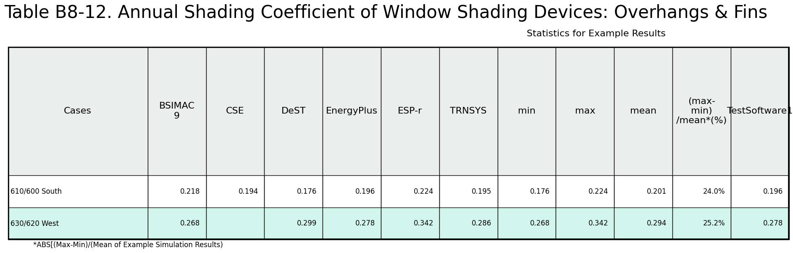
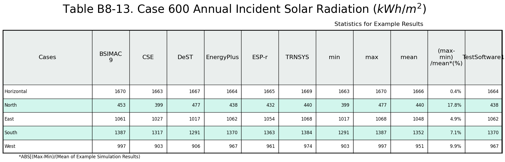
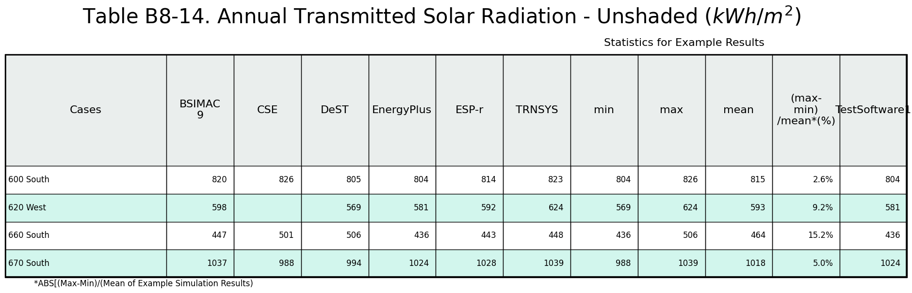
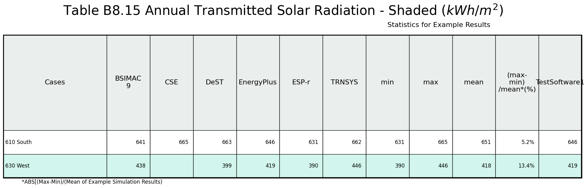

# Section 5-2A  

# Table B8-M1a. Monthly Heating Loads (kWh), Case 600
| Month |BSIMAC 9 |CSE |DeST |EnergyPlus |ESP-r |TRNSYS | |Min |Max |Mean |Dev % [^1] | |TestSoftware1 |
|-----|-----:|-----:|-----:|-----:|-----:|-----:|-----:|-----:|-----:|-----:|-----:|-----:|-----:|
| Jan |664.0 |655.6 |672.7 |711.9 |732.0 |734.9 | |655.6 |734.9 |695.2 |11.4 | |711.9 |
| Feb |653.3 |626.3 |635.3 |682.6 |682.0 |702.1 | |626.3 |702.1 |663.6 |11.4 | |682.6 |
| Mar |433.5 |435.7 |450.5 |472.2 |481.0 |495.0 | |433.5 |495.0 |461.3 |13.3 | |472.2 |
| Apr |511.0 |457.0 |448.0 |510.1 |479.0 |517.3 | |448.0 |517.3 |487.1 |14.2 | |510.1 |
| May |112.8 |127.8 |128.0 |136.8 |139.0 |150.7 | |112.8 |150.7 |132.5 |28.6 | |136.8 |
| Jun |2.7 |11.7 |11.2 |10.1 |14.0 |16.0 | |2.7 |16.0 |10.9 |121.1 | |10.1 |
| Jul |4.8 |11.5 |10.1 |12.0 |14.0 |16.7 | |4.8 |16.7 |11.5 |103.4 | |12.0 |
| Aug |1.4 |6.9 |8.4 |6.6 |9.0 |9.6 | |1.4 |9.6 |7.0 |117.5 | |6.6 |
| Sep |51.8 |74.3 |76.7 |73.3 |81.0 |84.8 | |51.8 |84.8 |73.7 |44.8 | |73.3 |
| Oct |317.0 |328.4 |324.1 |347.7 |354.0 |367.1 | |317.0 |367.1 |339.7 |14.7 | |347.7 |
| Nov |598.7 |575.6 |585.8 |625.3 |629.0 |645.8 | |575.6 |645.8 |610.0 |11.5 | |625.3 |
| Dec |698.7 |682.0 |697.8 |735.7 |750.0 |763.5 | |682.0 |763.5 |721.3 |11.3 | |735.7 |

[^1]: ABS[ (Max-Min) / (Mean of Example Simulation Results)]

# Table B8-M4a. Monthly Hourly Integrated Peak Sensible Cooling Loads (kW), Case 600
| Month |BSIMAC 9 |CSE |DeST |EnergyPlus |ESP-r |TRNSYS | |Min |Max |Mean |Dev % [^1] | |TestSoftware1 |
|-----|-----:|-----:|-----:|-----:|-----:|-----:|-----:|-----:|-----:|-----:|-----:|-----:|-----:|
| Jan |5.650 |6.481 |5.422 |6.352 |6.190 |6.046 | |5.422 |6.481 |6.023 |17.6 | |6.352 |
| Feb |4.921 |5.393 |4.444 |5.537 |5.420 |5.155 | |4.444 |5.537 |5.145 |21.2 | |5.537 |
| Mar |4.458 |5.148 |4.252 |5.009 |5.040 |4.740 | |4.252 |5.148 |4.775 |18.8 | |5.009 |
| Apr |3.473 |4.015 |3.600 |3.931 |4.040 |3.803 | |3.473 |4.040 |3.810 |14.9 | |3.931 |
| May |2.774 |3.080 |2.894 |3.086 |3.100 |3.040 | |2.774 |3.100 |2.996 |10.9 | |3.086 |
| Jun |3.253 |3.249 |3.067 |3.449 |3.430 |3.379 | |3.067 |3.449 |3.305 |11.6 | |3.449 |
| Jul |3.319 |3.290 |3.155 |3.628 |3.640 |3.497 | |3.155 |3.640 |3.422 |14.2 | |3.628 |
| Aug |4.192 |4.120 |4.038 |4.672 |4.700 |4.651 | |4.038 |4.700 |4.395 |15.1 | |4.672 |
| Sep |5.086 |5.450 |4.911 |5.715 |5.580 |5.420 | |4.911 |5.715 |5.360 |15.0 | |5.715 |
| Oct |5.577 |6.270 |5.278 |6.222 |6.070 |5.923 | |5.278 |6.270 |5.890 |16.8 | |6.222 |
| Nov |5.476 |6.149 |5.229 |6.194 |6.030 |5.824 | |5.229 |6.194 |5.817 |16.6 | |6.194 |
| Dec |5.537 |6.450 |5.294 |6.251 |6.120 |5.942 | |5.294 |6.450 |5.932 |19.5 | |6.251 |
|  |
| Time Stamps |
| Month |Day-Hr |Day-Hr |Day-Hr |Day-Hr |Day-Hr |Day-Hr | | | | | | |Day-Hr |
| Jan |22-15 |22-14 |22-14 |22-14 |22-14 |22-14 | | | | | | |22-14 |
| Feb |15-15 |15-14 |15-14 |2-14 |2-14 |2-14 | | | | | | |2-14 |
| Mar |24-14 |24-13 |9-14 |9-14 |9-14 |9-14 | | | | | | |9-14 |
| Apr |12-14 |27-14 |7-14 |12-14 |12-14 |12-14 | | | | | | |12-14 |
| May |10-14 |21-14 |10-14 |10-13 |10-14 |21-14 | | | | | | |10-13 |
| Jun |26-15 |13-13 |14-14 |13-13 |13-14 |13-13 | | | | | | |13-13 |
| Jul |17-14 |17-14 |29-13 |17-14 |17-14 |17-14 | | | | | | |17-14 |
| Aug |26-14 |8-14 |29-13 |26-14 |29-14 |27-13 | | | | | | |26-14 |
| Sep |30-14 |2-14 |30-13 |30-13 |30-14 |30-14 | | | | | | |30-13 |
| Oct |18-14 |1-13 |10-13 |18-14 |18-14 |18-14 | | | | | | |18-14 |
| Nov |28-14 |28-13 |29-13 |28-13 |28-14 |28-14 | | | | | | |28-13 |
| Dec |1-14 |1-14 |1-13 |1-14 |1-14 |1-14 | | | | | | |1-14 |

[^1]: ABS[ (Max-Min) / (Mean of Example Simulation Results)]

# Table B8-M1b. Monthly Heating Loads (kWh), Case 900
| Month |BSIMAC 9 |CSE |DeST |EnergyPlus |ESP-r |TRNSYS | |Min |Max |Mean |Dev % [^1] | |TestSoftware1 |
|-----|-----:|-----:|-----:|-----:|-----:|-----:|-----:|-----:|-----:|-----:|-----:|-----:|-----:|
| Jan |277.8 |206.1 |275.3 |255.8 |266.0 |291.9 | |206.1 |291.9 |262.2 |32.7 | |255.8 |
| Feb |307.4 |243.2 |292.9 |294.2 |283.0 |322.1 | |243.2 |322.1 |290.5 |27.2 | |294.2 |
| Mar |134.4 |102.4 |120.0 |125.5 |115.0 |143.8 | |102.4 |143.8 |123.5 |33.5 | |125.5 |
| Apr |275.7 |222.4 |214.2 |268.6 |228.0 |275.5 | |214.2 |275.7 |247.4 |24.9 | |268.6 |
| May |20.1 |33.3 |26.8 |33.4 |29.0 |37.5 | |20.1 |37.5 |30.0 |58.0 | |33.4 |
| Jun |0.0 |0.0 |0.0 |0.0 |0.0 |0.0 | |0.0 |0.0 |0.0 |- | |0.0 |
| Jul |0.0 |0.0 |0.0 |0.0 |0.0 |0.0 | |0.0 |0.0 |0.0 |- | |0.0 |
| Aug |0.0 |0.0 |0.0 |0.0 |0.0 |0.0 | |0.0 |0.0 |0.0 |- | |0.0 |
| Sep |2.1 |0.0 |0.0 |0.1 |0.0 |0.5 | |0.0 |2.1 |0.5 |458.7 | |0.1 |
| Oct |80.5 |65.1 |63.6 |81.1 |70.0 |85.0 | |63.6 |85.0 |74.2 |28.9 | |81.1 |
| Nov |298.2 |251.6 |283.9 |297.0 |286.0 |318.2 | |251.6 |318.2 |289.2 |23.0 | |297.0 |
| Dec |329.8 |254.7 |314.3 |307.9 |308.0 |339.4 | |254.7 |339.4 |309.0 |27.4 | |307.9 |

[^1]: ABS[ (Max-Min) / (Mean of Example Simulation Results)]

# Table B8-M4b. Monthly Hourly Integrated Peak Sensible Cooling Loads (kW), Case 900
| Month |BSIMAC 9 |CSE |DeST |EnergyPlus |ESP-r |TRNSYS | |Min |Max |Mean |Dev % [^1] | |TestSoftware1 |
|-----|-----:|-----:|-----:|-----:|-----:|-----:|-----:|-----:|-----:|-----:|-----:|-----:|-----:|
| Jan |1.982 |2.242 |1.637 |2.078 |1.810 |1.878 | |1.637 |2.242 |1.938 |31.2 | |2.078 |
| Feb |1.096 |0.996 |0.588 |0.979 |0.850 |0.829 | |0.588 |1.096 |0.890 |57.1 | |0.979 |
| Mar |1.508 |1.434 |1.143 |1.493 |1.270 |1.426 | |1.143 |1.508 |1.379 |26.5 | |1.493 |
| Apr |1.093 |0.631 |1.032 |0.953 |0.950 |0.837 | |0.631 |1.093 |0.916 |50.4 | |0.953 |
| May |1.555 |1.427 |1.446 |1.534 |1.460 |1.465 | |1.427 |1.555 |1.481 |8.6 | |1.534 |
| Jun |2.101 |1.897 |1.873 |1.966 |1.890 |1.974 | |1.873 |2.101 |1.950 |11.7 | |1.966 |
| Jul |2.140 |1.943 |1.830 |2.068 |1.970 |1.975 | |1.830 |2.140 |1.988 |15.6 | |2.068 |
| Aug |2.632 |2.485 |2.212 |2.526 |2.510 |2.534 | |2.212 |2.632 |2.483 |16.9 | |2.526 |
| Sep |2.961 |3.137 |2.556 |2.989 |2.810 |2.871 | |2.556 |3.137 |2.887 |20.1 | |2.989 |
| Oct |3.039 |3.376 |2.549 |3.040 |2.900 |2.940 | |2.549 |3.376 |2.974 |27.8 | |3.040 |
| Nov |1.982 |2.233 |1.683 |2.002 |1.940 |1.941 | |1.683 |2.233 |1.963 |28.0 | |2.002 |
| Dec |2.069 |2.105 |1.595 |1.968 |1.670 |1.690 | |1.595 |2.105 |1.850 |27.6 | |1.968 |
|  |
| Time Stamps |
| Month |Day-Hr |Day-Hr |Day-Hr |Day-Hr |Day-Hr |Day-Hr | | | | | | |Day-Hr |
| Jan |22-16 |22-15 |22-15 |22-15 |22-16 |22-15 | | | | | | |22-15 |
| Feb |15-16 |15-15 |15-15 |15-15 |15-16 |15-15 | | | | | | |15-15 |
| Mar |10-15 |24-15 |10-14 |11-14 |10-15 |11-14 | | | | | | |11-14 |
| Apr |7-15 |19-14 |8-14 |7-15 |8-15 |8-15 | | | | | | |7-15 |
| May |11-15 |21-14 |11-14 |11-14 |11-15 |11-14 | | | | | | |11-14 |
| Jun |26-15 |14-14 |14-14 |14-14 |14-15 |14-14 | | | | | | |14-14 |
| Jul |17-15 |17-14 |17-14 |17-15 |17-15 |17-15 | | | | | | |17-15 |
| Aug |26-15 |5-14 |29-14 |29-15 |29-15 |29-15 | | | | | | |29-15 |
| Sep |30-15 |4-14 |11-14 |11-15 |11-15 |11-15 | | | | | | |11-15 |
| Oct |1-15 |1-14 |12-14 |1-14 |12-15 |1-14 | | | | | | |1-14 |
| Nov |6-15 |20-15 |20-14 |20-15 |20-15 |22-14 | | | | | | |20-15 |
| Dec |1-15 |1-15 |2-14 |2-15 |2-15 |2-15 | | | | | | |2-15 |

[^1]: ABS[ (Max-Min) / (Mean of Example Simulation Results)]

# Table B8-16. Sky Temperatures Output, Case 600
| Case |Parameter |Annual Hourly Integrated Average |Annual Hourly Integrated Minimum |Annual Hourly Integrated Maximum |
|-----|-----:|-----:|-----:|-----:|
| BSIMAC 9 |T(C) |
| CSE |T(C) |-3.9 |-46.2 |30.1 |
| DeST |T(C) |-5.9 |-46.9 |24.6 |
| EnergyPlus |T(C) |-2.0 |-38.0 |24.7 |
| ESP-r |T(C) |-5.2 |-46.9 |26.7 |
| TRNSYS |T(C) |-5.1 |-46.2 |26.0 |
| TestSpec-Alt |T(C) |-5.9 |-46.9 |24.6 |
|  |
| Min |T(C) |-5.9 |-46.9 |24.6 |
| Max |T(C) |-2.0 |-38.0 |30.1 |
| Mean |T(C) |-4.7 |-45.2 |26.1 |
| (Max-Min)/Mean [^1] | %  |83.2 |19.7 |21.0 |
|  |
| TestSoftware1 |T(C) |-2.0 |-38.0 |24.7 |
|  |
| BSIMAC 9 |Mo Day Hr | |
| CSE |Mo Day Hr | |Dec 31 24 |Jun 13 15 |
| DeST |Mo Day Hr | |Dec 31 23 |Aug 4 15 |
| EnergyPlus |Mo Day Hr | |Dec 31 24 |Aug 4 16 |
| ESP-r |Mo Day Hr | |Dec 31 23 |Aug 4 15 |
| TRNSYS |Mo Day Hr | |Dec 31 24 |Jun 13 18 |
|  |Mo Day Hr |
|  |
| TestSoftware1 |Mo Day Hr | |Dec 31 24 |Aug 4 16 |

[^1]: ABS[ (Max-Min) / (Mean of Example Simulation Results)]

# Table B8-M5c. Monthly Load 600-900 Sensitivity Tests - Peak Heating (kW)
| Month |BSIMAC 9 |CSE |DeST |EnergyPlus |ESP-r |TRNSYS | |Min |Max |Mean |Dev % [^1] | |TestSoftware1 |
|-----|-----:|-----:|-----:|-----:|-----:|-----:|-----:|-----:|-----:|-----:|-----:|-----:|-----:|
| Jan |0.778 |0.943 |0.858 |1.075 |1.030 |0.980 | |0.778 |1.075 |0.944 |31.5 | |1.075 |
| Feb |0.490 |0.456 |0.469 |0.380 |0.510 |0.447 | |0.380 |0.510 |0.459 |28.3 | |0.380 |
| Mar |0.501 |0.422 |0.419 |0.371 |0.470 |0.429 | |0.371 |0.501 |0.435 |29.9 | |0.371 |
| Apr |0.449 |0.437 |0.513 |0.318 |0.450 |0.421 | |0.318 |0.513 |0.431 |45.2 | |0.318 |
| May |0.350 |0.450 |0.445 |0.356 |0.520 |0.454 | |0.350 |0.520 |0.429 |39.6 | |0.356 |
| Jun |0.805 |0.778 |0.748 |0.732 |0.760 |0.853 | |0.732 |0.853 |0.779 |15.5 | |0.732 |
| Jul |0.599 |0.540 |0.512 |0.514 |0.570 |0.619 | |0.512 |0.619 |0.559 |19.1 | |0.514 |
| Aug |0.572 |0.553 |0.532 |0.479 |0.560 |0.591 | |0.479 |0.591 |0.548 |20.4 | |0.479 |
| Sep |1.116 |1.120 |1.114 |1.066 |1.190 |1.017 | |1.017 |1.190 |1.104 |15.7 | |1.066 |
| Oct |0.501 |0.435 |0.461 |0.356 |0.560 |0.482 | |0.356 |0.560 |0.466 |43.8 | |0.356 |
| Nov |0.828 |0.764 |0.730 |0.790 |0.830 |0.744 | |0.730 |0.830 |0.781 |12.8 | |0.790 |
| Dec |1.051 |1.014 |0.991 |1.029 |1.130 |1.098 | |0.991 |1.130 |1.052 |13.2 | |1.029 |

[^1]: ABS[ (Max-Min) / (Mean of Example Simulation Results)]

# Table B8-M3b. Monthly Hourly Integrated Peak Heating Loads (kW), Case 900
| Month |BSIMAC 9 |CSE |DeST |EnergyPlus |ESP-r |TRNSYS | |Min |Max |Mean |Dev % [^1] | |TestSoftware1 |
|-----|-----:|-----:|-----:|-----:|-----:|-----:|-----:|-----:|-----:|-----:|-----:|-----:|-----:|
| Jan |2.322 |2.077 |2.178 |1.903 |2.200 |2.379 | |1.903 |2.379 |2.177 |21.9 | |1.903 |
| Feb |2.551 |2.443 |2.453 |2.687 |2.630 |2.778 | |2.443 |2.778 |2.590 |12.9 | |2.687 |
| Mar |1.774 |1.613 |1.646 |1.744 |1.760 |1.858 | |1.613 |1.858 |1.733 |14.2 | |1.744 |
| Apr |1.997 |1.771 |1.725 |2.004 |1.930 |2.036 | |1.725 |2.036 |1.910 |16.3 | |2.004 |
| May |1.295 |1.142 |1.124 |1.268 |1.230 |1.324 | |1.124 |1.324 |1.231 |16.3 | |1.268 |
| Jun |0.000 |0.000 |nan |0.000 |0.000 |0.000 | |0.000 |0.000 |nan |nan | |0.000 |
| Jul |0.000 |0.000 |nan |0.000 |0.000 |0.000 | |0.000 |0.000 |nan |nan | |0.000 |
| Aug |0.000 |0.000 |nan |0.000 |0.000 |0.000 | |0.000 |0.000 |nan |nan | |0.000 |
| Sep |0.113 |0.000 |nan |0.064 |0.000 |0.194 | |0.000 |0.194 |nan |nan | |0.064 |
| Oct |1.201 |1.188 |1.158 |1.326 |1.210 |1.331 | |1.158 |1.331 |1.236 |14.0 | |1.326 |
| Nov |2.427 |2.086 |2.201 |2.316 |2.280 |2.463 | |2.086 |2.463 |2.296 |16.4 | |2.316 |
| Dec |2.120 |1.927 |1.981 |2.175 |2.040 |2.180 | |1.927 |2.180 |2.070 |12.2 | |2.175 |
|  |
| Time Stamps |
| Month |Day-Hr |Day-Hr |Day-Hr |Day-Hr |Day-Hr |Day-Hr | | | | | | |Day-Hr |
| Jan |7-7 |1-5 |1-4 |29-7 |1-5 |1-5 | | | | | | |29-7 |
| Feb |8-24 |9-6 |9-5 |9-6 |9-7 |9-7 | | | | | | |9-6 |
| Mar |16-7 |17-6 |17-5 |17-6 |17-7 |17-6 | | | | | | |17-6 |
| Apr |2-7 |3-4 |3-3 |3-4 |3-4 |3-4 | | | | | | |3-4 |
| May |4-6 |1-5 |1-5 |1-5 |1-5 |1-5 | | | | | | |1-5 |
| Jun |0-0 |1-1 |0-0 |1-1 |1-1 |31-0 | | | | | | |1-1 |
| Jul |0-0 |1-1 |0-0 |1-1 |1-1 |31-0 | | | | | | |1-1 |
| Aug |0-0 |1-1 |0-0 |1-1 |1-1 |31-0 | | | | | | |1-1 |
| Sep |28-6 |1-1 |0-0 |29-7 |1-1 |29-7 | | | | | | |29-7 |
| Oct |6-7 |7-7 |7-6 |7-7 |7-7 |7-7 | | | | | | |7-7 |
| Nov |1-7 |26-8 |26-7 |26-7 |26-8 |26-8 | | | | | | |26-7 |
| Dec |31-8 |31-8 |9-6 |31-7 |9-7 |9-7 | | | | | | |31-7 |

[^1]: ABS[ (Max-Min) / (Mean of Example Simulation Results)]

# Table B8-M5a. Monthly Load 600-900 Sensitivity Tests - Annual Heating (kWh)
| Month |BSIMAC 9 |CSE |DeST |EnergyPlus |ESP-r |TRNSYS | |Min |Max |Mean |Dev % [^1] | |TestSoftware1 |
|-----|-----:|-----:|-----:|-----:|-----:|-----:|-----:|-----:|-----:|-----:|-----:|-----:|-----:|
| Jan |386.2 |449.5 |397.4 |456.0 |466.0 |443.0 | |386.2 |466.0 |433.0 |18.4 | |456.0 |
| Feb |345.9 |383.0 |342.4 |388.4 |399.0 |379.9 | |342.4 |399.0 |373.1 |15.2 | |388.4 |
| Mar |299.1 |333.3 |330.5 |346.7 |366.0 |351.2 | |299.1 |366.0 |337.8 |19.8 | |346.7 |
| Apr |235.3 |234.6 |233.8 |241.5 |251.0 |241.8 | |233.8 |251.0 |239.7 |7.2 | |241.5 |
| May |92.7 |94.4 |101.2 |103.4 |110.0 |113.2 | |92.7 |113.2 |102.5 |20.0 | |103.4 |
| Jun |2.7 |11.7 |11.2 |10.1 |14.0 |16.0 | |2.7 |16.0 |10.9 |121.1 | |10.1 |
| Jul |4.8 |11.5 |10.1 |12.0 |14.0 |16.7 | |4.8 |16.7 |11.5 |103.4 | |12.0 |
| Aug |1.4 |6.9 |8.4 |6.6 |9.0 |9.6 | |1.4 |9.6 |7.0 |117.5 | |6.6 |
| Sep |49.7 |74.3 |76.7 |73.2 |81.0 |84.3 | |49.7 |84.3 |73.2 |47.2 | |73.2 |
| Oct |236.5 |263.3 |260.6 |266.6 |284.0 |282.0 | |236.5 |284.0 |265.5 |17.9 | |266.6 |
| Nov |300.5 |324.0 |301.9 |328.3 |343.0 |327.6 | |300.5 |343.0 |320.9 |13.2 | |328.3 |
| Dec |368.9 |427.3 |383.5 |427.9 |442.0 |424.2 | |368.9 |442.0 |412.3 |17.7 | |427.9 |

[^1]: ABS[ (Max-Min) / (Mean of Example Simulation Results)]

# Table B8-M2b. Monthly Sensible Cooling Loads (kWh), Case 900
| Month |BSIMAC 9 |CSE |DeST |EnergyPlus |ESP-r |TRNSYS | |Min |Max |Mean |Dev % [^1] | |TestSoftware1 |
|-----|-----:|-----:|-----:|-----:|-----:|-----:|-----:|-----:|-----:|-----:|-----:|-----:|-----:|
| Jan |73.3 |67.8 |33.5 |53.3 |42.0 |44.6 | |33.5 |73.3 |52.4 |75.9 | |53.3 |
| Feb |24.0 |15.1 |4.7 |12.3 |11.0 |9.2 | |4.7 |24.0 |12.7 |151.3 | |12.3 |
| Mar |86.4 |68.5 |40.9 |65.4 |56.0 |50.6 | |40.9 |86.4 |61.3 |74.2 | |65.4 |
| Apr |29.3 |12.3 |18.3 |18.5 |22.0 |16.1 | |12.3 |29.3 |19.4 |87.6 | |18.5 |
| May |131.1 |117.8 |128.6 |114.5 |125.0 |98.4 | |98.4 |131.1 |119.2 |27.5 | |114.5 |
| Jun |447.5 |372.3 |408.5 |401.3 |404.0 |365.8 | |365.8 |447.5 |399.9 |20.4 | |401.3 |
| Jul |440.9 |380.4 |408.1 |398.7 |410.0 |365.5 | |365.5 |440.9 |400.6 |18.8 | |398.7 |
| Aug |532.6 |485.7 |510.2 |510.3 |531.0 |487.6 | |485.7 |532.6 |509.6 |9.2 | |510.3 |
| Sep |517.9 |484.0 |466.1 |492.8 |492.0 |458.9 | |458.9 |517.9 |485.3 |12.2 | |492.8 |
| Oct |296.2 |305.6 |269.6 |292.7 |281.0 |260.9 | |260.9 |305.6 |284.3 |15.7 | |292.7 |
| Nov |72.7 |80.5 |56.2 |68.0 |63.0 |60.2 | |56.2 |80.5 |66.8 |36.4 | |68.0 |
| Dec |62.1 |73.7 |38.1 |60.9 |48.0 |49.5 | |38.1 |73.7 |55.4 |64.4 | |60.9 |

[^1]: ABS[ (Max-Min) / (Mean of Example Simulation Results)]

# Table B8-M5b. Monthly Load 600-900 Sensitivity Tests - Annual Sensible Cooling (kWh)
| Month |BSIMAC 9 |CSE |DeST |EnergyPlus |ESP-r |TRNSYS | |Min |Max |Mean |Dev % [^1] | |TestSoftware1 |
|-----|-----:|-----:|-----:|-----:|-----:|-----:|-----:|-----:|-----:|-----:|-----:|-----:|-----:|
| Jan |402.1 |486.2 |384.4 |468.5 |481.0 |450.4 | |384.4 |486.2 |445.4 |22.8 | |468.5 |
| Feb |325.2 |379.2 |310.7 |375.2 |387.0 |358.2 | |310.7 |387.0 |355.9 |21.4 | |375.2 |
| Mar |363.9 |405.8 |369.8 |419.0 |433.0 |406.8 | |363.9 |433.0 |399.7 |17.3 | |419.0 |
| Apr |189.4 |207.8 |211.9 |222.0 |241.0 |219.3 | |189.4 |241.0 |215.2 |24.0 | |222.0 |
| May |211.6 |203.3 |210.0 |225.4 |239.0 |226.8 | |203.3 |239.0 |219.4 |16.3 | |225.4 |
| Jun |130.8 |125.2 |118.0 |138.3 |146.0 |150.2 | |118.0 |150.2 |134.7 |24.0 | |138.3 |
| Jul |127.5 |125.4 |117.0 |137.7 |146.0 |148.9 | |117.0 |148.9 |133.7 |23.8 | |137.7 |
| Aug |125.6 |120.8 |110.9 |138.2 |143.0 |146.6 | |110.9 |146.6 |130.9 |27.2 | |138.2 |
| Sep |206.9 |221.2 |206.0 |240.9 |251.0 |251.6 | |206.0 |251.6 |229.6 |19.9 | |240.9 |
| Oct |332.2 |370.6 |341.6 |382.6 |400.0 |388.6 | |332.2 |400.0 |369.3 |18.4 | |382.6 |
| Nov |321.6 |374.3 |320.9 |369.7 |381.0 |358.4 | |320.9 |381.0 |354.3 |17.0 | |369.7 |
| Dec |371.2 |429.5 |348.2 |420.9 |428.0 |406.6 | |348.2 |429.5 |400.7 |20.3 | |420.9 |

[^1]: ABS[ (Max-Min) / (Mean of Example Simulation Results)]

# Table B8-M3a. Monthly Hourly Integrated Peak Heating Loads (kW), Case 600
| Month |BSIMAC 9 |CSE |DeST |EnergyPlus |ESP-r |TRNSYS | |Min |Max |Mean |Dev % [^1] | |TestSoftware1 |
|-----|-----:|-----:|-----:|-----:|-----:|-----:|-----:|-----:|-----:|-----:|-----:|-----:|-----:|
| Jan |3.100 |3.020 |3.036 |2.978 |3.230 |3.359 | |2.978 |3.359 |3.121 |12.2 | |2.978 |
| Feb |3.041 |2.900 |2.922 |3.067 |3.140 |3.225 | |2.900 |3.225 |3.049 |10.7 | |3.067 |
| Mar |2.275 |2.034 |2.065 |2.115 |2.230 |2.287 | |2.034 |2.287 |2.168 |11.7 | |2.115 |
| Apr |2.446 |2.207 |2.238 |2.322 |2.380 |2.457 | |2.207 |2.457 |2.342 |10.7 | |2.322 |
| May |1.645 |1.592 |1.569 |1.624 |1.750 |1.778 | |1.569 |1.778 |1.660 |12.6 | |1.624 |
| Jun |0.805 |0.778 |0.748 |0.732 |0.760 |0.853 | |0.732 |0.853 |0.779 |15.5 | |0.732 |
| Jul |0.599 |0.540 |0.512 |0.514 |0.570 |0.619 | |0.512 |0.619 |0.559 |19.1 | |0.514 |
| Aug |0.572 |0.553 |0.532 |0.479 |0.560 |0.591 | |0.479 |0.591 |0.548 |20.4 | |0.479 |
| Sep |1.229 |1.120 |1.114 |1.130 |1.190 |1.212 | |1.114 |1.229 |1.166 |9.9 | |1.130 |
| Oct |1.702 |1.624 |1.619 |1.682 |1.770 |1.813 | |1.619 |1.813 |1.702 |11.4 | |1.682 |
| Nov |3.255 |2.850 |2.931 |3.106 |3.110 |3.207 | |2.850 |3.255 |3.076 |13.2 | |3.106 |
| Dec |3.171 |2.941 |2.972 |3.204 |3.170 |3.278 | |2.941 |3.278 |3.123 |10.8 | |3.204 |
|  |
| Time Stamps |
| Month |Day-Hr |Day-Hr |Day-Hr |Day-Hr |Day-Hr |Day-Hr | | | | | | |Day-Hr |
| Jan |29-7 |1-1 |1-0 |1-3 |1-1 |1-1 | | | | | | |1-3 |
| Feb |9-7 |9-6 |9-5 |9-6 |9-6 |9-6 | | | | | | |9-6 |
| Mar |2-7 |17-6 |17-5 |17-6 |17-6 |17-6 | | | | | | |17-6 |
| Apr |3-6 |11-6 |11-5 |11-5 |11-6 |11-6 | | | | | | |11-5 |
| May |3-5 |1-5 |1-4 |1-5 |1-5 |1-5 | | | | | | |1-5 |
| Jun |9-5 |9-5 |9-4 |9-5 |10-5 |9-5 | | | | | | |9-5 |
| Jul |25-6 |26-5 |26-4 |26-5 |26-5 |26-5 | | | | | | |26-5 |
| Aug |10-7 |17-6 |17-5 |17-6 |17-6 |17-6 | | | | | | |17-6 |
| Sep |28-24 |29-1 |29-2 |28-24 |29-1 |28-24 | | | | | | |28-24 |
| Oct |6-7 |15-6 |9-5 |15-5 |9-6 |15-6 | | | | | | |15-5 |
| Nov |26-8 |26-8 |26-7 |26-7 |26-7 |26-8 | | | | | | |26-7 |
| Dec |31-24 |31-24 |31-23 |31-24 |31-24 |31-24 | | | | | | |31-24 |

[^1]: ABS[ (Max-Min) / (Mean of Example Simulation Results)]

# Table B8-M2a. Monthly Sensible Cooling Loads (kWh), Case 600
| Month |BSIMAC 9 |CSE |DeST |EnergyPlus |ESP-r |TRNSYS | |Min |Max |Mean |Dev % [^1] | |TestSoftware1 |
|-----|-----:|-----:|-----:|-----:|-----:|-----:|-----:|-----:|-----:|-----:|-----:|-----:|-----:|
| Jan |475.4 |554.0 |417.9 |521.8 |523.0 |495.0 | |417.9 |554.0 |497.9 |27.3 | |521.8 |
| Feb |349.2 |394.3 |315.4 |387.5 |398.0 |367.4 | |315.4 |398.0 |368.6 |22.4 | |387.5 |
| Mar |450.3 |474.4 |410.7 |484.4 |489.0 |457.4 | |410.7 |489.0 |461.0 |17.0 | |484.4 |
| Apr |218.7 |220.1 |230.2 |240.5 |263.0 |235.4 | |218.7 |263.0 |234.6 |18.9 | |240.5 |
| May |342.7 |321.2 |338.6 |339.9 |364.0 |325.2 | |321.2 |364.0 |338.6 |12.7 | |339.9 |
| Jun |578.3 |497.4 |526.4 |539.6 |550.0 |516.1 | |497.4 |578.3 |534.6 |15.1 | |539.6 |
| Jul |568.4 |505.9 |525.1 |536.4 |556.0 |514.4 | |505.9 |568.4 |534.4 |11.7 | |536.4 |
| Aug |658.2 |606.5 |621.1 |648.5 |674.0 |634.1 | |606.5 |674.0 |640.4 |10.5 | |648.5 |
| Sep |724.8 |705.2 |672.1 |733.7 |743.0 |710.5 | |672.1 |743.0 |714.9 |9.9 | |733.7 |
| Oct |628.4 |676.1 |611.1 |675.3 |681.0 |649.5 | |611.1 |681.0 |653.6 |10.7 | |675.3 |
| Nov |394.3 |454.7 |377.1 |437.7 |444.0 |418.6 | |377.1 |454.7 |421.1 |18.4 | |437.7 |
| Dec |433.3 |503.3 |386.2 |481.9 |476.0 |456.1 | |386.2 |503.3 |456.1 |25.7 | |481.9 |

[^1]: ABS[ (Max-Min) / (Mean of Example Simulation Results)]

