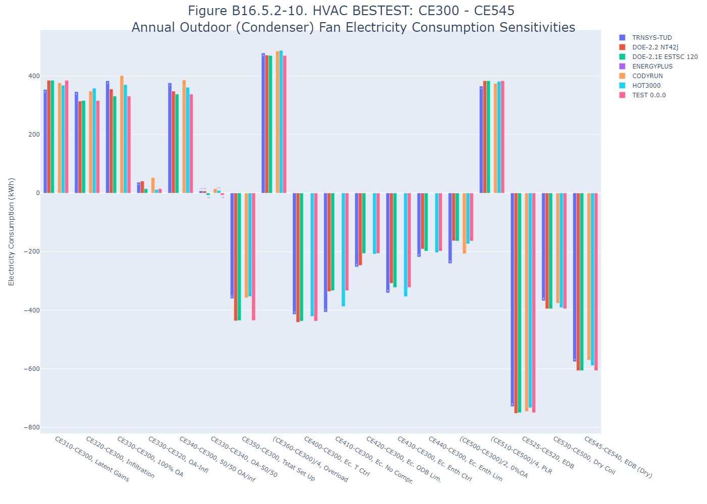
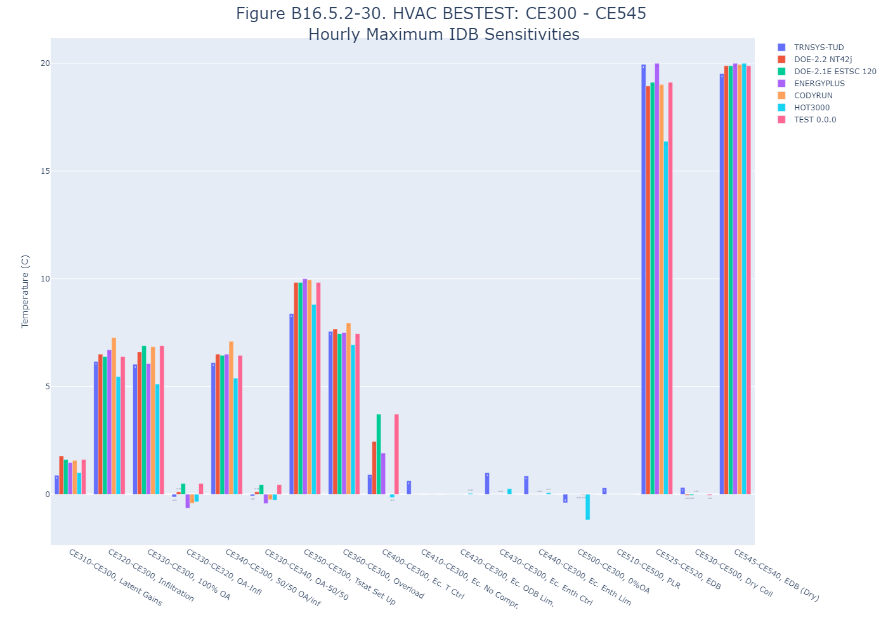
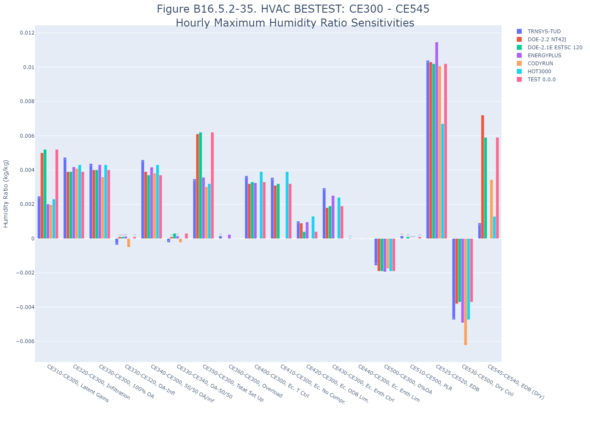
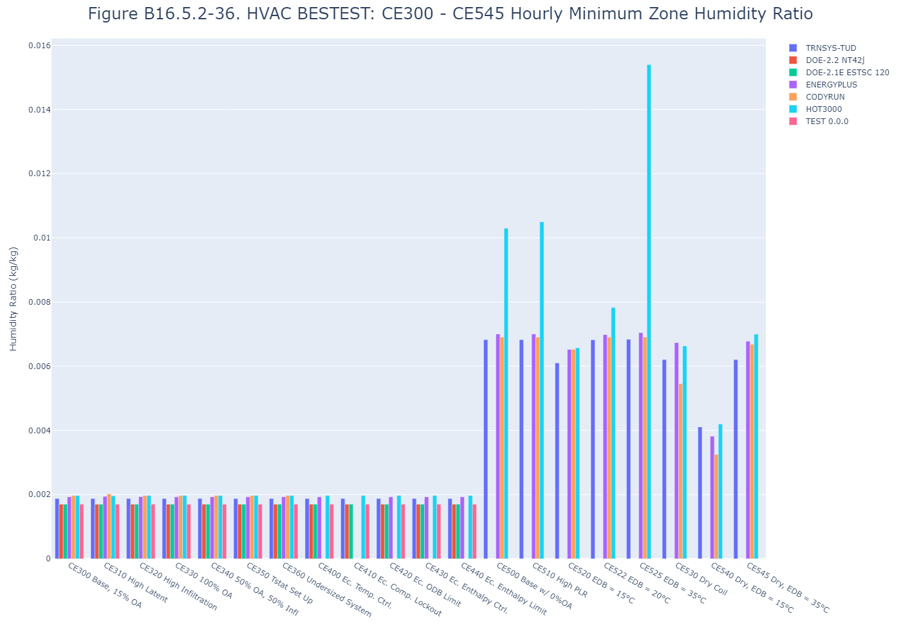
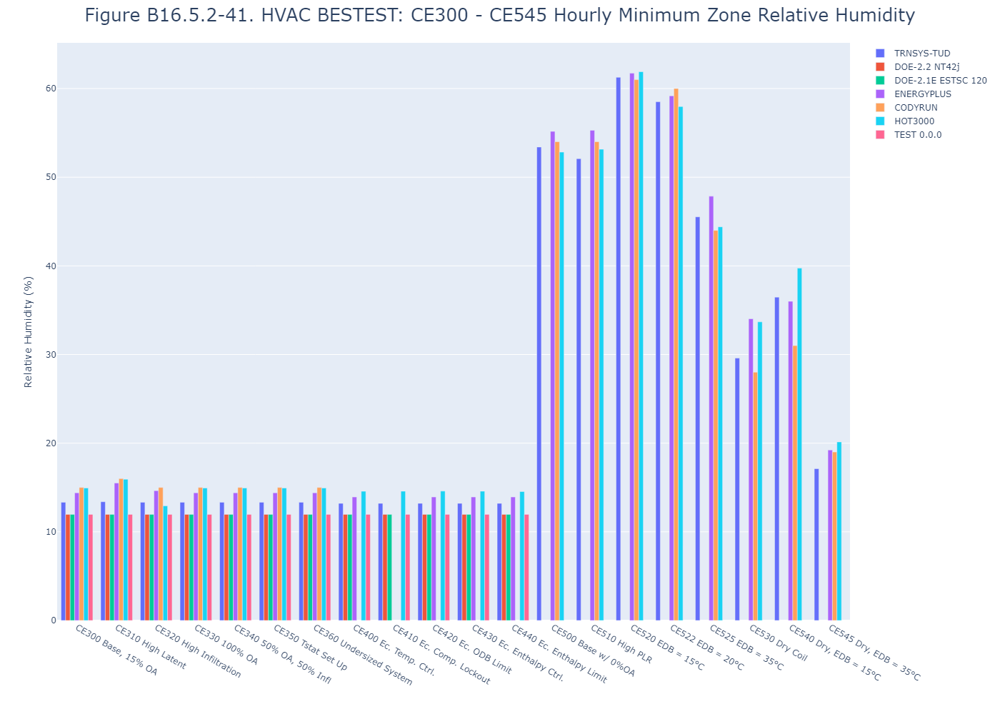

# Section 9 - HVAC Equipment Performance Tests CE300 through CE545

# Table B16.5.2-1a. Annual Space Cooling Electricity Consumption - Total (kWh,e)
| Case          | TRNSYS-TUD | DOE-2.2 NT42j | DOE-2.1E ESTSC 120 | ENERGYPLUS | CODYRUN | HOT3000 |     |   Min |   Max |  Mean | Dev % $$ |     | TEST 0.0.0 | 
|:------------- | ----------:| -------------:| ------------------:| ----------:| -------:| -------:| ---:| -----:| -----:| -----:| --------:| ---:| ----------:| 
| CE300         |      35634 |         34750 |              34755 |      34746 |   34976 |   35070 |     | 34746 | 35634 | 34988 |      2.5 |     |      34755 | 
| CE310         |      39973 |         39379 |              39384 |      39290 |   39520 |   39608 |     | 39290 | 39973 | 39526 |      1.7 |     |      39384 | 
| CE320         |      40060 |         38745 |              38792 |      39079 |   39401 |   39457 |     | 38745 | 40060 | 39256 |      3.3 |     |      38792 | 
| CE330         |      40963 |         39708 |              39438 |      40143 |   40535 |   40330 |     | 39438 | 40963 | 40186 |      3.8 |     |      39438 | 
| CE340         |      40619 |         39358 |              39265 |      39783 |   40065 |   39947 |     | 39265 | 40619 | 39840 |      3.4 |     |      39265 | 
| CE350         |      32237 |         30547 |              30548 |      31145 |   31587 |   31742 |     | 30547 | 32237 | 31301 |      5.4 |     |      30548 | 
| CE360         |      55299 |         54064 |              54016 |      54705 |   54843 |   55068 |     | 54016 | 55299 | 54666 |      2.3 |     |      54016 | 
| CE400         |      32045 |         30846 |              30876 |      31013 |         |   31413 |     | 30846 | 32045 | 31239 |      3.8 |     |      30876 | 
| CE410         |      32078 |         31668 |              31699 |            |         |   31503 |     | 31503 | 32078 | 31737 |      1.8 |     |      31699 | 
| CE420         |      33387 |         32530 |              32910 |      32736 |         |   33208 |     | 32530 | 33387 | 32954 |      2.6 |     |      32910 | 
| CE430         |      32538 |         31932 |              31811 |      31772 |         |   31818 |     | 31772 | 32538 | 31974 |      2.4 |     |      31811 | 
| CE440         |      33691 |         33032 |              32973 |      33032 |         |   33248 |     | 32973 | 33691 | 33195 |      2.2 |     |      32973 | 
| CE500         |      22338 |         22817 |              22822 |      23035 |   22323 |   23138 |     | 22323 | 23138 | 22745 |      3.6 |     |      22822 | 
| CE500 May-Sep |      17391 |         17872 |              17870 |      17996 |   17435 |   18051 |     | 17391 | 18051 | 17769 |      3.7 |     |      17870 | 
| CE510 May-Sep |      34609 |         35971 |              35970 |      35732 |   34849 |   35845 |     | 34609 | 35971 | 35496 |      3.8 |     |      35970 | 
| CE520         |      24987 |         25389 |              25390 |      25017 |   25131 |   25781 |     | 24987 | 25781 | 25282 |      3.1 |     |      25390 | 
| CE522         |      23544 |         24293 |              24307 |      24078 |   23620 |   24360 |     | 23544 | 24360 | 24034 |      3.4 |     |      24307 | 
| CE525         |      20321 |         20408 |              20421 |      20702 |   20242 |   21323 |     | 20242 | 21323 | 20569 |      5.3 |     |      20421 | 
| CE530         |      17281 |         17540 |              17537 |      17742 |   17442 |   17875 |     | 17281 | 17875 | 17570 |      3.4 |     |      17537 | 
| CE540         |      19430 |         19878 |              19874 |      19061 |   19537 |   20164 |     | 19061 | 20164 | 19657 |      5.6 |     |      19874 | 
| CE545         |      15687 |         15802 |              15791 |      16636 |   15791 |   16339 |     | 15687 | 16636 | 16008 |      5.9 |     |      15791 | 

$$ ABS[ (Max-Min) / (Mean of Example Simulation Results)]

# Table B16.5.2-1b. Annual Space Cooling Electricity Consumption - Compressor (kWh,e)
| Case          | TRNSYS-TUD | DOE-2.2 NT42j | DOE-2.1E ESTSC 120 | ENERGYPLUS | CODYRUN | HOT3000 |     |   Min |   Max |  Mean | Dev % $$ |     | TEST 0.0.0 | 
|:------------- | ----------:| -------------:| ------------------:| ----------:| -------:| -------:| ---:| -----:| -----:| -----:| --------:| ---:| ----------:| 
| CE300         |      22354 |         21569 |              21573 |      23884 |   21770 |   21876 |     | 21569 | 23884 | 22171 |     10.4 |     |      21573 | 
| CE310         |      26340 |         25813 |              25817 |      28428 |   25937 |   26053 |     | 25813 | 28428 | 26398 |      9.9 |     |      25817 | 
| CE320         |      26433 |         25250 |              25294 |      28217 |   25846 |   25912 |     | 25250 | 28217 | 26159 |     11.3 |     |      25294 | 
| CE330         |      27300 |         26172 |              25925 |      29281 |   26928 |   26775 |     | 25925 | 29281 | 27063 |     12.4 |     |      25925 | 
| CE340         |      26963 |         25829 |              25745 |      28921 |   26473 |   26400 |     | 25745 | 28921 | 26722 |     11.9 |     |      25745 | 
| CE350         |      19317 |         17802 |              17801 |      20283 |   18738 |   18891 |     | 17801 | 20283 | 18805 |     13.2 |     |      17801 | 
| CE360         |      40106 |         38999 |              38955 |      43843 |   39697 |   39941 |     | 38955 | 43843 | 40257 |     12.1 |     |      38955 | 
| CE400         |      19179 |         18106 |              18131 |      20151 |         |   18629 |     | 18106 | 20151 | 18839 |     10.9 |     |      18131 | 
| CE410         |      19204 |         18823 |              18850 |            |         |   18685 |     | 18685 | 19204 | 18891 |      2.8 |     |      18850 | 
| CE420         |      20359 |         19596 |              19934 |      21873 |         |   20214 |     | 19596 | 21873 | 20395 |     11.2 |     |      19934 | 
| CE430         |      19599 |         19059 |              18951 |      20910 |         |   18966 |     | 18951 | 20910 | 19497 |     10.0 |     |      18951 | 
| CE440         |      20629 |         20042 |              19989 |      22170 |         |   20249 |     | 19989 | 22170 | 20616 |     10.6 |     |      19989 | 
| CE500         |      17854 |         18473 |              18478 |      20406 |   17858 |   18522 |     | 17854 | 20406 | 18599 |     13.7 |     |      18478 | 
| CE500 May-Sep |      13942 |         14508 |              14506 |      15967 |   13989 |   14491 |     | 13942 | 15967 | 14567 |     13.9 |     |      14506 | 
| CE510 May-Sep |      27748 |         28811 |              28810 |      31669 |   27902 |   28721 |     | 27748 | 31669 | 28944 |     13.5 |     |      28810 | 
| CE520         |      19521 |         20121 |              20126 |      21999 |   19655 |   20185 |     | 19521 | 21999 | 20268 |     12.2 |     |      20126 | 
| CE522         |      18620 |         19407 |              19418 |      21235 |   18690 |   19281 |     | 18620 | 21235 | 19442 |     13.4 |     |      19418 | 
| CE525         |      16558 |         16880 |              16893 |      18522 |   16507 |   17443 |     | 16507 | 18522 | 17134 |     11.8 |     |      16893 | 
| CE530         |      13657 |         14127 |              14124 |      15652 |   13856 |   14172 |     | 13657 | 15652 | 14265 |     14.0 |     |      14124 | 
| CE540         |      15021 |         15680 |              15677 |      16752 |   15164 |   15664 |     | 15021 | 16752 | 15660 |     11.1 |     |      15677 | 
| CE545         |      12622 |         12967 |              12957 |      14765 |   12751 |   13215 |     | 12622 | 14765 | 13213 |     16.2 |     |      12957 | 

$$ ABS[ (Max-Min) / (Mean of Example Simulation Results)]

# Table B16.5.2-2a. Annual Space Cooling Electricity Consumption - Supply Fan (kWh,e)
| Case          | TRNSYS-TUD | DOE-2.2 NT42j | DOE-2.1E ESTSC 120 | ENERGYPLUS | CODYRUN | HOT3000 |     |   Min |   Max |  Mean | Dev % $$ |     | TEST 0.0.0 | 
|:------------- | ----------:| -------------:| ------------------:| ----------:| -------:| -------:| ---:| -----:| -----:| -----:| --------:| ---:| ----------:| 
| CE300         |      10880 |         10880 |              10880 |      10862 |   10880 |   10880 |     | 10862 | 10880 | 10877 |      0.2 |     |      10880 | 
| CE310         |      10880 |         10880 |              10880 |      10862 |   10880 |   10880 |     | 10862 | 10880 | 10877 |      0.2 |     |      10880 | 
| CE320         |      10880 |         10880 |              10880 |      10862 |   10880 |   10880 |     | 10862 | 10880 | 10877 |      0.2 |     |      10880 | 
| CE330         |      10880 |         10880 |              10880 |      10862 |   10880 |   10880 |     | 10862 | 10880 | 10877 |      0.2 |     |      10880 | 
| CE340         |      10880 |         10880 |              10880 |      10862 |   10880 |   10880 |     | 10862 | 10880 | 10877 |      0.2 |     |      10880 | 
| CE350         |      10880 |         10880 |              10880 |      10862 |   10880 |   10880 |     | 10862 | 10880 | 10877 |      0.2 |     |      10880 | 
| CE360         |      10880 |         10880 |              10880 |      10862 |   10880 |   10880 |     | 10862 | 10880 | 10877 |      0.2 |     |      10880 | 
| CE400         |      10880 |         10880 |              10880 |      10862 |         |   10880 |     | 10862 | 10880 | 10876 |      0.2 |     |      10880 | 
| CE410         |      10880 |         10880 |              10880 |            |         |   10880 |     | 10880 | 10880 | 10880 |      0.0 |     |      10880 | 
| CE420         |      10880 |         10880 |              10880 |      10862 |         |   10880 |     | 10862 | 10880 | 10876 |      0.2 |     |      10880 | 
| CE430         |      10880 |         10880 |              10880 |      10862 |         |   10880 |     | 10862 | 10880 | 10876 |      0.2 |     |      10880 | 
| CE440         |      10880 |         10880 |              10880 |      10862 |         |   10880 |     | 10862 | 10880 | 10876 |      0.2 |     |      10880 | 
| CE500         |       2564 |          2369 |               2369 |       2628 |    2553 |    2639 |     |  2369 |  2639 |  2520 |     10.7 |     |       2369 | 
| CE500 May-Sep |       1972 |          1837 |               1837 |       2029 |    1970 |    2035 |     |  1837 |  2035 |  1947 |     10.2 |     |       1837 | 
| CE510 May-Sep |       3923 |          4099 |               4099 |       4063 |    3972 |    4073 |     |  3923 |  4099 |  4038 |      4.4 |     |       4099 | 
| CE520         |       3125 |          2874 |               2871 |       3019 |    3131 |    3200 |     |  2871 |  3200 |  3037 |     10.8 |     |       2871 | 
| CE522         |       2816 |          2704 |               2707 |       2843 |    2819 |    2904 |     |  2704 |  2904 |  2799 |      7.1 |     |       2707 | 
| CE525         |       2152 |          1886 |               1885 |       2180 |    2136 |    2221 |     |  1885 |  2221 |  2077 |     16.2 |     |       1885 | 
| CE530         |       2072 |          1833 |               1833 |       2090 |    2051 |    2117 |     |  1833 |  2117 |  1999 |     14.2 |     |       1833 | 
| CE540         |       2522 |          2258 |               2258 |       2309 |    2500 |    2573 |     |  2258 |  2573 |  2403 |     13.1 |     |       2258 | 
| CE545         |       1753 |          1501 |               1501 |       1871 |    1739 |    1786 |     |  1501 |  1871 |  1692 |     21.9 |     |       1501 | 

$$ ABS[ (Max-Min) / (Mean of Example Simulation Results)]

# Table B16.5.2-2b. Annual Space Cooling Electricity Consumption - Condenser Fan (kWh,e)
| Case          | TRNSYS-TUD | DOE-2.2 NT42j | DOE-2.1E ESTSC 120 | ENERGYPLUS | CODYRUN | HOT3000 |     |  Min |  Max | Mean | Dev % $$ |     | TEST 0.0.0 | 
|:------------- | ----------:| -------------:| ------------------:| ----------:| -------:| -------:| ---:| ----:| ----:| ----:| --------:| ---:| ----------:| 
| CE300         |       2400 |          2301 |               2302 |            |    2326 |    2323 |     | 2301 | 2400 | 2331 |      4.3 |     |       2302 | 
| CE310         |       2754 |          2686 |               2687 |            |    2703 |    2691 |     | 2686 | 2754 | 2704 |      2.5 |     |       2687 | 
| CE320         |       2747 |          2615 |               2618 |            |    2675 |    2681 |     | 2615 | 2747 | 2667 |      4.9 |     |       2618 | 
| CE330         |       2784 |          2656 |               2633 |            |    2727 |    2693 |     | 2633 | 2784 | 2699 |      5.6 |     |       2633 | 
| CE340         |       2776 |          2649 |               2640 |            |    2713 |    2684 |     | 2640 | 2776 | 2692 |      5.1 |     |       2640 | 
| CE350         |       2040 |          1865 |               1867 |            |    1969 |    1970 |     | 1865 | 2040 | 1942 |      9.0 |     |       1867 | 
| CE360         |       4313 |          4185 |               4181 |            |    4266 |    4272 |     | 4181 | 4313 | 4243 |      3.1 |     |       4181 | 
| CE400         |       1986 |          1860 |               1865 |            |         |    1902 |     | 1860 | 1986 | 1903 |      6.6 |     |       1865 | 
| CE410         |       1994 |          1965 |               1969 |            |         |    1936 |     | 1936 | 1994 | 1966 |      3.0 |     |       1969 | 
| CE420         |       2149 |          2054 |               2096 |            |         |    2115 |     | 2054 | 2149 | 2103 |      4.5 |     |       2096 | 
| CE430         |       2059 |          1993 |               1980 |            |         |    1970 |     | 1970 | 2059 | 2001 |      4.5 |     |       1980 | 
| CE440         |       2182 |          2110 |               2104 |            |         |    2120 |     | 2104 | 2182 | 2129 |      3.7 |     |       2104 | 
| CE500         |       1920 |          1975 |               1975 |            |    1912 |    1976 |     | 1912 | 1976 | 1952 |      3.3 |     |       1975 | 
| CE500 May-Sep |       1477 |          1527 |               1527 |            |    1476 |    1524 |     | 1476 | 1527 | 1506 |      3.4 |     |       1527 | 
| CE510 May-Sep |       2938 |          3061 |               3061 |            |    2974 |    3050 |     | 2938 | 3061 | 3017 |      4.1 |     |       3061 | 
| CE520         |       2340 |          2394 |               2393 |            |    2345 |    2396 |     | 2340 | 2396 | 2374 |      2.4 |     |       2393 | 
| CE522         |       2108 |          2182 |               2182 |            |    2111 |    2174 |     | 2108 | 2182 | 2151 |      3.4 |     |       2182 | 
| CE525         |       1611 |          1642 |               1643 |            |    1599 |    1663 |     | 1599 | 1663 | 1632 |      3.9 |     |       1643 | 
| CE530         |       1552 |          1580 |               1580 |            |    1536 |    1585 |     | 1536 | 1585 | 1567 |      3.1 |     |       1580 | 
| CE540         |       1888 |          1940 |               1939 |            |    1872 |    1926 |     | 1872 | 1940 | 1913 |      3.5 |     |       1939 | 
| CE545         |       1312 |          1334 |               1333 |            |    1302 |    1337 |     | 1302 | 1337 | 1324 |      2.7 |     |       1333 | 

$$ ABS[ (Max-Min) / (Mean of Example Simulation Results)]

# Table B16.5.2-3a. Weather Data Checks, CE300 Only, Annual Outdoor Dry Bulb
| Case                         | TRNSYS-TUD | DOE-2.2 NT42j | DOE-2.1E ESTSC 120 | ENERGYPLUS | CODYRUN | HOT3000 |     |   Min |   Max |  Mean | Dev % $$ |     | TEST 0.0.0 | 
|:---------------------------- | ----------:| -------------:| ------------------:| ----------:| -------:| -------:| ---:| -----:| -----:| -----:| --------:| ---:| ----------:| 
| Mean (C)                     |      19.91 |         19.89 |              19.89 |      19.91 |   19.91 |   19.91 |     | 19.89 | 19.91 | 19.91 |      0.1 |     |      19.89 | 
| Hourly Integrated Maxima (C) |      34.70 |         35.00 |              35.00 |      34.77 |   35.00 |   35.00 |     | 34.70 | 35.00 | 34.91 |      0.9 |     |      35.00 | 

$$ ABS[ (Max-Min) / (Mean of Example Simulation Results)]

# Table B16.5.2-3b. Weather Data Checks, CE300 Only, Annual Humidity Ratio
| Case                             | TRNSYS-TUD | DOE-2.2 NT42j | DOE-2.1E ESTSC 120 | ENERGYPLUS | CODYRUN | HOT3000 |     |     Min |     Max |    Mean | Dev % $$ |     | TEST 0.0.0 | 
|:-------------------------------- | ----------:| -------------:| ------------------:| ----------:| -------:| -------:| ---:| -------:| -------:| -------:| --------:| ---:| ----------:| 
| Mean (kg/kg)                     |    0.01164 |       0.01160 |            0.01160 |    0.01159 | 0.01165 | 0.01160 |     | 0.01159 | 0.01165 | 0.01161 |      0.5 |     |    0.01160 | 
| Hourly Integrated Maxima (kg/kg) |    0.02188 |       0.02250 |            0.02250 |    0.02184 | 0.02241 | 0.02230 |     | 0.02184 | 0.02250 | 0.02224 |      3.0 |     |    0.02250 | 

$$ ABS[ (Max-Min) / (Mean of Example Simulation Results)]

# Table B16.5.2-4a. Annual Space Cooling Coil Loads - Total Sensible + Latent (kWh,thermal)
| Case          | TRNSYS-TUD | DOE-2.2 NT42j | DOE-2.1E ESTSC 120 | ENERGYPLUS | CODYRUN | HOT3000 |     |    Min |    Max |   Mean | Dev % $$ |     | TEST 0.0.0 | 
|:------------- | ----------:| -------------:| ------------------:| ----------:| -------:| -------:| ---:| ------:| ------:| ------:| --------:| ---:| ----------:| 
| CE300         |      80427 |         77283 |              77292 |      77318 |   77745 |   78257 |     |  77283 |  80427 |  78054 |      4.0 |     |      77292 | 
| CE310         |      99342 |         97395 |              97412 |      96448 |   97296 |   97261 |     |  96448 |  99342 |  97526 |      3.0 |     |      97412 | 
| CE320         |      99792 |         96356 |              96493 |      96084 |   97141 |   96957 |     |  96084 |  99792 |  97137 |      3.8 |     |      96493 | 
| CE330         |     105013 |        100730 |             100993 |     102211 |  103713 |  102008 |     | 100730 | 105013 | 102445 |      4.2 |     |     100993 | 
| CE340         |     102728 |         99028 |              99223 |      99709 |  100676 |   99753 |     |  99028 | 102728 | 100186 |      3.7 |     |      99223 | 
| CE350         |      69388 |         63736 |              63635 |      65790 |   66860 |   67389 |     |  63635 |  69388 |  66133 |      8.7 |     |      63635 | 
| CE360         |     162974 |        159807 |             159854 |     161248 |  161200 |  162168 |     | 159807 | 162974 | 161209 |      2.0 |     |     159854 | 
| CE400         |      68793 |         64918 |              65025 |      65414 |         |   66898 |     |  64918 |  68793 |  66209 |      5.9 |     |      65025 | 
| CE410         |      68673 |         66780 |              66844 |            |         |   66175 |     |  66175 |  68673 |  67118 |      3.7 |     |      66844 | 
| CE420         |      72609 |         69611 |              70882 |      70349 |         |   71803 |     |  69611 |  72609 |  71051 |      4.2 |     |      70882 | 
| CE430         |      69756 |         67641 |              67219 |      67141 |         |   67200 |     |  67141 |  69756 |  67792 |      3.9 |     |      67219 | 
| CE440         |      73711 |         71380 |              71181 |      71417 |         |   72029 |     |  71181 |  73711 |  71944 |      3.5 |     |      71181 | 
| CE500         |      63357 |         65996 |              65992 |      65571 |   63105 |   65614 |     |  63105 |  65996 |  64939 |      4.5 |     |      65992 | 
| CE500 May-Sep |      48443 |         50693 |              50690 |      50354 |   48440 |   50357 |     |  48440 |  50693 |  49830 |      4.5 |     |      50690 | 
| CE510 May-Sep |     108974 |        114018 |             114015 |     112793 |  108979 |  112781 |     | 108974 | 114018 | 111927 |      4.5 |     |     114015 | 
| CE520         |      63422 |         66571 |              66565 |      66088 |   63212 |   66146 |     |  63212 |  66571 |  65334 |      5.1 |     |      66565 | 
| CE522         |      63389 |         66373 |              66372 |      65851 |   63157 |   65900 |     |  63157 |  66373 |  65174 |      4.9 |     |      66372 | 
| CE525         |      63293 |         65399 |              65395 |      64973 |   63002 |   65155 |     |  63002 |  65399 |  64536 |      3.7 |     |      65395 | 
| CE530         |      45046 |         46634 |              46631 |      46944 |   44875 |   47002 |     |  44875 |  47002 |  46189 |      4.6 |     |      46631 | 
| CE540         |      45113 |         47130 |              47126 |      47297 |   44980 |   47462 |     |  44980 |  47462 |  46518 |      5.3 |     |      47126 | 
| CE545         |      44981 |         46240 |              46236 |      46612 |   44775 |   46668 |     |  44775 |  46668 |  45919 |      4.1 |     |      46236 | 

$$ ABS[ (Max-Min) / (Mean of Example Simulation Results)]

# Table B16.5.2-4b. Annual Space Cooling Coil Loads - Sensible (kWh,thermal)
| Case          | TRNSYS-TUD | DOE-2.2 NT42j | DOE-2.1E ESTSC 120 | ENERGYPLUS | CODYRUN | HOT3000 |     |    Min |    Max |   Mean | Dev % $$ |     | TEST 0.0.0 | 
|:------------- | ----------:| -------------:| ------------------:| ----------:| -------:| -------:| ---:| ------:| ------:| ------:| --------:| ---:| ----------:| 
| CE300         |      56662 |         55797 |              55805 |      55252 |   55209 |   55191 |     |  55191 |  56662 |  55653 |      2.6 |     |      55805 | 
| CE310         |      56256 |         56301 |              56313 |      55225 |   55185 |   55083 |     |  55083 |  56313 |  55727 |      2.2 |     |      56313 | 
| CE320         |      62859 |         62697 |              62747 |      62043 |   62009 |   62734 |     |  62009 |  62859 |  62515 |      1.4 |     |      62747 | 
| CE330         |      63083 |         63311 |              63328 |      63779 |   62649 |   61822 |     |  61822 |  63779 |  62995 |      3.1 |     |      63328 | 
| CE340         |      63033 |         63053 |              63111 |      62886 |   62381 |   61406 |     |  61406 |  63111 |  62645 |      2.7 |     |      63111 | 
| CE350         |      50371 |         47684 |              47677 |      48545 |   48589 |   48768 |     |  47677 |  50371 |  48606 |      5.5 |     |      47677 | 
| CE360         |     134977 |        134920 |             134940 |     135287 |  134206 |  134697 |     | 134206 | 135287 | 134838 |      0.8 |     |     134940 | 
| CE400         |      41952 |         41419 |              41437 |      40688 |         |   41181 |     |  40688 |  41952 |  41335 |      3.1 |     |      41437 | 
| CE410         |      45677 |         47659 |              47660 |            |         |   45585 |     |  45585 |  47660 |  46645 |      4.4 |     |      47660 | 
| CE420         |      50390 |         49666 |              50612 |      49524 |         |   49984 |     |  49524 |  50612 |  50035 |      2.2 |     |      50612 | 
| CE430         |      47863 |         47731 |              47454 |      46739 |         |   46143 |     |  46143 |  47863 |  47186 |      3.6 |     |      47454 | 
| CE440         |      50876 |         50593 |              50492 |      50060 |         |   49785 |     |  49785 |  50876 |  50361 |      2.2 |     |      50492 | 
| CE500         |      45044 |         47650 |              47646 |      47491 |   44874 |   47530 |     |  44874 |  47650 |  46706 |      5.9 |     |      47646 | 
| CE500 May-Sep |      34443 |         36596 |              36593 |      36476 |   34448 |   36480 |     |  34443 |  36596 |  35839 |      6.0 |     |      36593 | 
| CE510 May-Sep |      77489 |         82306 |              82303 |      81566 |   77499 |   81563 |     |  77489 |  82306 |  80454 |      6.0 |     |      82303 | 
| CE520         |      45110 |         48102 |              48096 |      47986 |   44977 |   48059 |     |  44977 |  48102 |  47055 |      6.6 |     |      48096 | 
| CE522         |      45076 |         47962 |              47961 |      47758 |   44924 |   47795 |     |  44924 |  47962 |  46913 |      6.5 |     |      47961 | 
| CE525         |      44979 |         47218 |              47213 |      46930 |   44775 |   47110 |     |  44775 |  47218 |  46371 |      5.3 |     |      47213 | 
| CE530         |      45046 |         46574 |              46570 |      46944 |   44874 |   47002 |     |  44874 |  47002 |  46168 |      4.6 |     |      46570 | 
| CE540         |      45112 |         47023 |              47019 |      47288 |   44977 |   47460 |     |  44977 |  47460 |  46480 |      5.3 |     |      47019 | 
| CE545         |      44981 |         46214 |              46210 |      46612 |   44775 |   46668 |     |  44775 |  46668 |  45910 |      4.1 |     |      46210 | 

$$ ABS[ (Max-Min) / (Mean of Example Simulation Results)]

# Table B16.5.2-5. Annual Space Cooling Coil Loads - Latent (kWh,thermal)
| Case          | TRNSYS-TUD | DOE-2.2 NT42j | DOE-2.1E ESTSC 120 | ENERGYPLUS | CODYRUN | HOT3000 |     |   Min |   Max |  Mean | Dev % $$ |     | TEST 0.0.0 | 
|:------------- | ----------:| -------------:| ------------------:| ----------:| -------:| -------:| ---:| -----:| -----:| -----:| --------:| ---:| ----------:| 
| CE300         |      23765 |         21487 |              21487 |      22066 |   22535 |   23067 |     | 21487 | 23765 | 22401 |     10.2 |     |      21487 | 
| CE310         |      43086 |         41094 |              41099 |      41222 |   42111 |   42178 |     | 41094 | 43086 | 41798 |      4.8 |     |      41099 | 
| CE320         |      36932 |         33659 |              33746 |      34040 |   35133 |   34224 |     | 33659 | 36932 | 34622 |      9.5 |     |      33746 | 
| CE330         |      41929 |         37419 |              37666 |      38433 |   41063 |   40186 |     | 37419 | 41929 | 39449 |     11.4 |     |      37666 | 
| CE340         |      39695 |         35974 |              36113 |      36823 |   38296 |   38346 |     | 35974 | 39695 | 37541 |      9.9 |     |      36113 | 
| CE350         |      19017 |         16052 |              15958 |      17245 |   18271 |   18621 |     | 15958 | 19017 | 17527 |     17.5 |     |      15958 | 
| CE360         |      27997 |         24887 |              24914 |      25961 |   26994 |   27470 |     | 24887 | 27997 | 26371 |     11.8 |     |      24914 | 
| CE400         |      26840 |         23498 |              23588 |      24726 |         |   25717 |     | 23498 | 26840 | 24874 |     13.4 |     |      23588 | 
| CE410         |      22996 |         19121 |              19184 |            |         |   20590 |     | 19121 | 22996 | 20473 |     18.9 |     |      19184 | 
| CE420         |      22219 |         19945 |              20270 |      20826 |         |   21855 |     | 19945 | 22219 | 21023 |     10.8 |     |      20270 | 
| CE430         |      21893 |         19909 |              19765 |      20403 |         |   21057 |     | 19765 | 21893 | 20605 |     10.3 |     |      19765 | 
| CE440         |      22835 |         20788 |              20689 |      21357 |         |   22244 |     | 20689 | 22835 | 21583 |      9.9 |     |      20689 | 
| CE500         |      18313 |         18346 |              18346 |      18080 |   18231 |   18084 |     | 18080 | 18346 | 18233 |      1.5 |     |      18346 | 
| CE500 May-Sep |      14000 |         14097 |              14097 |      13879 |   13991 |   13877 |     | 13877 | 14097 | 13990 |      1.6 |     |      14097 | 
| CE510 May-Sep |      31485 |         31712 |              31712 |      31226 |   31480 |   31217 |     | 31217 | 31712 | 31472 |      1.6 |     |      31712 | 
| CE520         |      18312 |         18470 |              18470 |      18101 |   18235 |   18087 |     | 18087 | 18470 | 18279 |      2.1 |     |      18470 | 
| CE522         |      18313 |         18411 |              18410 |      18093 |   18233 |   18104 |     | 18093 | 18411 | 18261 |      1.7 |     |      18410 | 
| CE525         |      18314 |         18182 |              18182 |      18044 |   18227 |   18045 |     | 18044 | 18314 | 18165 |      1.5 |     |      18182 | 
| CE530         |          0 |            61 |                 61 |          0 |       1 |       0 |     |     0 |    61 |    20 |    297.1 |     |         61 | 
| CE540         |          1 |           107 |                107 |          9 |       3 |       2 |     |     1 |   107 |    38 |    278.2 |     |        107 | 
| CE545         |          0 |            25 |                 25 |          0 |       0 |       0 |     |     0 |    25 |     9 |    300.0 |     |         25 | 

$$ ABS[ (Max-Min) / (Mean of Example Simulation Results)]

# Table B16.5.2-6a. Various Annual Means - COP2
| Case          | TRNSYS-TUD | DOE-2.2 NT42j | DOE-2.1E ESTSC 120 | ENERGYPLUS | CODYRUN | HOT3000 |     |   Min |   Max |  Mean | Dev % $$ |     | TEST 0.0.0 | 
|:------------- | ----------:| -------------:| ------------------:| ----------:| -------:| -------:| ---:| -----:| -----:| -----:| --------:| ---:| ----------:| 
| CE300         |      3.249 |         3.238 |              3.237 |      3.237 |   3.226 |   3.230 |     | 3.226 | 3.249 | 3.236 |      0.7 |     |      3.237 | 
| CE310         |      3.415 |         3.417 |              3.417 |      3.393 |   3.397 |   3.380 |     | 3.380 | 3.417 | 3.403 |      1.1 |     |      3.417 | 
| CE320         |      3.420 |         3.458 |              3.457 |      3.405 |   3.406 |   3.390 |     | 3.390 | 3.458 | 3.423 |      2.0 |     |      3.457 | 
| CE330         |      3.491 |         3.494 |              3.536 |      3.491 |   3.497 |   3.460 |     | 3.460 | 3.536 | 3.495 |      2.2 |     |      3.536 | 
| CE340         |      3.454 |         3.477 |              3.496 |      3.448 |   3.450 |   3.420 |     | 3.420 | 3.496 | 3.457 |      2.2 |     |      3.496 | 
| CE350         |      3.249 |         3.241 |              3.235 |      3.244 |   3.229 |   3.230 |     | 3.229 | 3.249 | 3.238 |      0.6 |     |      3.235 | 
| CE360         |      3.669 |         3.701 |              3.706 |      3.678 |   3.667 |   3.660 |     | 3.660 | 3.706 | 3.680 |      1.2 |     |      3.706 | 
| CE400         |      3.250 |         3.251 |              3.252 |      3.246 |         |   3.260 |     | 3.246 | 3.260 | 3.252 |      0.4 |     |      3.252 | 
| CE410         |      3.240 |         3.212 |              3.211 |            |         |   3.210 |     | 3.210 | 3.240 | 3.218 |      0.9 |     |      3.211 | 
| CE420         |      3.226 |         3.215 |              3.218 |      3.216 |         |   3.210 |     | 3.210 | 3.226 | 3.217 |      0.5 |     |      3.218 | 
| CE430         |      3.221 |         3.213 |              3.211 |      3.211 |         |   3.210 |     | 3.210 | 3.221 | 3.213 |      0.3 |     |      3.211 | 
| CE440         |      3.231 |         3.222 |              3.222 |      3.221 |         |   3.220 |     | 3.220 | 3.231 | 3.223 |      0.4 |     |      3.222 | 
| CE500         |      3.204 |         3.227 |              3.227 |      3.213 |   3.192 |   3.200 |     | 3.192 | 3.227 | 3.211 |      1.1 |     |      3.227 | 
| CE500 May-Sep |      3.142 |         3.161 |              3.162 |      3.154 |   3.132 |   3.140 |     | 3.132 | 3.162 | 3.148 |      0.9 |     |      3.162 | 
| CE510 May-Sep |      3.551 |         3.577 |              3.577 |      3.562 |   3.530 |   3.550 |     | 3.530 | 3.577 | 3.558 |      1.3 |     |      3.577 | 
| CE520         |      2.901 |         2.957 |              2.956 |      3.004 |   2.873 |   2.920 |     | 2.873 | 3.004 | 2.935 |      4.5 |     |      2.956 | 
| CE522         |      3.058 |         3.074 |              3.073 |      3.101 |   3.036 |   3.070 |     | 3.036 | 3.101 | 3.069 |      2.1 |     |      3.073 | 
| CE525         |      3.484 |         3.531 |              3.528 |      3.508 |   3.480 |   3.410 |     | 3.410 | 3.531 | 3.490 |      3.5 |     |      3.528 | 
| CE530         |      2.962 |         2.969 |              2.969 |      2.999 |   2.916 |   2.980 |     | 2.916 | 2.999 | 2.966 |      2.8 |     |      2.969 | 
| CE540         |      2.668 |         2.675 |              2.675 |      2.823 |   2.640 |   2.690 |     | 2.640 | 2.823 | 2.695 |      6.8 |     |      2.675 | 
| CE545         |      3.228 |         3.233 |              3.236 |      3.157 |   3.186 |   3.200 |     | 3.157 | 3.236 | 3.207 |      2.5 |     |      3.236 | 

$$ ABS[ (Max-Min) / (Mean of Example Simulation Results)]

# Table B16.5.2-6b. Various Annual Means - Indoor Dry Bulb (C)
| Case          | TRNSYS-TUD | DOE-2.2 NT42j | DOE-2.1E ESTSC 120 | ENERGYPLUS | CODYRUN | HOT3000 |     |   Min |   Max |  Mean | Dev % $$ |     | TEST 0.0.0 | 
|:------------- | ----------:| -------------:| ------------------:| ----------:| -------:| -------:| ---:| -----:| -----:| -----:| --------:| ---:| ----------:| 
| CE300         |      23.62 |         24.06 |              24.06 |      24.09 |   24.08 |   23.99 |     | 23.62 | 24.09 | 23.98 |      1.9 |     |      24.06 | 
| CE310         |      23.76 |         24.11 |              24.06 |      24.09 |   24.09 |   24.01 |     | 23.76 | 24.11 | 24.02 |      1.5 |     |      24.06 | 
| CE320         |      23.90 |         24.39 |              24.39 |      24.25 |   24.33 |   24.53 |     | 23.90 | 24.53 | 24.30 |      2.6 |     |      24.39 | 
| CE330         |      23.88 |         24.28 |              24.28 |      24.27 |   24.30 |   24.18 |     | 23.88 | 24.30 | 24.20 |      1.7 |     |      24.28 | 
| CE340         |      23.88 |         24.28 |              24.28 |      24.30 |   24.31 |   24.21 |     | 23.88 | 24.31 | 24.21 |      1.8 |     |      24.28 | 
| CE350         |      25.66 |         26.17 |              26.17 |      26.24 |   26.27 |   26.15 |     | 25.66 | 26.27 | 26.11 |      2.3 |     |      26.17 | 
| CE360         |      25.36 |         25.61 |              25.56 |      25.32 |   25.48 |   25.37 |     | 25.32 | 25.61 | 25.45 |      1.1 |     |      25.56 | 
| CE400         |      24.13 |         24.06 |              24.06 |      24.09 |         |   23.99 |     | 23.99 | 24.13 | 24.06 |      0.6 |     |      24.06 | 
| CE410         |      24.12 |         24.06 |              24.06 |            |         |   23.99 |     | 23.99 | 24.12 | 24.06 |      0.5 |     |      24.06 | 
| CE420         |      23.93 |         24.06 |              24.06 |      24.09 |         |   23.99 |     | 23.93 | 24.09 | 24.02 |      0.7 |     |      24.06 | 
| CE430         |      23.99 |         24.06 |              24.06 |      24.09 |         |   23.99 |     | 23.99 | 24.09 | 24.04 |      0.4 |     |      24.06 | 
| CE440         |      23.91 |         24.06 |              24.06 |      24.09 |         |   23.99 |     | 23.91 | 24.09 | 24.02 |      0.7 |     |      24.06 | 
| CE500         |      20.23 |         20.67 |              20.56 |      20.38 |   21.10 |   22.86 |     | 20.23 | 22.86 | 20.97 |     12.5 |     |      20.56 | 
| CE500 May-Sep |      24.57 |         25.00 |              25.00 |      24.98 |   25.00 |   25.00 |     | 24.57 | 25.00 | 24.93 |      1.7 |     |      25.00 | 
| CE510 May-Sep |      25.82 |         25.11 |              25.11 |      24.96 |   25.00 |   25.00 |     | 24.96 | 25.82 | 25.17 |      3.4 |     |      25.11 | 
| CE520         |      13.52 |         13.78 |              13.72 |      13.58 |   14.14 |   14.89 |     | 13.52 | 14.89 | 13.94 |      9.9 |     |      13.72 | 
| CE522         |      16.95 |         17.28 |              17.22 |      17.00 |   17.73 |   18.70 |     | 16.95 | 18.70 | 17.48 |     10.0 |     |      17.22 | 
| CE525         |      26.84 |         27.39 |              27.28 |      27.10 |   27.77 |   30.69 |     | 26.84 | 30.69 | 27.85 |     13.8 |     |      27.28 | 
| CE530         |      20.03 |         20.61 |              20.56 |      20.59 |   21.10 |   22.86 |     | 20.03 | 22.86 | 20.96 |     13.5 |     |      20.56 | 
| CE540         |      13.29 |         13.78 |              13.72 |      13.79 |   14.14 |   14.98 |     | 13.29 | 14.98 | 13.95 |     12.1 |     |      13.72 | 
| CE545         |      26.61 |         27.33 |              27.28 |      27.31 |   27.72 |   30.69 |     | 26.61 | 30.69 | 27.82 |     14.7 |     |      27.28 | 

$$ ABS[ (Max-Min) / (Mean of Example Simulation Results)]

# Table B16.5.2-7a. Various Annual Means - Zone Humidity Ratio (kg/kg)
| Case          | TRNSYS-TUD | DOE-2.2 NT42j | DOE-2.1E ESTSC 120 | ENERGYPLUS | CODYRUN | HOT3000 |     |    Min |    Max |   Mean | Dev % $$ |     | TEST 0.0.0 | 
|:------------- | ----------:| -------------:| ------------------:| ----------:| -------:| -------:| ---:| ------:| ------:| ------:| --------:| ---:| ----------:| 
| CE300         |     0.0091 |        0.0092 |             0.0092 |     0.0093 |  0.0092 |  0.0092 |     | 0.0091 | 0.0093 | 0.0092 |      2.4 |     |     0.0092 | 
| CE310         |     0.0111 |        0.0113 |             0.0113 |     0.0113 |  0.0112 |  0.0111 |     | 0.0111 | 0.0113 | 0.0112 |      2.0 |     |     0.0113 | 
| CE320         |     0.0100 |        0.0101 |             0.0101 |     0.0101 |  0.0100 |  0.0099 |     | 0.0099 | 0.0101 | 0.0100 |      2.1 |     |     0.0101 | 
| CE330         |     0.0097 |        0.0099 |             0.0099 |     0.0100 |  0.0098 |  0.0099 |     | 0.0097 | 0.0100 | 0.0099 |      2.3 |     |     0.0099 | 
| CE340         |     0.0098 |        0.0099 |             0.0099 |     0.0100 |  0.0099 |  0.0099 |     | 0.0098 | 0.0100 | 0.0099 |      1.9 |     |     0.0099 | 
| CE350         |     0.0097 |        0.0100 |             0.0100 |     0.0099 |  0.0098 |  0.0098 |     | 0.0097 | 0.0100 | 0.0099 |      3.0 |     |     0.0100 | 
| CE360         |     0.0085 |        0.0087 |             0.0087 |     0.0088 |  0.0086 |  0.0086 |     | 0.0085 | 0.0088 | 0.0086 |      3.1 |     |     0.0087 | 
| CE400         |     0.0098 |        0.0100 |             0.0100 |     0.0101 |         |  0.0100 |     | 0.0098 | 0.0101 | 0.0100 |      2.9 |     |     0.0100 | 
| CE410         |     0.0097 |        0.0095 |             0.0095 |            |         |  0.0095 |     | 0.0095 | 0.0097 | 0.0096 |      2.5 |     |     0.0095 | 
| CE420         |     0.0093 |        0.0094 |             0.0094 |     0.0094 |         |  0.0093 |     | 0.0093 | 0.0094 | 0.0094 |      2.0 |     |     0.0094 | 
| CE430         |     0.0093 |        0.0094 |             0.0094 |     0.0095 |         |  0.0094 |     | 0.0093 | 0.0095 | 0.0094 |      1.9 |     |     0.0094 | 
| CE440         |     0.0092 |        0.0093 |             0.0093 |     0.0093 |         |  0.0092 |     | 0.0092 | 0.0093 | 0.0093 |      1.9 |     |     0.0093 | 
| CE500         |     0.0098 |               |                    |     0.0094 |  0.0102 |  0.0107 |     | 0.0094 | 0.0107 | 0.0100 |     13.2 |     |            | 
| CE500 May-Sep |     0.0110 |        0.0114 |             0.0114 |     0.0113 |  0.0113 |  0.0109 |     | 0.0109 | 0.0114 | 0.0112 |      4.5 |     |     0.0114 | 
| CE510 May-Sep |     0.0114 |        0.0114 |             0.0114 |     0.0113 |  0.0113 |  0.0109 |     | 0.0109 | 0.0114 | 0.0113 |      4.4 |     |     0.0114 | 
| CE520         |     0.0067 |               |                    |     0.0060 |  0.0070 |  0.0076 |     | 0.0060 | 0.0076 | 0.0068 |     23.1 |     |            | 
| CE522         |     0.0082 |               |                    |     0.0076 |  0.0086 |  0.0090 |     | 0.0076 | 0.0090 | 0.0083 |     16.8 |     |            | 
| CE525         |     0.0137 |               |                    |     0.0138 |  0.0140 |  0.0151 |     | 0.0137 | 0.0151 | 0.0141 |      9.8 |     |            | 
| CE530         |     0.0062 |               |                    |     0.0067 |  0.0058 |  0.0067 |     | 0.0058 | 0.0067 | 0.0064 |     14.4 |     |            | 
| CE540         |     0.0045 |               |                    |     0.0043 |  0.0039 |  0.0046 |     | 0.0039 | 0.0046 | 0.0043 |     17.9 |     |            | 
| CE545         |     0.0062 |               |                    |     0.0067 |  0.0067 |  0.0072 |     | 0.0062 | 0.0072 | 0.0067 |     14.8 |     |            | 

$$ ABS[ (Max-Min) / (Mean of Example Simulation Results)]

# Table B16.5.2-7b. Various Annual Means - Zone Relative Humidity (%)
| Case          | TRNSYS-TUD | DOE-2.2 NT42j | DOE-2.1E ESTSC 120 | ENERGYPLUS | CODYRUN | HOT3000 |     |   Min |   Max |  Mean | Dev % $$ |     | TEST 0.0.0 | 
|:------------- | ----------:| -------------:| ------------------:| ----------:| -------:| -------:| ---:| -----:| -----:| -----:| --------:| ---:| ----------:| 
| CE300         |      48.61 |         48.26 |              48.28 |      48.59 |   47.83 |   47.93 |     | 47.83 | 48.61 | 48.25 |      1.6 |     |      48.28 | 
| CE310         |      58.33 |         58.51 |              58.53 |      58.55 |   57.84 |   57.80 |     | 57.80 | 58.55 | 58.26 |      1.3 |     |      58.53 | 
| CE320         |      52.01 |         51.21 |              51.25 |      51.84 |   51.10 |   49.94 |     | 49.94 | 52.01 | 51.22 |      4.0 |     |      51.25 | 
| CE330         |      50.84 |         50.58 |              50.65 |      51.18 |   50.08 |   50.70 |     | 50.08 | 51.18 | 50.67 |      2.2 |     |      50.65 | 
| CE340         |      51.09 |         50.69 |              50.73 |      51.15 |   50.30 |   50.78 |     | 50.30 | 51.15 | 50.79 |      1.7 |     |      50.73 | 
| CE350         |      45.48 |         45.45 |              45.55 |      45.17 |   44.32 |   44.56 |     | 44.32 | 45.55 | 45.09 |      2.7 |     |      45.55 | 
| CE360         |      41.03 |         41.49 |              41.49 |      42.37 |   40.87 |   41.21 |     | 40.87 | 42.37 | 41.41 |      3.6 |     |      41.49 | 
| CE400         |      50.77 |         52.21 |              52.25 |      52.55 |         |   52.01 |     | 50.77 | 52.55 | 51.96 |      3.4 |     |      52.25 | 
| CE410         |      50.50 |         49.65 |              49.63 |            |         |   49.75 |     | 49.63 | 50.50 | 49.88 |      1.7 |     |      49.63 | 
| CE420         |      48.78 |         49.14 |              48.97 |      49.40 |         |   48.76 |     | 48.76 | 49.40 | 49.01 |      1.3 |     |      48.97 | 
| CE430         |      48.82 |         49.17 |              49.30 |      49.60 |         |   49.17 |     | 48.82 | 49.60 | 49.21 |      1.6 |     |      49.30 | 
| CE440         |      48.33 |         48.46 |              48.57 |      48.83 |         |   48.23 |     | 48.23 | 48.83 | 48.48 |      1.2 |     |      48.57 | 
| CE500         |      66.53 |               |                    |      59.20 |   65.94 |   63.73 |     | 59.20 | 66.53 | 63.85 |     11.5 |     |            | 
| CE500 May-Sep |      57.05 |         57.47 |              57.47 |      57.32 |   57.07 |   55.13 |     | 55.13 | 57.47 | 56.92 |      4.1 |     |      57.47 | 
| CE510 May-Sep |      54.70 |         57.36 |              57.36 |      57.44 |   57.06 |   55.24 |     | 54.70 | 57.44 | 56.53 |      4.8 |     |      57.36 | 
| CE520         |      69.87 |               |                    |      61.40 |   70.23 |   72.17 |     | 61.40 | 72.17 | 68.42 |     15.7 |     |            | 
| CE522         |      68.68 |               |                    |      60.75 |   68.23 |   68.11 |     | 60.75 | 68.68 | 66.44 |     11.9 |     |            | 
| CE525         |      61.47 |               |                    |      54.99 |   60.14 |   57.37 |     | 54.99 | 61.47 | 58.49 |     11.1 |     |            | 
| CE530         |      46.73 |               |                    |      48.97 |   41.45 |   39.60 |     | 39.60 | 48.97 | 44.19 |     21.2 |     |            | 
| CE540         |      48.52 |               |                    |      46.31 |   40.05 |   43.82 |     | 40.05 | 48.52 | 44.67 |     19.0 |     |            | 
| CE545         |      36.62 |               |                    |      38.63 |   36.87 |   29.20 |     | 29.20 | 38.63 | 35.33 |     26.7 |     |            | 

$$ ABS[ (Max-Min) / (Mean of Example Simulation Results)]

# Table B16.5.2-8a. f(ODB) Sensitivity CE500 and CE530, April 30 and July 25, Energy Consumption, Compressor + Both Fans (Wh,e)
| Case           | TRNSYS-TUD | DOE-2.2 NT42j | DOE-2.1E ESTSC 120 | ENERGYPLUS | CODYRUN | HOT3000 |     |  Min |  Max | Mean | Dev % $$ |     | TEST 0.0.0 | 
|:-------------- | ----------:| -------------:| ------------------:| ----------:| -------:| -------:| ---:| ----:| ----:| ----:| --------:| ---:| ----------:| 
| CE500 April 30 |       3893 |          3975 |               3975 |       4029 |    3901 |    4073 |     | 3893 | 4073 | 3974 |      4.5 |     |       3975 | 
| CE500 June 25  |       5045 |          5204 |               5204 |       5229 |    5066 |    5230 |     | 5045 | 5230 | 5163 |      3.6 |     |       5204 | 
| Delta CE500    |       1152 |          1229 |               1229 |       1200 |    1165 |    1157 |     | 1152 | 1229 | 1189 |      6.5 |     |       1229 | 
| CE530 April 30 |       3023 |          3062 |               3062 |       3101 |    3092 |    3144 |     | 3023 | 3144 | 3081 |      3.9 |     |       3062 | 
| CE530 June 25  |       3894 |          3978 |               3978 |       4029 |    3935 |    4043 |     | 3894 | 4043 | 3976 |      3.7 |     |       3978 | 
| Delta CE530    |        871 |           916 |                916 |        927 |     843 |     899 |     |  843 |  927 |  896 |      9.4 |     |        916 | 

$$ ABS[ (Max-Min) / (Mean of Example Simulation Results)]

# Table B16.5.2-8b. f(ODB) Sensitivity CE500 and CE530, April 30 and July 25, Energy Consumption, Compressor (Wh,e)
| Case           | TRNSYS-TUD | DOE-2.2 NT42j | DOE-2.1E ESTSC 120 | ENERGYPLUS | CODYRUN | HOT3000 |     |  Min |  Max | Mean | Dev % $$ |     | TEST 0.0.0 | 
|:-------------- | ----------:| -------------:| ------------------:| ----------:| -------:| -------:| ---:| ----:| ----:| ----:| --------:| ---:| ----------:| 
| CE500 April 30 |       3015 |          3120 |               3120 |       3510 |    3020 |    3159 |     | 3015 | 3510 | 3157 |     15.7 |     |       3120 | 
| CE500 June 25  |       4084 |          4264 |               4263 |       4663 |    4106 |    4239 |     | 4084 | 4663 | 4270 |     13.6 |     |       4263 | 
| Delta CE500    |       1069 |          1144 |               1144 |       1153 |    1086 |    1080 |     | 1069 | 1153 | 1113 |      7.6 |     |       1144 | 
| CE530 April 30 |       2311 |          2390 |               2390 |       2689 |    2378 |    2411 |     | 2311 | 2689 | 2428 |     15.5 |     |       2390 | 
| CE530 June 25  |       3118 |          3243 |               3243 |       3579 |    3166 |    3248 |     | 3118 | 3579 | 3266 |     14.1 |     |       3243 | 
| Delta CE530    |        807 |           853 |                853 |        890 |     787 |     837 |     |  787 |  890 |  838 |     12.2 |     |        853 | 

$$ ABS[ (Max-Min) / (Mean of Example Simulation Results)]

# Table B16.5.2-8c. f(ODB) Sensitivity CE500 and CE530, April 30 and July 25, Energy Consumption, Condenser Fan (Wh,e)
| Case           | TRNSYS-TUD | DOE-2.2 NT42j | DOE-2.1E ESTSC 120 | ENERGYPLUS | CODYRUN | HOT3000 |     | Min | Max | Mean | Dev % $$ |     | TEST 0.0.0 | 
|:-------------- | ----------:| -------------:| ------------------:| ----------:| -------:| -------:| ---:| ---:| ---:| ----:| --------:| ---:| ----------:| 
| CE500 April 30 |        376 |           389 |                389 |            |     377 |     391 |     | 376 | 391 |  385 |      3.9 |     |        389 | 
| CE500 June 25  |        411 |           426 |                426 |            |     411 |     424 |     | 411 | 426 |  420 |      3.6 |     |        426 | 
| Delta CE500    |         35 |            37 |                 37 |            |      34 |      33 |     |  33 |  37 |   35 |     12.0 |     |         37 | 
| CE530 April 30 |        305 |           311 |                311 |            |     305 |     314 |     | 305 | 314 |  309 |      3.1 |     |        311 | 
| CE530 June 25  |        332 |           340 |                340 |            |     329 |     340 |     | 329 | 340 |  336 |      3.2 |     |        340 | 
| Delta CE530    |         28 |            28 |                 28 |            |      24 |      26 |     |  24 |  28 |   27 |     17.0 |     |         28 | 

$$ ABS[ (Max-Min) / (Mean of Example Simulation Results)]

# Table B16.5.2-8d. f(ODB) Sensitivity CE500 and CE530, April 30 and July 25, Energy Consumption, Supply Fan (Wh,e)
| Case           | TRNSYS-TUD | DOE-2.2 NT42j | DOE-2.1E ESTSC 120 | ENERGYPLUS | CODYRUN | HOT3000 |     | Min | Max | Mean | Dev % $$ |     | TEST 0.0.0 | 
|:-------------- | ----------:| -------------:| ------------------:| ----------:| -------:| -------:| ---:| ---:| ---:| ----:| --------:| ---:| ----------:| 
| CE500 April 30 |        502 |           466 |                466 |        519 |     504 |     522 |     | 466 | 522 |  497 |     11.2 |     |        466 | 
| CE500 June 25  |        550 |           514 |                514 |        566 |     549 |     566 |     | 514 | 566 |  543 |      9.5 |     |        514 | 
| Delta CE500    |         47 |            48 |                 48 |         47 |      45 |      44 |     |  44 |  48 |   47 |      8.5 |     |         48 | 
| CE530 April 30 |        407 |           361 |                361 |        412 |     408 |     419 |     | 361 | 419 |  395 |     14.8 |     |        361 | 
| CE530 June 25  |        444 |           396 |                396 |        450 |     440 |     454 |     | 396 | 454 |  430 |     13.6 |     |        396 | 
| Delta CE530    |         37 |            35 |                 35 |         38 |      32 |      35 |     |  32 |  38 |   35 |     16.0 |     |         35 | 

$$ ABS[ (Max-Min) / (Mean of Example Simulation Results)]

# Table B16.5.2-8e. f(ODB) Sensitivity CE500 and CE530, April 30 and July 25, Sensible + Latent Coil Load (Wh,th)
| Case           | TRNSYS-TUD | DOE-2.2 NT42j | DOE-2.1E ESTSC 120 | ENERGYPLUS | CODYRUN | HOT3000 |     |   Min |   Max |  Mean | Dev % $$ |     | TEST 0.0.0 | 
|:-------------- | ----------:| -------------:| ------------------:| ----------:| -------:| -------:| ---:| -----:| -----:| -----:| --------:| ---:| ----------:| 
| CE500 April 30 |      13186 |         13733 |              13733 |      13655 |   13170 |   13673 |     | 13170 | 13733 | 13525 |      4.2 |     |      13733 | 
| CE500 June 25  |      13188 |         13838 |              13837 |      13733 |   13198 |   13727 |     | 13188 | 13838 | 13587 |      4.8 |     |      13837 | 
| Delta CE500    |          2 |           105 |                104 |         78 |      29 |      54 |     |     2 |   105 |    62 |    165.3 |     |        104 | 
| CE530 April 30 |       9353 |          9721 |               9721 |       9775 |    9365 |    9798 |     |  9353 |  9798 |  9622 |      4.6 |     |       9721 | 
| CE530 June 25  |       9376 |          9761 |               9761 |       9835 |    9388 |    9834 |     |  9376 |  9835 |  9659 |      4.8 |     |       9761 | 
| Delta CE530    |         23 |            40 |                 39 |         60 |      22 |      36 |     |    22 |    60 |    37 |    102.8 |     |         39 | 

$$ ABS[ (Max-Min) / (Mean of Example Simulation Results)]

# Table B16.5.2-8f. f(ODB) Sensitivity CE500 and CE530, April 30 and July 25, Sensible Coil Load (Wh,th)
| Case           | TRNSYS-TUD | DOE-2.2 NT42j | DOE-2.1E ESTSC 120 | ENERGYPLUS | CODYRUN | HOT3000 |     |  Min |  Max | Mean | Dev % $$ |     | TEST 0.0.0 | 
|:-------------- | ----------:| -------------:| ------------------:| ----------:| -------:| -------:| ---:| ----:| ----:| ----:| --------:| ---:| ----------:| 
| CE500 April 30 |       9375 |          9925 |               9925 |       9884 |    9365 |    9902 |     | 9365 | 9925 | 9729 |      5.8 |     |       9925 | 
| CE500 June 25  |       9378 |          9981 |               9981 |       9953 |    9388 |    9946 |     | 9378 | 9981 | 9771 |      6.2 |     |       9981 | 
| Delta CE500    |          3 |            56 |                 56 |         69 |      22 |      44 |     |    3 |   69 |   42 |    158.2 |     |         56 | 
| CE530 April 30 |       9353 |          9721 |               9721 |       9775 |    9365 |    9798 |     | 9353 | 9798 | 9622 |      4.6 |     |       9721 | 
| CE530 June 25  |       9376 |          9761 |               9761 |       9835 |    9388 |    9834 |     | 9376 | 9835 | 9659 |      4.8 |     |       9761 | 
| Delta CE530    |         23 |            40 |                 39 |         60 |      22 |      36 |     |   22 |   60 |   37 |    102.9 |     |         39 | 

$$ ABS[ (Max-Min) / (Mean of Example Simulation Results)]

# Table B16.5.2-8g. f(ODB) Sensitivity CE500 and CE530, April 30 and July 25, Latent Coil Load (Wh,th)
| Case           | TRNSYS-TUD | DOE-2.2 NT42j | DOE-2.1E ESTSC 120 | ENERGYPLUS | CODYRUN | HOT3000 |     |  Min |  Max | Mean | Dev % $$ |     | TEST 0.0.0 | 
|:-------------- | ----------:| -------------:| ------------------:| ----------:| -------:| -------:| ---:| ----:| ----:| ----:| --------:| ---:| ----------:| 
| CE500 April 30 |       3811 |          3808 |               3808 |       3772 |    3804 |    3770 |     | 3770 | 3811 | 3795 |      1.1 |     |       3808 | 
| CE500 June 25  |       3810 |          3856 |               3856 |       3781 |    3810 |    3780 |     | 3780 | 3856 | 3816 |      2.0 |     |       3856 | 
| Delta CE500    |         -1 |            48 |                 48 |          9 |       6 |      10 |     |   -1 |   48 |   20 |    242.3 |     |         48 | 
| CE530 April 30 |         -0 |             0 |                  0 |          0 |       0 |       0 |     |   -0 |    0 |    0 |  28464.8 |     |          0 | 
| CE530 June 25  |          0 |             0 |                  0 |          0 |       0 |       0 |     |    0 |    0 |    0 |    300.0 |     |          0 | 
| Delta CE530    |          0 |             0 |                  0 |          0 |       0 |       0 |     |    0 |    0 |    0 |    300.0 |     |          0 | 

$$ ABS[ (Max-Min) / (Mean of Example Simulation Results)]

# Table B16.5.2-9a. f(ODB) Sensitivity CE500 and CE530, April 30 and July 25, Humidity Ratio (kg/kg)
| Case           | TRNSYS-TUD | DOE-2.2 NT42j | DOE-2.1E ESTSC 120 | ENERGYPLUS | CODYRUN | HOT3000 |     |     Min |    Max |    Mean | Dev % $$ |     | TEST 0.0.0 | 
|:-------------- | ----------:| -------------:| ------------------:| ----------:| -------:| -------:| ---:| -------:| ------:| -------:| --------:| ---:| ----------:| 
| CE500 April 30 |     0.0107 |        0.0110 |             0.0110 |     0.0110 |  0.0109 |  0.0160 |     |  0.0107 | 0.0160 |  0.0118 |     45.3 |     |     0.0110 | 
| CE500 June 25  |     0.0112 |        0.0115 |             0.0115 |     0.0115 |  0.0115 |  0.0110 |     |  0.0110 | 0.0115 |  0.0114 |      4.4 |     |     0.0115 | 
| Delta CE500    |     0.0005 |        0.0005 |             0.0005 |     0.0005 |  0.0005 | -0.0050 |     | -0.0050 | 0.0005 | -0.0004 |   1334.8 |     |     0.0005 | 
| CE530 April 30 |     0.0062 |        0.0071 |             0.0071 |     0.0068 |  0.0055 |  0.0067 |     |  0.0055 | 0.0071 |  0.0066 |     24.6 |     |     0.0071 | 
| CE530 June 25  |     0.0062 |        0.0078 |             0.0078 |     0.0068 |  0.0055 |  0.0067 |     |  0.0055 | 0.0078 |  0.0068 |     34.2 |     |     0.0078 | 
| Delta CE530    |     0.0000 |        0.0007 |             0.0007 |     0.0000 | -0.0000 |  0.0000 |     | -0.0000 | 0.0007 |  0.0002 |    304.5 |     |     0.0007 | 

$$ ABS[ (Max-Min) / (Mean of Example Simulation Results)]

# Table B16.5.2-9b. f(ODB) Sensitivity CE500 and CE530, April 30 and July 25, COP2
| Case           | TRNSYS-TUD | DOE-2.2 NT42j | DOE-2.1E ESTSC 120 | ENERGYPLUS | CODYRUN | HOT3000 |     |    Min |    Max |   Mean | Dev % $$ |     | TEST 0.0.0 | 
|:-------------- | ----------:| -------------:| ------------------:| ----------:| -------:| -------:| ---:| ------:| ------:| ------:| --------:| ---:| ----------:| 
| CE500 April 30 |      3.845 |         3.914 |              3.914 |      3.850 |   3.837 |   3.850 |     |  3.837 |  3.914 |  3.868 |      2.0 |     |      3.914 | 
| CE500 June 25  |      2.931 |         2.951 |              2.951 |      2.943 |   2.921 |   2.940 |     |  2.921 |  2.951 |  2.939 |      1.0 |     |      2.951 | 
| Delta CE500    |     -0.914 |        -0.963 |             -0.963 |     -0.907 |  -0.916 |  -0.910 |     | -0.963 | -0.907 | -0.929 |      6.1 |     |     -0.963 | 
| CE530 April 30 |      3.543 |         3.599 |              3.599 |      3.441 |   3.460 |   3.590 |     |  3.441 |  3.599 |  3.539 |      4.5 |     |      3.599 | 
| CE530 June 25  |      2.720 |         2.724 |              2.724 |      2.780 |   2.690 |   2.740 |     |  2.690 |  2.780 |  2.730 |      3.3 |     |      2.724 | 
| Delta CE530    |     -0.823 |        -0.874 |             -0.875 |     -0.662 |  -0.770 |  -0.850 |     | -0.875 | -0.662 | -0.809 |     26.3 |     |     -0.875 | 

$$ ABS[ (Max-Min) / (Mean of Example Simulation Results)]

# Table B16.5.2-9c. f(ODB) Sensitivity CE500 and CE530, April 30 and July 25, ODB (C)
| Case           | TRNSYS-TUD | DOE-2.2 NT42j | DOE-2.1E ESTSC 120 | ENERGYPLUS | CODYRUN | HOT3000 |     |   Min |   Max |  Mean | Dev % $$ |     | TEST 0.0.0 | 
|:-------------- | ----------:| -------------:| ------------------:| ----------:| -------:| -------:| ---:| -----:| -----:| -----:| --------:| ---:| ----------:| 
| CE500 April 30 |      16.79 |         16.83 |              16.83 |      16.81 |   16.88 |   16.96 |     | 16.79 | 16.96 | 16.85 |      1.0 |     |      16.83 | 
| CE500 June 25  |      29.52 |         29.50 |              29.50 |      29.52 |   29.52 |   29.50 |     | 29.50 | 29.52 | 29.51 |      0.1 |     |      29.50 | 
| Delta CE500    |      12.73 |         12.67 |              12.67 |      12.70 |   12.63 |   12.54 |     | 12.54 | 12.73 | 12.66 |      1.5 |     |      12.67 | 
| CE530 April 30 |      16.79 |         16.83 |              16.83 |      16.81 |   16.88 |   16.96 |     | 16.79 | 16.96 | 16.85 |      1.0 |     |      16.83 | 
| CE530 June 25  |      29.52 |         29.50 |              29.50 |      29.52 |   29.52 |   29.50 |     | 29.50 | 29.52 | 29.51 |      0.1 |     |      29.50 | 
| Delta CE530    |      12.73 |         12.67 |              12.67 |      12.70 |   12.63 |   12.54 |     | 12.54 | 12.73 | 12.66 |      1.5 |     |      12.67 | 

$$ ABS[ (Max-Min) / (Mean of Example Simulation Results)]

# Table B16.5.2-9d. f(ODB) Sensitivity CE500 and CE530, April 30 and July 25, ODB (C)
| Case           | TRNSYS-TUD | DOE-2.2 NT42j | DOE-2.1E ESTSC 120 | ENERGYPLUS | CODYRUN | HOT3000 |     |   Min |   Max |  Mean | Dev % $$ |     | TEST 0.0.0 | 
|:-------------- | ----------:| -------------:| ------------------:| ----------:| -------:| -------:| ---:| -----:| -----:| -----:| --------:| ---:| ----------:| 
| CE500 April 30 |      16.79 |         16.83 |              16.83 |      16.81 |   16.88 |   16.96 |     | 16.79 | 16.96 | 16.85 |      1.0 |     |      16.83 | 
| CE500 June 25  |      29.52 |         29.50 |              29.50 |      29.52 |   29.52 |   29.50 |     | 29.50 | 29.52 | 29.51 |      0.1 |     |      29.50 | 
| Delta CE500    |      12.73 |         12.67 |              12.67 |      12.70 |   12.63 |   12.54 |     | 12.54 | 12.73 | 12.66 |      1.5 |     |      12.67 | 
| CE530 April 30 |      16.79 |         16.83 |              16.83 |      16.81 |   16.88 |   16.96 |     | 16.79 | 16.96 | 16.85 |      1.0 |     |      16.83 | 
| CE530 June 25  |      29.52 |         29.50 |              29.50 |      29.52 |   29.52 |   29.50 |     | 29.50 | 29.52 | 29.51 |      0.1 |     |      29.50 | 
| Delta CE530    |      12.73 |         12.67 |              12.67 |      12.70 |   12.63 |   12.54 |     | 12.54 | 12.73 | 12.66 |      1.5 |     |      12.67 | 

$$ ABS[ (Max-Min) / (Mean of Example Simulation Results)]

# Table B16.5.2-10a. Hourly Integrated Maxima Total Cooling Energy Consumption, Compressor + Both Fans (Wh,e)
| Case        | TRNSYS-TUD | DOE-2.2 NT42j | DOE-2.1E ESTSC 120 | ENERGYPLUS | CODYRUN | HOT3000 |     |   Min |   Max |  Mean | Dev % $$ |     | TEST 0.0.0 | 
|:----------- | ----------:| -------------:| ------------------:| ----------:| -------:| -------:| ---:| -----:| -----:| -----:| --------:| ---:| ----------:| 
| CE300       |      11626 |         11564 |              11602 |      11900 |   11932 |   11548 |     | 11548 | 11932 | 11695 |      3.3 |     |      11602 | 
| CE310       |      12594 |         12583 |              12595 |      12541 |   12653 |   12162 |     | 12162 | 12653 | 12521 |      3.9 |     |      12595 | 
| CE320       |      13028 |         12916 |              12981 |      12954 |   13104 |   12875 |     | 12875 | 13104 | 12976 |      1.8 |     |      12981 | 
| CE330       |      13347 |         13212 |              13407 |      13314 |   13467 |   13335 |     | 13212 | 13467 | 13347 |      1.9 |     |      13407 | 
| CE340       |      13181 |         13158 |              13190 |      13134 |   13277 |   13101 |     | 13101 | 13277 | 13174 |      1.3 |     |      13190 | 
| CE350       |      11627 |         11654 |              11602 |      11900 |   11932 |   11546 |     | 11546 | 11932 | 11710 |      3.3 |     |      11602 | 
| CE360       |      12770 |         12736 |              12726 |      12744 |   12863 |   12762 |     | 12726 | 12863 | 12767 |      1.1 |     |      12726 | 
| CE400       |      11628 |         11564 |              11677 |      11900 |         |   11519 |     | 11519 | 11900 | 11658 |      3.3 |     |      11677 | 
| CE410       |      11628 |         11564 |              11602 |            |         |   11549 |     | 11549 | 11628 | 11586 |      0.7 |     |      11602 | 
| CE420       |      11626 |         11564 |              11602 |      11900 |         |   11548 |     | 11548 | 11900 | 11648 |      3.0 |     |      11602 | 
| CE430       |      11626 |         11564 |              11602 |      11900 |         |   11548 |     | 11548 | 11900 | 11648 |      3.0 |     |      11602 | 
| CE440       |      11626 |         11564 |              11602 |      11900 |         |   11461 |     | 11461 | 11900 | 11631 |      3.8 |     |      11602 | 
| CE500       |      10166 |         10431 |              10425 |      10399 |   10177 |   10274 |     | 10166 | 10431 | 10312 |      2.6 |     |      10425 | 
| CE510       |      11205 |         11590 |              11587 |      11410 |   11186 |   11344 |     | 11186 | 11590 | 11387 |      3.5 |     |      11587 | 
| CE520       |      11035 |         10989 |              11014 |      11101 |   11044 |   10684 |     | 10684 | 11101 | 10978 |      3.8 |     |      11014 | 
| CE522       |      10431 |         10972 |              10966 |      10762 |   10639 |   10747 |     | 10431 | 10972 | 10753 |      5.0 |     |      10966 | 
| CE525       |       9367 |          9538 |               9531 |       9570 |    9419 |    9585 |     |  9367 |  9585 |  9502 |      2.3 |     |       9531 | 
| CE530       |       8028 |          8059 |               8055 |       8171 |    7992 |    8089 |     |  7992 |  8171 |  8066 |      2.2 |     |       8055 | 
| CE540       |       8699 |          8943 |               8939 |       8677 |    8846 |    8985 |     |  8677 |  8985 |  8848 |      3.5 |     |       8939 | 
| CE545       |       7205 |          7350 |               7346 |       7763 |    7351 |    7471 |     |  7205 |  7763 |  7414 |      7.5 |     |       7346 | 
|             | 
| Time Stamps | 
| Month       |     Day-Hr |        Day-Hr |             Day-Hr |     Day-Hr |  Day-Hr |  Day-Hr |     |       |       |       |          |     |     Day-Hr | 
| CE300       |    7 20-15 |       7 20-15 |            7 20-15 |    7 20-15 | 7 20-15 | 7 20-15 |     |       |       |       |          |     |    7 20-15 | 
| CE310       |    7 20-15 |       7 20-15 |            7 20-15 |    7 20-15 | 7 20-15 | 8 16-16 |     |       |       |       |          |     |    7 20-15 | 
| CE320       |    7 20-15 |       7 20-15 |            7 20-15 |    7 20-15 | 7 20-15 | 7 20-14 |     |       |       |       |          |     |    7 20-15 | 
| CE330       |    7 20-15 |       7 20-15 |            7 20-15 |    7 20-15 | 7 20-15 | 7 20-15 |     |       |       |       |          |     |    7 20-15 | 
| CE340       |    7 20-15 |       7 20-15 |            7 20-15 |    7 20-15 | 7 20-15 | 7 20-14 |     |       |       |       |          |     |    7 20-15 | 
| CE350       |    7 20-15 |       7 20-15 |            7 20-15 |    7 20-15 | 7 20-15 | 7 20-15 |     |       |       |       |          |     |    7 20-15 | 
| CE360       |    7 20-15 |       7 20-15 |            7 20-15 |    7 20-15 | 7 20-15 | 7 20-14 |     |       |       |       |          |     |    7 20-15 | 
| CE400       |    7 20-15 |       7 20-15 |            9 18-15 |    7 20-15 |   0 0-0 | 7 20-15 |     |       |       |       |          |     |    9 18-15 | 
| CE410       |    7 20-15 |       7 20-15 |            7 20-15 |      0 0-0 |   0 0-0 | 7 20-15 |     |       |       |       |          |     |    7 20-15 | 
| CE420       |    7 20-15 |       7 20-15 |            7 20-15 |    7 20-15 |   0 0-0 | 7 20-15 |     |       |       |       |          |     |    7 20-15 | 
| CE430       |    7 20-15 |       7 20-15 |            7 20-15 |    7 20-15 |   0 0-0 | 7 20-15 |     |       |       |       |          |     |    7 20-15 | 
| CE440       |    7 20-15 |       7 20-15 |            7 20-15 |    7 20-15 |   0 0-0 | 8 16-16 |     |       |       |       |          |     |    7 20-15 | 
| CE500       |    7 20-15 |       7 20-15 |            7 20-15 |    7 20-15 | 7 20-15 |  6 4-15 |     |       |       |       |          |     |    7 20-15 | 
| CE510       |    7 20-15 |       7 20-15 |            7 20-15 |    7 20-15 | 7 20-15 | 7 20-14 |     |       |       |       |          |     |    7 20-15 | 
| CE520       |    7 20-15 |       7 20-15 |            7 20-15 |    7 20-15 | 7 20-15 |  6 4-15 |     |       |       |       |          |     |    7 20-15 | 
| CE522       |    7 20-15 |       7 20-15 |            7 20-15 |    7 20-15 | 7 20-15 | 8 16-15 |     |       |       |       |          |     |    7 20-15 | 
| CE525       |    7 20-15 |       7 20-15 |            7 20-15 |    7 20-15 | 7 20-15 | 8 16-15 |     |       |       |       |          |     |    7 20-15 | 
| CE530       |    7 20-15 |       7 20-15 |            7 20-15 |    7 20-15 | 7 20-15 | 8 16-15 |     |       |       |       |          |     |    7 20-15 | 
| CE540       |    7 20-15 |       7 20-15 |            7 20-15 |    7 20-15 | 7 20-15 | 8 16-15 |     |       |       |       |          |     |    7 20-15 | 
| CE545       |    7 20-15 |       7 20-15 |            7 20-15 |    7 20-15 | 7 20-15 |  6 4-15 |     |       |       |       |          |     |    7 20-15 | 

$$ ABS[ (Max-Min) / (Mean of Example Simulation Results)]

# Table B16.5.2-10b. Hourly Integrated Maxima Total Coil Load - Sensible + Latent Coil Load  (Wh,th)
| Case        | TRNSYS-TUD | DOE-2.2 NT42j | DOE-2.1E ESTSC 120 | ENERGYPLUS | CODYRUN | HOT3000 |     |   Min |   Max |  Mean | Dev % $$ |     | TEST 0.0.0 | 
|:----------- | ----------:| -------------:| ------------------:| ----------:| -------:| -------:| ---:| -----:| -----:| -----:| --------:| ---:| ----------:| 
| CE300       |      32174 |         31401 |              31455 |      32733 |   32502 |   32072 |     | 31401 | 32733 | 32056 |      4.2 |     |      31455 | 
| CE310       |      37328 |         36750 |              37033 |      37126 |   37261 |   36991 |     | 36750 | 37328 | 37082 |      1.6 |     |      37033 | 
| CE320       |      40318 |         53813 |              53823 |      39765 |   39904 |   39920 |     | 39765 | 53823 | 44590 |     31.5 |     |      53823 | 
| CE330       |      43492 |         43628 |              64572 |      43445 |   43978 |   42415 |     | 42415 | 64572 | 46922 |     47.2 |     |      64572 | 
| CE340       |      41652 |         50819 |              59549 |      41328 |   41366 |   41132 |     | 41132 | 59549 | 45974 |     40.1 |     |      59549 | 
| CE350       |      32092 |         31401 |              31454 |      32733 |   32502 |   32077 |     | 31401 | 32733 | 32043 |      4.2 |     |      31454 | 
| CE360       |      38857 |         40613 |              41019 |      38460 |   38322 |   38451 |     | 38322 | 41019 | 39287 |      6.9 |     |      41019 | 
| CE400       |      41179 |         40543 |              49838 |      40728 |         |   40774 |     | 40543 | 49838 | 42612 |     21.8 |     |      49838 | 
| CE410       |      32092 |         31401 |              31455 |            |         |   32073 |     | 31401 | 32092 | 31755 |      2.2 |     |      31455 | 
| CE420       |      32174 |         31401 |              31455 |      32733 |         |   32072 |     | 31401 | 32733 | 31967 |      4.2 |     |      31455 | 
| CE430       |      32174 |         31401 |              31455 |      32733 |         |   32072 |     | 31401 | 32733 | 31967 |      4.2 |     |      31455 | 
| CE440       |      32174 |         31401 |              31455 |      32733 |         |   31777 |     | 31401 | 32733 | 31908 |      4.2 |     |      31455 | 
| CE500       |      27486 |         27707 |              27706 |      27646 |   26567 |   27555 |     | 26567 | 27707 | 27444 |      4.2 |     |      27706 | 
| CE510       |      30593 |         31188 |              31188 |      31178 |   29948 |   31097 |     | 29948 | 31188 | 30865 |      4.0 |     |      31188 | 
| CE520       |      27330 |         27878 |              27878 |      27653 |   26675 |   28343 |     | 26675 | 28343 | 27626 |      6.0 |     |      27878 | 
| CE522       |      27384 |         27868 |              27866 |      27659 |   26514 |   27636 |     | 26514 | 27868 | 27488 |      4.9 |     |      27866 | 
| CE525       |      27740 |         27466 |              27466 |      27577 |   26683 |   27462 |     | 26683 | 27740 | 27399 |      3.9 |     |      27466 | 
| CE530       |      19834 |         19576 |              19575 |      19639 |   18776 |   19626 |     | 18776 | 19834 | 19504 |      5.4 |     |      19575 | 
| CE540       |      19575 |         19766 |              19766 |      19726 |   18794 |   19799 |     | 18794 | 19799 | 19571 |      5.1 |     |      19766 | 
| CE545       |      20075 |         19475 |              19474 |      19540 |   18764 |   19497 |     | 18764 | 20075 | 19471 |      6.7 |     |      19474 | 
|             | 
| Time Stamps | 
| Month       |     Day-Hr |        Day-Hr |             Day-Hr |     Day-Hr |  Day-Hr |  Day-Hr |     |       |       |       |          |     |     Day-Hr | 
| CE300       |     7 8-15 |       7 20-15 |            7 20-15 |    7 20-15 | 7 20-15 | 7 20-15 |     |       |       |       |          |     |    7 20-15 | 
| CE310       |     9 3-15 |        9 3-16 |             9 3-16 |    9 17-15 |  9 3-15 |  9 3-16 |     |       |       |       |          |     |     9 3-16 | 
| CE320       |     9 3-16 |        10 2-9 |             10 2-9 |     9 3-16 |  9 3-16 |  9 3-16 |     |       |       |       |          |     |     10 2-9 | 
| CE330       |     10 2-9 |        10 2-9 |             10 2-9 |     10 2-9 |  10 2-9 | 7 10-11 |     |       |       |       |          |     |     10 2-9 | 
| CE340       |    10 2-10 |        10 2-9 |             10 2-9 |    10 2-10 |  9 3-15 |  9 3-16 |     |       |       |       |          |     |     10 2-9 | 
| CE350       |     7 8-15 |       7 20-15 |            7 20-15 |    7 20-15 | 7 20-15 | 7 20-15 |     |       |       |       |          |     |    7 20-15 | 
| CE360       |    10 2-10 |        10 2-9 |             10 2-9 |    10 2-11 | 10 2-10 | 10 2-10 |     |       |       |       |          |     |     10 2-9 | 
| CE400       |    9 16-15 |       9 18-14 |            9 18-15 |    9 16-15 |   0 0-0 | 9 16-14 |     |       |       |       |          |     |    9 18-15 | 
| CE410       |     7 8-15 |       7 20-15 |            7 20-15 |      0 0-0 |   0 0-0 | 7 20-15 |     |       |       |       |          |     |    7 20-15 | 
| CE420       |     7 8-15 |       7 20-15 |            7 20-15 |    7 20-15 |   0 0-0 | 7 20-15 |     |       |       |       |          |     |    7 20-15 | 
| CE430       |     7 8-15 |       7 20-15 |            7 20-15 |    7 20-15 |   0 0-0 | 7 20-15 |     |       |       |       |          |     |    7 20-15 | 
| CE440       |     7 8-15 |       7 20-15 |            7 20-15 |    7 20-15 |   0 0-0 |  7 8-16 |     |       |       |       |          |     |    7 20-15 | 
| CE500       |   10 28-15 |       8 16-16 |            8 16-16 |    6 29-16 | 6 29-16 | 6 29-15 |     |       |       |       |          |     |    8 16-16 | 
| CE510       |    4 29-19 |       7 20-15 |            7 20-15 |    6 17-14 | 6 17-14 | 6 17-13 |     |       |       |       |          |     |    7 20-15 | 
| CE520       |    9 28-15 |       8 14-16 |            7 23-16 |    6 29-16 | 7 20-16 | 5 23-15 |     |       |       |       |          |     |    7 23-16 | 
| CE522       |    5 12-15 |       8 16-16 |            8 16-16 |    6 29-16 | 6 29-16 | 6 29-15 |     |       |       |       |          |     |    8 16-16 | 
| CE525       |    7 26-16 |        7 8-16 |             7 8-16 |    6 29-16 | 6 29-16 | 6 29-15 |     |       |       |       |          |     |     7 8-16 | 
| CE530       |    5 29-15 |       4 24-16 |            4 24-16 |    7 20-15 |  6 4-15 |  7 8-15 |     |       |       |       |          |     |    4 24-16 | 
| CE540       |    8 30-16 |       4 24-16 |            4 24-16 |    7 20-15 |  6 4-15 | 8 16-15 |     |       |       |       |          |     |    4 24-16 | 
| CE545       |    6 17-16 |       4 24-16 |            4 24-16 |    7 20-15 | 7 20-15 |  6 4-15 |     |       |       |       |          |     |    4 24-16 | 

$$ ABS[ (Max-Min) / (Mean of Example Simulation Results)]

# Table B16.5.2-11a. Hourly Integrated Maxima Sensible Coil Load  (Wh,th)
| Case        | TRNSYS-TUD | DOE-2.2 NT42j | DOE-2.1E ESTSC 120 | ENERGYPLUS | CODYRUN | HOT3000 |     |   Min |   Max |  Mean | Dev % $$ |     | TEST 0.0.0 | 
|:----------- | ----------:| -------------:| ------------------:| ----------:| -------:| -------:| ---:| -----:| -----:| -----:| --------:| ---:| ----------:| 
| CE300       |      23277 |         23203 |              23205 |      23531 |   23457 |   22908 |     | 22908 | 23531 | 23264 |      2.7 |     |      23205 | 
| CE310       |      23094 |         23080 |              23119 |      23276 |   23078 |   22649 |     | 22649 | 23276 | 23049 |      2.7 |     |      23119 | 
| CE320       |      31316 |         31119 |              31072 |      31972 |   31134 |   30967 |     | 30967 | 31972 | 31263 |      3.2 |     |      31072 | 
| CE330       |      33226 |         33410 |              34490 |      34765 |   33997 |   33421 |     | 33226 | 34765 | 33885 |      4.5 |     |      34490 | 
| CE340       |      32829 |         32086 |              32086 |      32888 |   32940 |   32180 |     | 32086 | 32940 | 32501 |      2.6 |     |      32086 | 
| CE350       |      23278 |         23203 |              23205 |      23531 |   23457 |   22876 |     | 22876 | 23531 | 23258 |      2.8 |     |      23205 | 
| CE360       |      32061 |         32111 |              32065 |      32621 |   31981 |   32179 |     | 31981 | 32621 | 32170 |      2.0 |     |      32065 | 
| CE400       |      23278 |         23203 |              23205 |      23531 |         |   22877 |     | 22877 | 23531 | 23219 |      2.8 |     |      23205 | 
| CE410       |      23266 |         23203 |              23205 |            |         |   22893 |     | 22893 | 23266 | 23142 |      1.6 |     |      23205 | 
| CE420       |      23277 |         23203 |              23205 |      23531 |         |   22893 |     | 22893 | 23531 | 23222 |      2.7 |     |      23205 | 
| CE430       |      23277 |         23203 |              23205 |      23531 |         |   22893 |     | 22893 | 23531 | 23222 |      2.7 |     |      23205 | 
| CE440       |      23277 |         23203 |              23205 |      23531 |         |   22875 |     | 22875 | 23531 | 23218 |      2.8 |     |      23205 | 
| CE500       |      19549 |         20009 |              20008 |      19849 |   18776 |   19818 |     | 18776 | 20009 | 19668 |      6.3 |     |      20008 | 
| CE510       |      21729 |         22513 |              22513 |      22290 |   21121 |   22269 |     | 21121 | 22513 | 22073 |      6.3 |     |      22513 | 
| CE520       |      19416 |         20159 |              20154 |      19999 |   18969 |   20378 |     | 18969 | 20378 | 19846 |      7.1 |     |      20154 | 
| CE522       |      19489 |         20137 |              20135 |      19934 |   18785 |   19920 |     | 18785 | 20137 | 19733 |      6.9 |     |      20135 | 
| CE525       |      19703 |         19850 |              19850 |      19664 |   18759 |   19661 |     | 18759 | 19850 | 19581 |      5.6 |     |      19850 | 
| CE530       |      19834 |         19576 |              19575 |      19639 |   18776 |   19626 |     | 18776 | 19834 | 19504 |      5.4 |     |      19575 | 
| CE540       |      19575 |         19766 |              19766 |      19726 |   18794 |   19799 |     | 18794 | 19799 | 19571 |      5.1 |     |      19766 | 
| CE545       |      20075 |         19475 |              19474 |      19540 |   18759 |   19497 |     | 18759 | 20075 | 19470 |      6.8 |     |      19474 | 
|             | 
| Time Stamps | 
| Month       |     Day-Hr |        Day-Hr |             Day-Hr |     Day-Hr |  Day-Hr |  Day-Hr |     |       |       |       |          |     |     Day-Hr | 
| CE300       |    7 20-16 |       7 20-15 |            7 20-15 |    7 20-15 | 7 20-15 |  6 4-15 |     |       |       |       |          |     |    7 20-15 | 
| CE310       |    9 10-15 |       9 10-16 |             6 4-16 |    7 11-16 | 9 10-15 | 6 13-16 |     |       |       |       |          |     |     6 4-16 | 
| CE320       |    4 24-16 |       4 24-16 |            4 24-16 |    4 24-15 |  6 3-16 | 4 24-15 |     |       |       |       |          |     |    4 24-16 | 
| CE330       |    6 14-14 |       6 14-14 |            6 14-15 |    6 14-15 | 4 24-16 |  9 9-14 |     |       |       |       |          |     |    6 14-15 | 
| CE340       |    4 24-15 |       5 16-16 |            5 16-16 |    4 24-15 | 4 24-16 | 4 24-15 |     |       |       |       |          |     |    5 16-16 | 
| CE350       |    7 29-15 |       7 20-15 |            7 20-15 |    7 20-15 | 7 20-15 | 7 10-15 |     |       |       |       |          |     |    7 20-15 | 
| CE360       |    4 24-16 |       4 24-16 |            4 24-16 |    4 24-16 | 4 24-16 | 4 24-15 |     |       |       |       |          |     |    4 24-16 | 
| CE400       |    7 29-15 |       7 20-15 |            7 20-15 |    7 20-15 |   0 0-0 |  7 8-16 |     |       |       |       |          |     |    7 20-15 | 
| CE410       |    9 10-16 |       7 20-15 |            7 20-15 |      0 0-0 |   0 0-0 | 7 29-15 |     |       |       |       |          |     |    7 20-15 | 
| CE420       |    7 20-16 |       7 20-15 |            7 20-15 |    7 20-15 |   0 0-0 | 7 29-15 |     |       |       |       |          |     |    7 20-15 | 
| CE430       |    7 20-16 |       7 20-15 |            7 20-15 |    7 20-15 |   0 0-0 | 7 29-15 |     |       |       |       |          |     |    7 20-15 | 
| CE440       |    7 20-16 |       7 20-15 |            7 20-15 |    7 20-15 |   0 0-0 | 8 16-16 |     |       |       |       |          |     |    7 20-15 | 
| CE500       |   10 28-15 |        6 4-16 |            9 10-16 |    7 20-15 |  6 4-15 | 7 29-15 |     |       |       |       |          |     |    9 10-16 | 
| CE510       |    4 29-19 |       7 11-15 |            7 11-15 |    7 20-15 |  6 4-13 | 7 20-14 |     |       |       |       |          |     |    7 11-15 | 
| CE520       |    9 28-15 |       5 26-16 |            5 26-16 |    7 20-15 | 7 20-16 | 5 23-15 |     |       |       |       |          |     |    5 26-16 | 
| CE522       |    5 12-15 |       7 11-16 |            7 11-16 |    7 20-15 |  6 4-15 | 8 16-15 |     |       |       |       |          |     |    7 11-16 | 
| CE525       |    7 26-16 |       4 24-16 |            4 24-16 |    7 20-15 |  6 4-15 |  6 4-15 |     |       |       |       |          |     |    4 24-16 | 
| CE530       |    5 29-15 |       4 24-16 |            4 24-16 |    7 20-15 |  6 4-15 |  7 8-15 |     |       |       |       |          |     |    4 24-16 | 
| CE540       |    8 30-16 |       4 24-16 |            4 24-16 |    7 20-15 |  6 4-15 | 8 16-15 |     |       |       |       |          |     |    4 24-16 | 
| CE545       |    6 17-16 |       4 24-16 |            4 24-16 |    7 20-15 |  6 4-15 |  6 4-15 |     |       |       |       |          |     |    4 24-16 | 

$$ ABS[ (Max-Min) / (Mean of Example Simulation Results)]

# Table B16.5.2-11b. Hourly Integrated Maxima Latent Coil Load  (Wh,th)
| Case        | TRNSYS-TUD | DOE-2.2 NT42j | DOE-2.1E ESTSC 120 | ENERGYPLUS | CODYRUN | HOT3000 |     |   Min |   Max |  Mean | Dev % $$ |     | TEST 0.0.0 | 
|:----------- | ----------:| -------------:| ------------------:| ----------:| -------:| -------:| ---:| -----:| -----:| -----:| --------:| ---:| ----------:| 
| CE300       |       9636 |          9304 |               9394 |      10235 |   10375 |   10392 |     |  9304 | 10392 |  9889 |     11.0 |     |       9394 | 
| CE310       |      15907 |         15139 |              15270 |      16275 |   16112 |   16077 |     | 15139 | 16275 | 15797 |      7.2 |     |      15270 | 
| CE320       |      23147 |         31497 |              31503 |      22195 |   21697 |   21929 |     | 21697 | 31503 | 25328 |     38.7 |     |      31503 | 
| CE330       |      27825 |         26941 |              40809 |      27134 |   28184 |   27488 |     | 26941 | 40809 | 29730 |     46.6 |     |      40809 | 
| CE340       |      24848 |         30451 |              36011 |      23911 |   24225 |   23794 |     | 23794 | 36011 | 27207 |     44.9 |     |      36011 | 
| CE350       |       9751 |          9303 |               9393 |      10235 |   10755 |   11603 |     |  9303 | 11603 | 10173 |     22.6 |     |       9393 | 
| CE360       |       9275 |         10026 |              10336 |       8520 |    8859 |    8934 |     |  8520 | 10336 |  9325 |     19.5 |     |      10336 | 
| CE400       |      27075 |         25578 |              32396 |      26317 |         |   26645 |     | 25578 | 32396 | 27602 |     24.7 |     |      32396 | 
| CE410       |      11139 |          9304 |               9391 |            |         |   10377 |     |  9304 | 11139 | 10053 |     18.3 |     |       9391 | 
| CE420       |       9751 |          9304 |               9394 |      10235 |         |   10394 |     |  9304 | 10394 |  9816 |     11.1 |     |       9394 | 
| CE430       |       9636 |         11105 |              11101 |      11074 |         |   10394 |     |  9636 | 11105 | 10662 |     13.8 |     |      11101 | 
| CE440       |       9636 |          9304 |               9391 |      10235 |         |   10139 |     |  9304 | 10235 |  9741 |      9.6 |     |       9391 | 
| CE500       |       7965 |          7733 |               7733 |       7839 |    7805 |    7762 |     |  7733 |  7965 |  7806 |      3.0 |     |       7733 | 
| CE510       |       8893 |          8723 |               8723 |       8955 |    8850 |    8874 |     |  8723 |  8955 |  8836 |      2.6 |     |       8723 | 
| CE520       |       7914 |          7785 |               7785 |       7699 |    7726 |    7964 |     |  7699 |  7964 |  7812 |      3.4 |     |       7785 | 
| CE522       |       7907 |          7760 |               7760 |       7770 |    7743 |    7745 |     |  7743 |  7907 |  7781 |      2.1 |     |       7760 | 
| CE525       |       8037 |          7663 |               7663 |       7947 |    7938 |    7820 |     |  7663 |  8037 |  7845 |      4.8 |     |       7663 | 
| CE530       |          0 |               |                    |          1 |     179 |      36 |     |     0 |   179 |    54 |    331.5 |     |          0 | 
| CE540       |        627 |               |                    |       1655 |     845 |    1181 |     |   627 |  1655 |  1077 |     95.4 |     |          0 | 
| CE545       |          0 |               |                    |          0 |       4 |       0 |     |     0 |     4 |     1 |    400.0 |     |          0 | 
|             | 
| Time Stamps | 
| Month       |     Day-Hr |        Day-Hr |             Day-Hr |     Day-Hr |  Day-Hr |  Day-Hr |     |       |       |       |          |     |     Day-Hr | 
| CE300       |     9 3-16 |        9 3-15 |             9 3-15 |    7 10-13 |  9 3-15 |  9 3-15 |     |       |       |       |          |     |     9 3-15 | 
| CE310       |     9 3-15 |        9 3-15 |             9 3-15 |     8 4-15 |  8 4-15 |  9 3-16 |     |       |       |       |          |     |     9 3-15 | 
| CE320       |    10 2-10 |        10 2-9 |             10 2-9 |    10 2-10 | 9 17-12 | 10 1-20 |     |       |       |       |          |     |     10 2-9 | 
| CE330       |    9 18-16 |       9 18-15 |             10 2-9 |    9 18-16 | 9 18-15 | 9 18-15 |     |       |       |       |          |     |     10 2-9 | 
| CE340       |     10 2-9 |        10 2-9 |             10 2-9 |    10 2-10 |  9 3-17 | 10 1-20 |     |       |       |       |          |     |     10 2-9 | 
| CE350       |    10 1-13 |        9 3-15 |             9 3-15 |    7 10-13 |  10 2-8 |   8 3-7 |     |       |       |       |          |     |     9 3-15 | 
| CE360       |    10 2-10 |        10 2-9 |             10 2-9 |    10 2-11 |  9 3-17 |  9 3-17 |     |       |       |       |          |     |     10 2-9 | 
| CE400       |    9 16-15 |       9 18-14 |            9 18-15 |    9 16-14 |   0 0-0 | 9 16-14 |     |       |       |       |          |     |    9 18-15 | 
| CE410       |    9 16-15 |        9 3-15 |             9 3-15 |      0 0-0 |   0 0-0 |  9 9-15 |     |       |       |       |          |     |     9 3-15 | 
| CE420       |    10 1-13 |        9 3-15 |             9 3-15 |    7 10-13 |   0 0-0 |  9 3-15 |     |       |       |       |          |     |     9 3-15 | 
| CE430       |     9 3-16 |      10 24-14 |            5 21-15 |   10 24-13 |   0 0-0 |  9 3-15 |     |       |       |       |          |     |    5 21-15 | 
| CE440       |     9 3-16 |        9 3-15 |             9 3-15 |    7 10-13 |   0 0-0 |  9 3-15 |     |       |       |       |          |     |     9 3-15 | 
| CE500       |    10 6-15 |        9 3-15 |             9 3-15 |    6 29-16 | 6 29-16 | 6 29-15 |     |       |       |       |          |     |     9 3-15 | 
| CE510       |    9 15-11 |        10 2-9 |             10 2-9 |    6 17-14 | 6 17-14 | 6 17-13 |     |       |       |       |          |     |     10 2-9 | 
| CE520       |    9 28-15 |        9 3-15 |             9 3-15 |    6 29-16 | 6 30-16 | 5 23-15 |     |       |       |       |          |     |     9 3-15 | 
| CE522       |     5 2-15 |        9 3-15 |             9 3-15 |    6 29-16 | 6 29-16 | 6 29-15 |     |       |       |       |          |     |     9 3-15 | 
| CE525       |    7 26-16 |        9 3-15 |             9 3-15 |    6 29-16 | 6 29-16 | 6 29-15 |     |       |       |       |          |     |     9 3-15 | 
| CE530       |    6 18-16 |         0 0-0 |              0 0-0 |    3 16-10 | 3 11-11 | 11 1-20 |     |       |       |       |          |     |      0 0-0 | 
| CE540       |    3 11-10 |         0 0-0 |              0 0-0 |    3 11-10 | 3 11-10 | 3 11-10 |     |       |       |       |          |     |      0 0-0 | 
| CE545       |     7 1-16 |         0 0-0 |              0 0-0 |    5 23-15 | 7 20-15 |   1 1-1 |     |       |       |       |          |     |      0 0-0 | 

$$ ABS[ (Max-Min) / (Mean of Example Simulation Results)]

# Table B16.5.2-12a. Hourly Integrated Maxima and Minima Maximum COP2
| Case        | TRNSYS-TUD | DOE-2.2 NT42j | DOE-2.1E ESTSC 120 | ENERGYPLUS | CODYRUN | HOT3000 |     |   Min |   Max |  Mean | Dev % $$ |     | TEST 0.0.0 | 
|:----------- | ----------:| -------------:| ------------------:| ----------:| -------:| -------:| ---:| -----:| -----:| -----:| --------:| ---:| ----------:| 
| CE300       |      4.168 |         3.869 |              3.857 |      3.925 |   3.871 |   3.880 |     | 3.857 | 4.168 | 3.928 |      7.9 |     |      3.857 | 
| CE310       |      4.143 |         4.141 |              4.128 |      4.173 |   4.128 |   4.120 |     | 4.120 | 4.173 | 4.139 |      1.3 |     |      4.128 | 
| CE320       |      4.168 |         5.143 |              4.967 |      3.940 |   3.943 |   4.380 |     | 3.940 | 5.143 | 4.424 |     27.2 |     |      4.967 | 
| CE330       |      4.168 |         4.109 |              5.595 |      4.071 |   4.122 |   4.050 |     | 4.050 | 5.595 | 4.353 |     35.5 |     |      5.595 | 
| CE340       |      4.168 |         4.621 |              5.339 |      3.987 |   4.017 |   3.950 |     | 3.950 | 5.339 | 4.347 |     32.0 |     |      5.339 | 
| CE350       |      4.168 |         3.889 |              3.863 |      4.555 |   3.932 |   3.880 |     | 3.863 | 4.555 | 4.048 |     17.1 |     |      3.863 | 
| CE360       |      4.401 |         4.428 |              4.427 |      4.455 |   4.432 |   4.440 |     | 4.401 | 4.455 | 4.431 |      1.2 |     |      4.427 | 
| CE400       |      4.077 |         4.088 |              4.776 |      4.071 |         |   4.050 |     | 4.050 | 4.776 | 4.212 |     17.2 |     |      4.776 | 
| CE410       |      3.888 |         3.903 |              3.855 |            |         |   3.840 |     | 3.840 | 3.903 | 3.871 |      1.6 |     |      3.855 | 
| CE420       |      3.781 |         3.807 |              3.759 |      3.821 |         |   3.940 |     | 3.759 | 3.940 | 3.822 |      4.7 |     |      3.759 | 
| CE430       |      3.781 |         3.805 |              3.759 |      3.793 |         |   3.930 |     | 3.759 | 3.930 | 3.814 |      4.5 |     |      3.759 | 
| CE440       |      3.883 |         3.774 |              3.759 |      3.802 |         |   3.810 |     | 3.759 | 3.883 | 3.806 |      3.3 |     |      3.759 | 
| CE500       |      4.275 |         7.367 |              5.301 |      4.198 |   4.185 |   4.140 |     | 4.140 | 7.367 | 4.911 |     65.7 |     |      5.301 | 
| CE510       |      4.693 |         7.367 |              5.301 |      4.685 |   4.690 |   4.530 |     | 4.530 | 7.367 | 5.211 |     54.4 |     |      5.301 | 
| CE520       |      3.814 |         4.896 |              4.652 |      3.938 |   3.802 |   3.840 |     | 3.802 | 4.896 | 4.157 |     26.3 |     |      4.652 | 
| CE522       |      3.986 |         6.233 |              5.678 |      4.042 |   3.986 |   4.000 |     | 3.986 | 6.233 | 4.654 |     48.3 |     |      5.678 | 
| CE525       |      4.718 |         6.325 |              6.031 |      4.704 |   4.638 |   4.400 |     | 4.400 | 6.325 | 5.136 |     37.5 |     |      6.031 | 
| CE530       |      4.006 |         3.981 |              3.850 |      3.925 |   3.840 |   3.880 |     | 3.840 | 4.006 | 3.914 |      4.2 |     |      3.850 | 
| CE540       |      3.456 |         3.456 |              3.455 |      3.696 |   3.667 |   3.690 |     | 3.455 | 3.696 | 3.570 |      6.7 |     |      3.455 | 
| CE545       |      4.250 |         4.275 |              4.428 |      4.166 |   4.156 |   4.170 |     | 4.156 | 4.428 | 4.241 |      6.4 |     |      4.428 | 
|             | 
| Time Stamps | 
| Month       |     Day-Hr |        Day-Hr |             Day-Hr |     Day-Hr |  Day-Hr |  Day-Hr |     |       |       |       |          |     |     Day-Hr | 
| CE300       |     4 16-3 |       4 30-16 |            4 30-16 |    4 30-15 | 4 30-16 | 4 30-16 |     |       |       |       |          |     |    4 30-16 | 
| CE310       |    4 30-15 |       4 30-16 |            4 30-16 |    4 30-15 | 4 30-15 | 4 30-15 |     |       |       |       |          |     |    4 30-16 | 
| CE320       |     4 16-3 |        10 2-9 |             10 2-9 |    9 16-15 | 9 16-15 | 12 18-3 |     |       |       |       |          |     |     10 2-9 | 
| CE330       |     4 16-3 |       6 17-16 |             10 2-9 |    9 16-14 | 6 17-16 | 6 17-16 |     |       |       |       |          |     |     10 2-9 | 
| CE340       |     4 16-3 |        10 2-9 |             10 2-9 |    9 16-15 | 9 16-16 | 9 16-16 |     |       |       |       |          |     |     10 2-9 | 
| CE350       |     4 16-3 |        4 27-5 |             10 5-3 |    10 13-1 | 10 4-24 | 4 30-16 |     |       |       |       |          |     |     10 5-3 | 
| CE360       |     10 5-1 |       10 4-24 |            10 4-24 |    10 4-24 | 10 4-24 | 10 4-24 |     |       |       |       |          |     |    10 4-24 | 
| CE400       |    9 16-15 |       6 17-16 |            9 18-15 |    9 16-14 |   0 0-0 | 6 17-16 |     |       |       |       |          |     |    9 18-15 | 
| CE410       |    4 30-15 |       4 30-15 |            4 30-16 |      0 0-0 |   0 0-0 | 5 21-15 |     |       |       |       |          |     |    4 30-16 | 
| CE420       |    9 27-16 |       5 21-15 |            9 27-15 |    5 21-15 |   0 0-0 | 5 21-13 |     |       |       |       |          |     |    9 27-15 | 
| CE430       |    9 27-16 |      10 24-15 |            9 27-15 |    5 21-16 |   0 0-0 | 4 30-13 |     |       |       |       |          |     |    9 27-15 | 
| CE440       |    12 12-7 |       9 27-15 |            9 27-15 |    5 21-15 |   0 0-0 | 4 30-15 |     |       |       |       |          |     |    9 27-15 | 
| CE500       |    10 13-1 |       3 11-10 |            10 13-9 |    3 16-10 | 3 16-10 | 4 30-16 |     |       |       |       |          |     |    10 13-9 | 
| CE510       |     10 5-1 |       3 11-10 |            10 13-9 |     10 5-1 | 10 4-24 |   5 4-3 |     |       |       |       |          |     |    10 13-9 | 
| CE520       |    4 30-15 |       3 16-10 |            3 16-10 |    4 30-15 | 4 30-16 | 4 30-16 |     |       |       |       |          |     |    3 16-10 | 
| CE522       |    3 16-10 |       3 11-10 |            3 11-10 |    4 30-15 | 4 30-16 | 4 30-16 |     |       |       |       |          |     |    3 11-10 | 
| CE525       |    10 13-1 |        4 12-9 |            3 16-10 |    3 16-10 | 3 16-10 | 3 16-10 |     |       |       |       |          |     |    3 16-10 | 
| CE530       |     11 2-1 |       3 11-10 |            10 13-9 |    3 16-10 | 3 16-10 | 3 16-10 |     |       |       |       |          |     |    10 13-9 | 
| CE540       |    4 30-15 |       4 30-16 |            4 30-16 |    3 16-10 | 3 11-22 | 10 17-5 |     |       |       |       |          |     |    4 30-16 | 
| CE545       |    3 16-10 |       3 16-10 |            3 16-10 |    3 16-10 | 3 16-10 | 3 16-10 |     |       |       |       |          |     |    3 16-10 | 

$$ ABS[ (Max-Min) / (Mean of Example Simulation Results)]

# Table B16.5.2-12b. Hourly Integrated Maxima and Minima Minimum COP2
| Case        | TRNSYS-TUD | DOE-2.2 NT42j | DOE-2.1E ESTSC 120 | ENERGYPLUS | CODYRUN | HOT3000 |     |   Min |   Max |  Mean | Dev % $$ |     | TEST 0.0.0 | 
|:----------- | ----------:| -------------:| ------------------:| ----------:| -------:| -------:| ---:| -----:| -----:| -----:| --------:| ---:| ----------:| 
| CE300       |      2.793 |         2.798 |              2.801 |      2.782 |   2.786 |   2.810 |     | 2.782 | 2.810 | 2.795 |      1.0 |     |      2.801 | 
| CE310       |      2.865 |         2.850 |              2.851 |      2.893 |   2.873 |   2.870 |     | 2.850 | 2.893 | 2.867 |      1.5 |     |      2.851 | 
| CE320       |      2.825 |         2.801 |              2.805 |      2.842 |   2.815 |   2.830 |     | 2.801 | 2.842 | 2.820 |      1.4 |     |      2.805 | 
| CE330       |      2.825 |         2.798 |              2.801 |      2.844 |   2.823 |   2.840 |     | 2.798 | 2.844 | 2.822 |      1.6 |     |      2.801 | 
| CE340       |      2.825 |         2.798 |              2.801 |      2.844 |   2.823 |   2.840 |     | 2.798 | 2.844 | 2.822 |      1.6 |     |      2.801 | 
| CE350       |      2.790 |         2.798 |              2.801 |      2.782 |   2.786 |   2.810 |     | 2.782 | 2.810 | 2.794 |      1.0 |     |      2.801 | 
| CE360       |      2.825 |         2.799 |              2.801 |      2.844 |   2.823 |   2.840 |     | 2.799 | 2.844 | 2.822 |      1.6 |     |      2.801 | 
| CE400       |      2.782 |         2.734 |              2.735 |      2.782 |         |   2.810 |     | 2.734 | 2.810 | 2.768 |      2.7 |     |      2.735 | 
| CE410       |      2.786 |         2.798 |              2.801 |            |         |   2.810 |     | 2.786 | 2.810 | 2.799 |      0.9 |     |      2.801 | 
| CE420       |      2.793 |         2.798 |              2.801 |      2.782 |         |   2.810 |     | 2.782 | 2.810 | 2.797 |      1.0 |     |      2.801 | 
| CE430       |      2.771 |         2.734 |              2.735 |      2.782 |         |   2.810 |     | 2.734 | 2.810 | 2.766 |      2.7 |     |      2.735 | 
| CE440       |      2.782 |         2.734 |              2.735 |      2.782 |         |   2.810 |     | 2.734 | 2.810 | 2.769 |      2.7 |     |      2.735 | 
| CE500       |      2.685 |         2.693 |              2.652 |      2.705 |   2.666 |   2.710 |     | 2.652 | 2.710 | 2.685 |      2.2 |     |      2.652 | 
| CE510       |      2.888 |         2.817 |              2.652 |      2.865 |   2.882 |   2.900 |     | 2.652 | 2.900 | 2.834 |      8.8 |     |      2.652 | 
| CE520       |      2.442 |         2.463 |              2.394 |      2.532 |   2.333 |   2.470 |     | 2.333 | 2.532 | 2.439 |      8.1 |     |      2.394 | 
| CE522       |      2.569 |         2.572 |              2.562 |      2.613 |   2.429 |   2.590 |     | 2.429 | 2.613 | 2.556 |      7.2 |     |      2.562 | 
| CE525       |      2.911 |         2.939 |              2.814 |      2.940 |   2.894 |   2.900 |     | 2.814 | 2.940 | 2.900 |      4.3 |     |      2.814 | 
| CE530       |      2.501 |         2.495 |              2.498 |      2.532 |   2.473 |   2.520 |     | 2.473 | 2.532 | 2.503 |      2.3 |     |      2.498 | 
| CE540       |      2.253 |         2.261 |              2.262 |      2.383 |   2.143 |   2.280 |     | 2.143 | 2.383 | 2.264 |     10.6 |     |      2.262 | 
| CE545       |      2.733 |         2.720 |              2.722 |      2.660 |   2.692 |   2.720 |     | 2.660 | 2.733 | 2.708 |      2.7 |     |      2.722 | 
|             | 
| Time Stamps | 
| Month       |     Day-Hr |        Day-Hr |             Day-Hr |     Day-Hr |  Day-Hr |  Day-Hr |     |       |       |       |          |     |     Day-Hr | 
| CE300       |    4 24-17 |       12 1-14 |            12 1-12 |    6 13-17 | 6 13-17 | 6 14-12 |     |       |       |       |          |     |    12 1-12 | 
| CE310       |    12 1-15 |       12 1-14 |            12 1-12 |    12 1-15 | 12 1-15 | 12 1-14 |     |       |       |       |          |     |    12 1-12 | 
| CE320       |    3 31-14 |       12 1-14 |            12 1-15 |    3 31-15 | 3 31-15 | 3 31-14 |     |       |       |       |          |     |    12 1-15 | 
| CE330       |    3 31-14 |       12 1-14 |            12 1-12 |    3 31-15 | 3 31-15 | 3 31-14 |     |       |       |       |          |     |    12 1-12 | 
| CE340       |    3 31-14 |       12 1-14 |            12 1-12 |    3 31-15 | 3 31-15 | 3 31-14 |     |       |       |       |          |     |    12 1-12 | 
| CE350       |    4 24-17 |       12 1-14 |            12 1-12 |    6 13-17 | 6 13-17 | 6 14-12 |     |       |       |       |          |     |    12 1-12 | 
| CE360       |    3 31-14 |       12 1-14 |            12 1-12 |    3 31-15 | 3 31-15 | 3 31-14 |     |       |       |       |          |     |    12 1-12 | 
| CE400       |    3 31-19 |       12 3-15 |            12 3-13 |    6 13-17 |   0 0-0 | 6 14-12 |     |       |       |       |          |     |    12 3-13 | 
| CE410       |    4 24-17 |       12 1-14 |            12 1-12 |      0 0-0 |   0 0-0 | 6 14-12 |     |       |       |       |          |     |    12 1-12 | 
| CE420       |    4 24-17 |       12 1-14 |            12 1-12 |    6 13-17 |   0 0-0 | 6 14-12 |     |       |       |       |          |     |    12 1-12 | 
| CE430       |    3 30-19 |       12 3-13 |            12 3-13 |    6 13-17 |   0 0-0 | 6 14-12 |     |       |       |       |          |     |    12 3-13 | 
| CE440       |    3 31-19 |       12 3-13 |            12 3-13 |    6 13-17 |   0 0-0 |  4 8-13 |     |       |       |       |          |     |    12 3-13 | 
| CE500       |    7 30-12 |       7 29-12 |            3 30-17 |    7 30-12 | 7 30-12 | 7 29-12 |     |       |       |       |          |     |    3 30-17 | 
| CE510       |    3 31-15 |        4 5-17 |            3 30-17 |    3 31-18 | 3 31-15 | 3 31-14 |     |       |       |       |          |     |    3 30-17 | 
| CE520       |    7 30-12 |        4 5-17 |             4 5-17 |    7 30-12 | 1 29-10 | 7 30-12 |     |       |       |       |          |     |     4 5-17 | 
| CE522       |     7 8-17 |       7 29-12 |            3 31-17 |    7 30-12 | 3 30-17 | 7 29-12 |     |       |       |       |          |     |    3 31-17 | 
| CE525       |    7 14-17 |       7 30-12 |            3 31-17 |    7 30-12 | 7 29-12 | 7 29-12 |     |       |       |       |          |     |    3 31-17 | 
| CE530       |    7 30-12 |       7 29-12 |            7 29-12 |    7 30-12 | 7 29-12 | 7 29-12 |     |       |       |       |          |     |    7 29-12 | 
| CE540       |    7 30-12 |       7 29-12 |            7 30-12 |    7 30-12 |  4 5-20 | 7 29-12 |     |       |       |       |          |     |    7 30-12 | 
| CE545       |    7 14-17 |       7 29-12 |            7 30-12 |    7 30-12 | 7 29-12 | 7 29-12 |     |       |       |       |          |     |    7 30-12 | 

$$ ABS[ (Max-Min) / (Mean of Example Simulation Results)]

# Table B16.5.2-13a. Hourly Integrated Maxima and Minima - Maximum Indoor Dry Bulb (C)
| Case        | TRNSYS-TUD | DOE-2.2 NT42j | DOE-2.1E ESTSC 120 | ENERGYPLUS | CODYRUN |  HOT3000 |     |   Min |   Max |  Mean | Dev % $$ |     | TEST 0.0.0 | 
|:----------- | ----------:| -------------:| ------------------:| ----------:| -------:| --------:| ---:| -----:| -----:| -----:| --------:| ---:| ----------:| 
| CE300       |      26.20 |         25.11 |              25.11 |      25.00 |   25.05 |    26.19 |     | 25.00 | 26.20 | 25.44 |      4.7 |     |      25.11 | 
| CE310       |      27.08 |         26.89 |              26.72 |      26.47 |   26.62 |    27.19 |     | 26.47 | 27.19 | 26.83 |      2.7 |     |      26.72 | 
| CE320       |      32.36 |         31.61 |              31.50 |      31.71 |   32.32 |    31.65 |     | 31.50 | 32.36 | 31.86 |      2.7 |     |      31.50 | 
| CE330       |      32.23 |         31.72 |              32.00 |      31.07 |   31.90 |    31.30 |     | 31.07 | 32.23 | 31.70 |      3.7 |     |      32.00 | 
| CE340       |      32.31 |         31.61 |              31.56 |      31.50 |   32.15 |    31.58 |     | 31.50 | 32.31 | 31.78 |      2.5 |     |      31.56 | 
| CE350       |      34.58 |         34.94 |              34.94 |      35.00 |   35.00 |    35.00 |     | 34.58 | 35.00 | 34.91 |      1.2 |     |      34.94 | 
| CE360       |      33.76 |         32.78 |              32.56 |      32.51 |   33.00 |    33.13 |     | 32.51 | 33.76 | 32.96 |      3.8 |     |      32.56 | 
| CE400       |      27.11 |         27.56 |              28.83 |      26.91 |         |    26.04 |     | 26.04 | 28.83 | 27.29 |     10.2 |     |      28.83 | 
| CE410       |      26.83 |         25.11 |              25.11 |            |         |    26.19 |     | 25.11 | 26.83 | 25.81 |      6.6 |     |      25.11 | 
| CE420       |      26.20 |         25.11 |              25.11 |      25.00 |         |    26.23 |     | 25.00 | 26.23 | 25.53 |      4.8 |     |      25.11 | 
| CE430       |      27.20 |         25.11 |              25.11 |      25.00 |         |    26.45 |     | 25.00 | 27.20 | 25.77 |      8.5 |     |      25.11 | 
| CE440       |      27.05 |         25.11 |              25.11 |      25.00 |         |    26.26 |     | 25.00 | 27.05 | 25.71 |      7.9 |     |      25.11 | 
| CE500       |      25.81 |         25.11 |              25.11 |      25.00 |   25.02 |    25.00 |     | 25.00 | 25.81 | 25.17 |      3.2 |     |      25.11 | 
| CE510       |      26.10 |         25.11 |              25.11 |      25.00 |   25.02 |    25.00 |     | 25.00 | 26.10 | 25.22 |      4.4 |     |      25.11 | 
| CE520       |      16.12 |         16.11 |              15.94 |      15.00 |   15.98 |    18.62 |     | 15.00 | 18.62 | 16.30 |     22.2 |     |      15.94 | 
| CE522       |      21.01 |         20.11 |              20.11 |      20.00 |   20.05 |    20.93 |     | 20.00 | 21.01 | 20.37 |      5.0 |     |      20.11 | 
| CE525       |      36.08 |         35.06 |              35.06 |      35.00 |   35.00 |    35.00 |     | 35.00 | 36.08 | 35.20 |      3.1 |     |      35.06 | 
| CE530       |      26.12 |         25.06 |              25.06 |      25.00 |   25.02 |    25.00 |     | 25.00 | 26.12 | 25.21 |      4.4 |     |      25.06 | 
| CE540       |      16.15 |         15.11 |              15.11 |      15.00 |   15.05 |    15.00 |     | 15.00 | 16.15 | 15.24 |      7.5 |     |      15.11 | 
| CE545       |      35.67 |         35.00 |              35.00 |      35.00 |   35.00 |    35.00 |     | 35.00 | 35.67 | 35.11 |      1.9 |     |      35.00 | 
|             | 
| Time Stamps | 
| Month       |     Day-Hr |        Day-Hr |             Day-Hr |     Day-Hr |  Day-Hr |   Day-Hr |     |       |       |       |          |     |     Day-Hr | 
| CE300       |     7 7-15 |       4 22-15 |            4 22-15 |     9 23-8 | 2 21-17 |  11 3-15 |     |       |       |       |          |     |    4 22-15 | 
| CE310       |    7 20-15 |       7 20-16 |            7 20-16 |    7 20-16 | 7 20-15 |   7 8-15 |     |       |       |       |          |     |    7 20-16 | 
| CE320       |    7 20-15 |        7 8-16 |             7 8-16 |    7 20-15 | 7 20-15 |   7 8-15 |     |       |       |       |          |     |     7 8-16 | 
| CE330       |    7 20-15 |        7 8-16 |            7 20-16 |     7 8-16 | 7 20-15 |   7 8-15 |     |       |       |       |          |     |    7 20-16 | 
| CE340       |    7 20-15 |        7 8-16 |             7 8-16 |    7 20-15 | 7 20-15 |   7 8-15 |     |       |       |       |          |     |     7 8-16 | 
| CE350       |    10 1-24 |       6 23-24 |            6 24-24 |     10 1-2 |  4 21-1 |   4 21-2 |     |       |       |       |          |     |    6 24-24 | 
| CE360       |    7 10-13 |       7 20-15 |            7 20-16 |    7 10-13 | 7 20-15 |  7 10-12 |     |       |       |       |          |     |    7 20-16 | 
| CE400       |    9 16-15 |       9 16-16 |            9 18-16 |    9 16-16 |   0 0-0 |  8 15-15 |     |       |       |       |          |     |    9 18-16 | 
| CE410       |   10 23-15 |       4 22-15 |            4 22-15 |      0 0-0 |   0 0-0 |  11 3-15 |     |       |       |       |          |     |    4 22-15 | 
| CE420       |     7 7-15 |       4 22-15 |            4 22-15 |     9 23-8 |   0 0-0 | 10 20-15 |     |       |       |       |          |     |    4 22-15 | 
| CE430       |    11 1-16 |       4 22-15 |            4 22-15 |    5 18-19 |   0 0-0 | 10 23-15 |     |       |       |       |          |     |    4 22-15 | 
| CE440       |    4 28-15 |       4 22-15 |            4 22-15 |    4 24-19 |   0 0-0 | 10 23-15 |     |       |       |       |          |     |    4 22-15 | 
| CE500       |    4 30-15 |       4 21-16 |            4 21-16 |    3 31-18 | 3 30-17 |  3 11-11 |     |       |       |       |          |     |    4 21-16 | 
| CE510       |     7 9-15 |        4 21-3 |             4 21-3 |    3 31-18 | 3 30-17 |  4 24-12 |     |       |       |       |          |     |     4 21-3 | 
| CE520       |    8 15-15 |       8 16-16 |            7 10-16 |     4 16-1 | 7 20-15 |   6 4-16 |     |       |       |       |          |     |    7 10-16 | 
| CE522       |    7 16-15 |       4 21-15 |            4 21-15 |    4 16-20 | 3 13-22 |  4 21-15 |     |       |       |       |          |     |    4 21-15 | 
| CE525       |    5 10-16 |       4 21-16 |            4 21-16 |    3 11-12 | 3 11-10 |  3 11-11 |     |       |       |       |          |     |    4 21-16 | 
| CE530       |     6 4-15 |       4 21-16 |            4 21-16 |    3 30-17 | 3 30-17 |  3 11-11 |     |       |       |       |          |     |    4 21-16 | 
| CE540       |    9 21-16 |       5 31-16 |            5 31-16 |     3 25-8 | 1 28-20 |  3 11-10 |     |       |       |       |          |     |    5 31-16 | 
| CE545       |    7 20-15 |       4 21-15 |            4 21-15 |     7 9-22 | 3 11-10 |  3 11-11 |     |       |       |       |          |     |    4 21-15 | 

$$ ABS[ (Max-Min) / (Mean of Example Simulation Results)]

# Table B16.5.2-13b. Hourly Integrated Maxima and Minima - Minimum Indoor Dry Bulb (C)
| Case        | TRNSYS-TUD | DOE-2.2 NT42j | DOE-2.1E ESTSC 120 | ENERGYPLUS |  CODYRUN | HOT3000 |     |  Min |   Max |  Mean | Dev % $$ |     | TEST 0.0.0 | 
|:----------- | ----------:| -------------:| ------------------:| ----------:| --------:| -------:| ---:| ----:| -----:| -----:| --------:| ---:| ----------:| 
| CE300       |       7.93 |          8.89 |               8.83 |       8.72 |     8.00 |    6.99 |     | 6.99 |  8.89 |  8.23 |     23.1 |     |       8.83 | 
| CE310       |       7.93 |          8.89 |               8.83 |       8.72 |     8.00 |    6.99 |     | 6.99 |  8.89 |  8.23 |     23.1 |     |       8.83 | 
| CE320       |       7.93 |         10.83 |              10.78 |       7.75 |     8.00 |    6.99 |     | 6.99 | 10.83 |  8.71 |     44.1 |     |      10.78 | 
| CE330       |       7.93 |          8.89 |               8.83 |       8.72 |     8.00 |    6.99 |     | 6.99 |  8.89 |  8.23 |     23.1 |     |       8.83 | 
| CE340       |       7.93 |          8.89 |               8.83 |       8.72 |     8.00 |    6.99 |     | 6.99 |  8.89 |  8.23 |     23.1 |     |       8.83 | 
| CE350       |       7.93 |          8.89 |               8.83 |       8.72 |     8.00 |    6.99 |     | 6.99 |  8.89 |  8.23 |     23.1 |     |       8.83 | 
| CE360       |       7.93 |          8.89 |               8.83 |       8.72 |     8.00 |    6.99 |     | 6.99 |  8.89 |  8.23 |     23.1 |     |       8.83 | 
| CE400       |       7.93 |          8.89 |               8.83 |       8.72 |          |    6.99 |     | 6.99 |  8.89 |  8.27 |     23.0 |     |       8.83 | 
| CE410       |       7.93 |          8.89 |               8.83 |            |          |    6.99 |     | 6.99 |  8.89 |  8.16 |     23.3 |     |       8.83 | 
| CE420       |       7.93 |          8.89 |               8.83 |       8.72 |          |    6.99 |     | 6.99 |  8.89 |  8.27 |     23.0 |     |       8.83 | 
| CE430       |       7.93 |          8.89 |               8.83 |       8.72 |          |    6.99 |     | 6.99 |  8.89 |  8.27 |     23.0 |     |       8.83 | 
| CE440       |       7.93 |          8.89 |               8.83 |       8.72 |          |    7.00 |     | 7.00 |  8.89 |  8.27 |     22.8 |     |       8.83 | 
| CE500       |       8.43 |          8.17 |               7.94 |       8.94 |     8.54 |   24.04 |     | 7.94 | 24.04 | 11.01 |    146.2 |     |       7.94 | 
| CE510       |       8.43 |          8.17 |               7.94 |       8.94 |     8.54 |   24.04 |     | 7.94 | 24.04 | 11.01 |    146.2 |     |       7.94 | 
| CE520       |       8.31 |          8.11 |               7.89 |       8.83 |     8.51 |   13.57 |     | 7.89 | 13.57 |  9.20 |     61.7 |     |       7.89 | 
| CE522       |       8.41 |          8.17 |               7.94 |       8.90 |     8.54 |   15.98 |     | 7.94 | 15.98 |  9.66 |     83.3 |     |       7.94 | 
| CE525       |       8.44 |          8.17 |               7.94 |       9.01 |     8.54 |   33.01 |     | 7.94 | 33.01 | 12.52 |    200.2 |     |       7.94 | 
| CE530       |       8.42 |          8.17 |               7.94 |       8.94 |     8.54 |   24.04 |     | 7.94 | 24.04 | 11.01 |    146.3 |     |       7.94 | 
| CE540       |       8.23 |          8.11 |               7.89 |       8.83 |     8.51 |   14.95 |     | 7.89 | 14.95 |  9.42 |     74.9 |     |       7.89 | 
| CE545       |       8.45 |          8.17 |               7.94 |       9.01 |     8.54 |   33.01 |     | 7.94 | 33.01 | 12.52 |    200.2 |     |       7.94 | 
|             | 
| Time Stamps | 
| Month       |     Day-Hr |        Day-Hr |             Day-Hr |     Day-Hr |   Day-Hr |  Day-Hr |     |      |       |       |          |     |     Day-Hr | 
| CE300       |      1 6-6 |         1 6-6 |              1 6-6 |      1 6-6 |    1 6-5 |   1 6-5 |     |      |       |       |          |     |      1 6-6 | 
| CE310       |      1 6-6 |         1 6-6 |              1 6-6 |      1 6-6 |    1 6-5 |   1 6-5 |     |      |       |       |          |     |      1 6-6 | 
| CE320       |      1 6-6 |         1 6-7 |              1 6-7 |      1 6-6 |    1 6-5 |   1 6-5 |     |      |       |       |          |     |      1 6-7 | 
| CE330       |      1 6-6 |         1 6-6 |              1 6-6 |      1 6-6 |    1 6-5 |   1 6-5 |     |      |       |       |          |     |      1 6-6 | 
| CE340       |      1 6-6 |         1 6-6 |              1 6-6 |      1 6-6 |    1 6-5 |   1 6-5 |     |      |       |       |          |     |      1 6-6 | 
| CE350       |      1 6-6 |         1 6-6 |              1 6-6 |      1 6-6 |    1 6-5 |   1 6-5 |     |      |       |       |          |     |      1 6-6 | 
| CE360       |      1 6-6 |         1 6-6 |              1 6-6 |      1 6-6 |    1 6-5 |   1 6-5 |     |      |       |       |          |     |      1 6-6 | 
| CE400       |      1 6-6 |         1 6-6 |              1 6-6 |      1 6-6 |    0 0-0 |   1 6-5 |     |      |       |       |          |     |      1 6-6 | 
| CE410       |      1 6-6 |         1 6-6 |              1 6-6 |      0 0-0 |    0 0-0 |   1 6-5 |     |      |       |       |          |     |      1 6-6 | 
| CE420       |      1 6-6 |         1 6-6 |              1 6-6 |      1 6-6 |    0 0-0 |   1 6-5 |     |      |       |       |          |     |      1 6-6 | 
| CE430       |      1 6-6 |         1 6-6 |              1 6-6 |      1 6-6 |    0 0-0 |   1 6-5 |     |      |       |       |          |     |      1 6-6 | 
| CE440       |      1 6-6 |         1 6-6 |              1 6-6 |      1 6-6 |    0 0-0 |   1 6-5 |     |      |       |       |          |     |      1 6-6 | 
| CE500       |   12 20-22 |      12 20-12 |           12 20-11 |    12 21-2 | 12 20-20 |  4 15-5 |     |      |       |       |          |     |   12 20-11 | 
| CE510       |   12 20-22 |      12 20-12 |           12 20-11 |    12 21-2 | 12 20-20 |  4 15-5 |     |      |       |       |          |     |   12 20-11 | 
| CE520       |   12 20-22 |      12 20-12 |           12 20-12 |    12 21-1 | 12 20-20 |  11 1-7 |     |      |       |       |          |     |   12 20-12 | 
| CE522       |   12 20-22 |      12 20-12 |           12 20-11 |    12 21-1 | 12 20-20 | 4 12-19 |     |      |       |       |          |     |   12 20-11 | 
| CE525       |   12 20-22 |      12 20-13 |           12 20-12 |    12 21-2 | 12 20-20 |   4 1-8 |     |      |       |       |          |     |   12 20-12 | 
| CE530       |   12 20-22 |      12 20-12 |           12 20-11 |    12 21-2 | 12 20-20 |  4 15-5 |     |      |       |       |          |     |   12 20-11 | 
| CE540       |   12 20-22 |      12 20-12 |           12 20-12 |    12 21-1 | 12 20-20 | 12 19-1 |     |      |       |       |          |     |   12 20-12 | 
| CE545       |   12 20-22 |      12 20-13 |           12 20-12 |    12 21-2 | 12 20-20 |   4 1-8 |     |      |       |       |          |     |   12 20-12 | 

$$ ABS[ (Max-Min) / (Mean of Example Simulation Results)]

# Table B16.5.2-14a. Hourly Integrated Maxima and Minima - Maximum Zone Humidity Ratio (kg/kg)
| Case        | TRNSYS-TUD | DOE-2.2 NT42j | DOE-2.1E ESTSC 120 | ENERGYPLUS |  CODYRUN |  HOT3000 |     |    Min |    Max |   Mean | Dev % $$ |     | TEST 0.0.0 | 
|:----------- | ----------:| -------------:| ------------------:| ----------:| --------:| --------:| ---:| ------:| ------:| ------:| --------:| ---:| ----------:| 
| CE300       |     0.0133 |        0.0138 |             0.0137 |     0.0136 |   0.0135 |   0.0134 |     | 0.0133 | 0.0138 | 0.0135 |      3.8 |     |     0.0137 | 
| CE310       |     0.0158 |        0.0188 |             0.0189 |     0.0156 |   0.0154 |   0.0157 |     | 0.0154 | 0.0189 | 0.0167 |     20.8 |     |     0.0189 | 
| CE320       |     0.0180 |        0.0177 |             0.0176 |     0.0178 |   0.0175 |   0.0177 |     | 0.0175 | 0.0180 | 0.0177 |      2.7 |     |     0.0176 | 
| CE330       |     0.0177 |        0.0178 |             0.0177 |     0.0179 |   0.0170 |   0.0177 |     | 0.0170 | 0.0179 | 0.0176 |      5.0 |     |     0.0177 | 
| CE340       |     0.0179 |        0.0177 |             0.0174 |     0.0178 |   0.0173 |   0.0177 |     | 0.0173 | 0.0179 | 0.0176 |      3.4 |     |     0.0174 | 
| CE350       |     0.0168 |        0.0199 |             0.0199 |     0.0172 |   0.0165 |   0.0166 |     | 0.0165 | 0.0199 | 0.0178 |     19.2 |     |     0.0199 | 
| CE360       |     0.0134 |        0.0138 |             0.0137 |     0.0139 |   0.0135 |   0.0134 |     | 0.0134 | 0.0139 | 0.0136 |      3.4 |     |     0.0137 | 
| CE400       |     0.0169 |        0.0170 |             0.0170 |     0.0169 |          |   0.0173 |     | 0.0169 | 0.0173 | 0.0170 |      2.5 |     |     0.0170 | 
| CE410       |     0.0168 |        0.0169 |             0.0169 |            |          |   0.0173 |     | 0.0168 | 0.0173 | 0.0170 |      2.7 |     |     0.0169 | 
| CE420       |     0.0143 |        0.0147 |             0.0141 |     0.0146 |          |   0.0147 |     | 0.0141 | 0.0147 | 0.0145 |      4.1 |     |     0.0141 | 
| CE430       |     0.0162 |        0.0156 |             0.0156 |     0.0161 |          |   0.0158 |     | 0.0156 | 0.0162 | 0.0159 |      4.0 |     |     0.0156 | 
| CE440       |     0.0133 |        0.0138 |             0.0137 |     0.0136 |          |   0.0134 |     | 0.0133 | 0.0138 | 0.0136 |      3.6 |     |     0.0137 | 
| CE500       |     0.0117 |        0.0119 |             0.0118 |     0.0117 |   0.0117 |   0.0115 |     | 0.0115 | 0.0119 | 0.0117 |      3.4 |     |     0.0118 | 
| CE510       |     0.0119 |        0.0119 |             0.0119 |     0.0117 |   0.0117 |   0.0115 |     | 0.0115 | 0.0119 | 0.0118 |      3.4 |     |     0.0119 | 
| CE520       |     0.0075 |        0.0077 |             0.0078 |     0.0070 |   0.0076 |   0.0106 |     | 0.0070 | 0.0106 | 0.0080 |     44.5 |     |     0.0078 | 
| CE522       |     0.0094 |        0.0095 |             0.0138 |     0.0091 |   0.0094 |   0.0107 |     | 0.0091 | 0.0138 | 0.0103 |     45.4 |     |     0.0138 | 
| CE525       |     0.0179 |        0.0180 |             0.0180 |     0.0185 |   0.0176 |   0.0173 |     | 0.0173 | 0.0185 | 0.0179 |      6.6 |     |     0.0180 | 
| CE530       |     0.0070 |        0.0081 |             0.0081 |     0.0068 |   0.0055 |   0.0068 |     | 0.0055 | 0.0081 | 0.0070 |     37.1 |     |     0.0081 | 
| CE540       |     0.0061 |        0.0050 |             0.0063 |     0.0068 |   0.0033 |   0.0063 |     | 0.0033 | 0.0068 | 0.0056 |     62.6 |     |     0.0063 | 
| CE545       |     0.0070 |        0.0122 |             0.0122 |     0.0068 |   0.0067 |   0.0076 |     | 0.0067 | 0.0122 | 0.0087 |     63.0 |     |     0.0122 | 
|             | 
| Time Stamps | 
| Month       |     Day-Hr |        Day-Hr |             Day-Hr |     Day-Hr |   Day-Hr |   Day-Hr |     |        |        |        |          |     |     Day-Hr | 
| CE300       |   11 16-17 |      11 16-16 |           11 16-16 |   11 16-17 | 11 16-16 | 11 16-16 |     |        |        |        |          |     |   11 16-16 | 
| CE310       |    10 1-23 |       10 15-9 |            10 15-9 |     10 1-8 |   10 2-8 |   10 2-8 |     |        |        |        |          |     |    10 15-9 | 
| CE320       |    7 10-13 |       7 10-12 |            7 10-12 |    7 10-13 |  7 10-12 |  7 10-12 |     |        |        |        |          |     |    7 10-12 | 
| CE330       |    7 10-12 |        10 2-9 |            7 10-13 |    7 10-12 |  7 10-13 |  7 10-12 |     |        |        |        |          |     |    7 10-13 | 
| CE340       |    7 10-13 |       7 10-12 |            7 10-12 |    7 10-12 |  7 10-13 |  7 10-12 |     |        |        |        |          |     |    7 10-12 | 
| CE350       |    10 1-24 |        8 2-22 |             8 2-22 |     10 2-1 |   10 2-2 |   10 2-1 |     |        |        |        |          |     |     8 2-22 | 
| CE360       |    7 10-13 |      11 16-16 |           11 16-16 |    7 10-13 | 11 16-16 | 11 16-16 |     |        |        |        |          |     |   11 16-16 | 
| CE400       |     4 5-22 |        4 5-21 |             4 5-21 |     4 5-22 |    0 0-0 |   4 22-6 |     |        |        |        |          |     |     4 5-21 | 
| CE410       |     4 5-22 |         4 2-5 |              4 2-5 |      0 0-0 |    0 0-0 |   4 22-6 |     |        |        |        |          |     |      4 2-5 | 
| CE420       |     4 2-10 |        4 1-21 |             4 17-3 |     4 2-18 |    0 0-0 |   4 2-18 |     |        |        |        |          |     |     4 17-3 | 
| CE430       |      4 2-5 |         4 2-4 |              4 2-4 |      4 2-5 |    0 0-0 |    4 2-5 |     |        |        |        |          |     |      4 2-4 | 
| CE440       |   11 16-17 |      11 16-16 |           11 16-16 |   11 16-17 |    0 0-0 | 11 16-16 |     |        |        |        |          |     |   11 16-16 | 
| CE500       |    7 11-15 |       7 20-15 |             4 6-10 |    7 20-15 |  7 20-15 |  3 11-10 |     |        |        |        |          |     |     4 6-10 | 
| CE510       |     9 7-15 |       7 20-15 |            7 20-15 |    7 20-15 |  7 20-15 |  3 11-10 |     |        |        |        |          |     |    7 20-15 | 
| CE520       |     9 7-15 |       7 10-16 |            3 29-10 |    7 20-15 |  7 20-15 |   1 5-16 |     |        |        |        |          |     |    3 29-10 | 
| CE522       |    7 20-16 |        6 4-15 |             4 6-10 |    7 20-15 |  7 20-15 |    1 1-2 |     |        |        |        |          |     |     4 6-10 | 
| CE525       |    5 10-16 |       7 20-15 |            7 20-15 |    7 20-15 |  7 20-15 |  7 20-15 |     |        |        |        |          |     |    7 20-15 | 
| CE530       |      1 1-1 |       7 20-15 |            7 20-15 |     3 11-1 |    4 1-1 |  10 26-9 |     |        |        |        |          |     |    7 20-15 | 
| CE540       |      1 1-1 |        6 4-13 |              4 8-8 |     3 11-1 |    4 1-1 |   3 11-9 |     |        |        |        |          |     |      4 8-8 | 
| CE545       |      1 1-1 |       7 20-15 |            7 20-15 |    12 31-7 |    4 1-1 |   11 5-9 |     |        |        |        |          |     |    7 20-15 | 

$$ ABS[ (Max-Min) / (Mean of Example Simulation Results)]

# Table B16.5.2-14b. Hourly Integrated Maxima and Minima - Minimum Zone Humidity Ratio (kg/kg)
| Case        | TRNSYS-TUD | DOE-2.2 NT42j | DOE-2.1E ESTSC 120 | ENERGYPLUS |  CODYRUN | HOT3000 |     |    Min |    Max |   Mean | Dev % $$ |     | TEST 0.0.0 | 
|:----------- | ----------:| -------------:| ------------------:| ----------:| --------:| -------:| ---:| ------:| ------:| ------:| --------:| ---:| ----------:| 
| CE300       |     0.0019 |        0.0017 |             0.0017 |     0.0019 |   0.0020 |  0.0020 |     | 0.0017 | 0.0020 | 0.0019 |     14.5 |     |     0.0017 | 
| CE310       |     0.0019 |        0.0017 |             0.0017 |     0.0019 |   0.0020 |  0.0020 |     | 0.0017 | 0.0020 | 0.0019 |     17.1 |     |     0.0017 | 
| CE320       |     0.0019 |        0.0017 |             0.0017 |     0.0019 |   0.0020 |  0.0020 |     | 0.0017 | 0.0020 | 0.0019 |     14.5 |     |     0.0017 | 
| CE330       |     0.0019 |        0.0017 |             0.0017 |     0.0019 |   0.0020 |  0.0020 |     | 0.0017 | 0.0020 | 0.0019 |     14.5 |     |     0.0017 | 
| CE340       |     0.0019 |        0.0017 |             0.0017 |     0.0019 |   0.0020 |  0.0020 |     | 0.0017 | 0.0020 | 0.0019 |     14.5 |     |     0.0017 | 
| CE350       |     0.0019 |        0.0017 |             0.0017 |     0.0019 |   0.0020 |  0.0020 |     | 0.0017 | 0.0020 | 0.0019 |     14.5 |     |     0.0017 | 
| CE360       |     0.0019 |        0.0017 |             0.0017 |     0.0019 |   0.0020 |  0.0020 |     | 0.0017 | 0.0020 | 0.0019 |     14.5 |     |     0.0017 | 
| CE400       |     0.0019 |        0.0017 |             0.0017 |     0.0019 |          |  0.0020 |     | 0.0017 | 0.0020 | 0.0018 |     14.7 |     |     0.0017 | 
| CE410       |     0.0019 |        0.0017 |             0.0017 |            |          |  0.0020 |     | 0.0017 | 0.0020 | 0.0018 |     14.9 |     |     0.0017 | 
| CE420       |     0.0019 |        0.0017 |             0.0017 |     0.0019 |          |  0.0020 |     | 0.0017 | 0.0020 | 0.0018 |     14.7 |     |     0.0017 | 
| CE430       |     0.0019 |        0.0017 |             0.0017 |     0.0019 |          |  0.0020 |     | 0.0017 | 0.0020 | 0.0018 |     14.7 |     |     0.0017 | 
| CE440       |     0.0019 |        0.0017 |             0.0017 |     0.0019 |          |  0.0020 |     | 0.0017 | 0.0020 | 0.0018 |     14.7 |     |     0.0017 | 
| CE500       |     0.0068 |               |                    |     0.0070 |   0.0069 |  0.0103 |     | 0.0068 | 0.0103 | 0.0078 |     44.7 |     |            | 
| CE510       |     0.0068 |               |                    |     0.0070 |   0.0069 |  0.0105 |     | 0.0068 | 0.0105 | 0.0078 |     47.0 |     |            | 
| CE520       |     0.0061 |               |                    |     0.0065 |   0.0065 |  0.0066 |     | 0.0061 | 0.0066 | 0.0064 |      7.3 |     |            | 
| CE522       |     0.0068 |               |                    |     0.0070 |   0.0069 |  0.0078 |     | 0.0068 | 0.0078 | 0.0071 |     14.1 |     |            | 
| CE525       |     0.0068 |               |                    |     0.0070 |   0.0069 |  0.0154 |     | 0.0068 | 0.0154 | 0.0090 |     94.7 |     |            | 
| CE530       |     0.0062 |               |                    |     0.0067 |   0.0055 |  0.0066 |     | 0.0055 | 0.0067 | 0.0063 |     20.5 |     |            | 
| CE540       |     0.0041 |               |                    |     0.0038 |   0.0033 |  0.0042 |     | 0.0033 | 0.0042 | 0.0038 |     24.6 |     |            | 
| CE545       |     0.0062 |               |                    |     0.0068 |   0.0067 |  0.0070 |     | 0.0062 | 0.0070 | 0.0067 |     11.9 |     |            | 
|             | 
| Time Stamps | 
| Month       |     Day-Hr |        Day-Hr |             Day-Hr |     Day-Hr |   Day-Hr |  Day-Hr |     |        |        |        |          |     |     Day-Hr | 
| CE300       |     1 11-3 |        1 4-24 |             1 4-24 |     1 11-3 |   1 11-3 |   1 5-6 |     |        |        |        |          |     |     1 4-24 | 
| CE310       |     1 11-3 |        1 4-24 |             1 4-24 |      1 5-7 |    1 5-7 |   1 5-7 |     |        |        |        |          |     |     1 4-24 | 
| CE320       |     1 11-3 |        1 4-24 |             1 4-24 |     1 11-3 |   1 11-3 |   1 5-6 |     |        |        |        |          |     |     1 4-24 | 
| CE330       |     1 11-3 |        1 4-24 |             1 4-24 |     1 11-3 |   1 11-3 |   1 5-6 |     |        |        |        |          |     |     1 4-24 | 
| CE340       |     1 11-3 |        1 4-24 |             1 4-24 |     1 11-3 |   1 11-3 |   1 5-6 |     |        |        |        |          |     |     1 4-24 | 
| CE350       |     1 11-3 |        1 4-24 |             1 4-24 |     1 11-3 |   1 11-3 |   1 5-6 |     |        |        |        |          |     |     1 4-24 | 
| CE360       |     1 11-3 |        1 4-24 |             1 4-24 |     1 11-3 |   1 11-3 |   1 5-6 |     |        |        |        |          |     |     1 4-24 | 
| CE400       |     1 11-3 |        1 4-24 |             1 4-24 |     1 11-3 |    0 0-0 |   1 5-6 |     |        |        |        |          |     |     1 4-24 | 
| CE410       |     1 11-3 |        1 4-24 |             1 4-24 |      0 0-0 |    0 0-0 |   1 5-6 |     |        |        |        |          |     |     1 4-24 | 
| CE420       |     1 11-3 |        1 4-24 |             1 4-24 |     1 11-3 |    0 0-0 |   1 5-6 |     |        |        |        |          |     |     1 4-24 | 
| CE430       |     1 11-3 |        1 4-24 |             1 4-24 |     1 11-3 |    0 0-0 |   1 5-6 |     |        |        |        |          |     |     1 4-24 | 
| CE440       |     1 11-3 |        1 4-24 |             1 4-24 |     1 11-3 |    0 0-0 |   1 5-7 |     |        |        |        |          |     |     1 4-24 | 
| CE500       |   12 20-22 |         0 0-0 |              0 0-0 |   12 20-12 | 12 20-20 |  11 2-2 |     |        |        |        |          |     |      0 0-0 | 
| CE510       |   12 20-22 |         0 0-0 |              0 0-0 |   12 20-12 | 12 20-20 |  4 2-22 |     |        |        |        |          |     |      0 0-0 | 
| CE520       |    11 26-2 |         0 0-0 |              0 0-0 |    11 10-9 | 11 27-23 |  11 1-7 |     |        |        |        |          |     |      0 0-0 | 
| CE522       |   12 20-22 |         0 0-0 |              0 0-0 |   12 20-12 | 12 20-20 |  4 2-21 |     |        |        |        |          |     |      0 0-0 | 
| CE525       |   12 20-22 |         0 0-0 |              0 0-0 |   12 20-12 | 12 20-20 |  11 2-2 |     |        |        |        |          |     |      0 0-0 | 
| CE530       |      4 1-1 |         0 0-0 |              0 0-0 |   10 18-12 |  11 1-21 |   4 1-5 |     |        |        |        |          |     |      0 0-0 | 
| CE540       |     10 5-3 |         0 0-0 |              0 0-0 |    10 18-9 |  4 29-23 | 10 15-5 |     |        |        |        |          |     |      0 0-0 | 
| CE545       |      4 1-1 |         0 0-0 |              0 0-0 |      4 1-2 |  7 20-15 |   4 1-8 |     |        |        |        |          |     |      0 0-0 | 

$$ ABS[ (Max-Min) / (Mean of Example Simulation Results)]

# Table B16.5.2-15a. Hourly Integrated Maxima and Minima - Maximum Relative Humidity (%)
| Case        | TRNSYS-TUD | DOE-2.2 NT42j | DOE-2.1E ESTSC 120 | ENERGYPLUS |  CODYRUN |  HOT3000 |     |   Min |    Max |  Mean | Dev % $$ |     | TEST 0.0.0 | 
|:----------- | ----------:| -------------:| ------------------:| ----------:| --------:| --------:| ---:| -----:| ------:| -----:| --------:| ---:| ----------:| 
| CE300       |      68.79 |         69.35 |              68.85 |      68.37 |    68.00 |    67.44 |     | 67.44 |  69.35 | 68.47 |      2.8 |     |      68.85 | 
| CE310       |      77.70 |        100.18 |             100.70 |      78.64 |    77.00 |    78.19 |     | 77.00 | 100.70 | 85.40 |     27.8 |     |     100.70 | 
| CE320       |      81.84 |         83.41 |              83.67 |      82.97 |    83.00 |    81.88 |     | 81.84 |  83.67 | 82.79 |      2.2 |     |      83.67 | 
| CE330       |      76.66 |         78.46 |              77.94 |      76.88 |    76.00 |    78.70 |     | 76.00 |  78.70 | 77.44 |      3.5 |     |      77.94 | 
| CE340       |      79.93 |         81.37 |              81.26 |      80.80 |    80.00 |    80.25 |     | 79.93 |  81.37 | 80.60 |      1.8 |     |      81.26 | 
| CE350       |      68.79 |         81.12 |              81.12 |      68.37 |    70.00 |    72.65 |     | 68.37 |  81.12 | 73.67 |     17.3 |     |      81.12 | 
| CE360       |      68.79 |         69.35 |              68.85 |      68.37 |    68.00 |    67.44 |     | 67.44 |  69.35 | 68.47 |      2.8 |     |      68.85 | 
| CE400       |      83.75 |         85.57 |              85.57 |      84.64 |          |    86.31 |     | 83.75 |  86.31 | 85.17 |      3.0 |     |      85.57 | 
| CE410       |      83.22 |         84.79 |              84.79 |            |          |    86.18 |     | 83.22 |  86.18 | 84.75 |      3.5 |     |      84.79 | 
| CE420       |      70.84 |         74.51 |              71.53 |      73.28 |          |    73.85 |     | 70.84 |  74.51 | 72.80 |      5.0 |     |      71.53 | 
| CE430       |      80.71 |         78.43 |              78.43 |      80.74 |          |    78.94 |     | 78.43 |  80.74 | 79.45 |      2.9 |     |      78.43 | 
| CE440       |      68.72 |         69.35 |              68.85 |      68.37 |          |    67.51 |     | 67.51 |  69.35 | 68.56 |      2.7 |     |      68.85 | 
| CE500       |     100.00 |               |                    |     100.00 |   100.00 |    60.08 |     | 60.08 | 100.00 | 90.02 |     44.3 |     |            | 
| CE510       |     100.00 |               |                    |     100.00 |   100.00 |    57.51 |     | 57.51 | 100.00 | 89.38 |     47.5 |     |            | 
| CE520       |      90.23 |               |                    |      93.81 |    95.00 |    71.77 |     | 71.77 |  95.00 | 87.70 |     26.5 |     |            | 
| CE522       |     100.00 |               |                    |     100.00 |   100.00 |    71.32 |     | 71.32 | 100.00 | 92.83 |     30.9 |     |            | 
| CE525       |     100.00 |               |                    |     100.00 |   100.00 |    51.12 |     | 51.12 | 100.00 | 87.78 |     55.7 |     |            | 
| CE530       |      91.04 |               |                    |      96.16 |    79.00 |    36.01 |     | 36.01 |  96.16 | 75.55 |     79.6 |     |            | 
| CE540       |      61.27 |               |                    |      55.18 |    47.00 |    39.96 |     | 39.96 |  61.27 | 50.85 |     41.9 |     |            | 
| CE545       |      90.88 |               |                    |      96.23 |    97.00 |    24.14 |     | 24.14 |  97.00 | 77.06 |     94.5 |     |            | 
|             | 
| Time Stamps | 
| Month       |     Day-Hr |        Day-Hr |             Day-Hr |     Day-Hr |   Day-Hr |   Day-Hr |     |       |        |       |          |     |     Day-Hr | 
| CE300       |   11 16-17 |      11 16-16 |           11 16-16 |   11 16-17 | 11 16-16 | 11 16-16 |     |       |        |       |          |     |   11 16-16 | 
| CE310       |     10 2-4 |       10 15-9 |            10 15-9 |     10 2-8 |   6 12-8 |   10 2-8 |     |       |        |       |          |     |    10 15-9 | 
| CE320       |    9 18-10 |        10 2-9 |            4 22-18 |    9 18-10 |   9 3-17 |  9 16-20 |     |       |        |       |          |     |    4 22-18 | 
| CE330       |    9 22-20 |        10 2-9 |             9 18-9 |     9 3-10 |  6 10-18 |   9 2-12 |     |       |        |       |          |     |     9 18-9 | 
| CE340       |    9 18-10 |        9 18-9 |            4 22-18 |    9 18-10 |   9 3-17 |  9 16-20 |     |       |        |       |          |     |    4 22-18 | 
| CE350       |   11 16-17 |        8 7-21 |             8 7-21 |   11 16-17 |   10 2-8 |    8 3-7 |     |       |        |       |          |     |     8 7-21 | 
| CE360       |   11 16-17 |      11 16-16 |           11 16-16 |   11 16-17 | 11 16-16 | 11 16-16 |     |       |        |       |          |     |   11 16-16 | 
| CE400       |     4 5-22 |        4 5-21 |             4 5-21 |     4 5-22 |    0 0-0 |   4 22-6 |     |       |        |       |          |     |     4 5-21 | 
| CE410       |     4 5-22 |         4 2-5 |              4 2-5 |      0 0-0 |    0 0-0 |   4 22-6 |     |       |        |       |          |     |      4 2-5 | 
| CE420       |     4 2-10 |        4 17-7 |             4 17-3 |     4 2-18 |    0 0-0 |   4 2-18 |     |       |        |       |          |     |     4 17-3 | 
| CE430       |      4 2-5 |         4 2-4 |              4 2-4 |      4 2-5 |    0 0-0 |    4 2-5 |     |       |        |       |          |     |      4 2-4 | 
| CE440       |   11 16-17 |      11 16-16 |           11 16-16 |   11 16-17 |    0 0-0 | 11 16-16 |     |       |        |       |          |     |   11 16-16 | 
| CE500       |   11 21-24 |         0 0-0 |              0 0-0 |    11 21-9 |  11 14-5 |    4 1-5 |     |       |        |       |          |     |      0 0-0 | 
| CE510       |   11 21-24 |         0 0-0 |              0 0-0 |    11 21-9 |  11 14-5 |    4 1-5 |     |       |        |       |          |     |      0 0-0 | 
| CE520       |   12 20-22 |         0 0-0 |              0 0-0 |   12 20-11 | 12 20-17 |  8 16-17 |     |       |        |       |          |     |      0 0-0 | 
| CE522       |    12 18-8 |         0 0-0 |              0 0-0 |   12 15-22 |  12 15-1 |   4 5-17 |     |       |        |       |          |     |      0 0-0 | 
| CE525       |   11 12-20 |         0 0-0 |              0 0-0 |   11 12-19 | 11 11-23 |    4 1-8 |     |       |        |       |          |     |      0 0-0 | 
| CE530       |   12 20-22 |         0 0-0 |              0 0-0 |   12 20-11 |  12 20-8 |  4 20-21 |     |       |        |       |          |     |      0 0-0 | 
| CE540       |   12 20-22 |         0 0-0 |              0 0-0 |   12 20-11 |  12 20-6 |  4 18-18 |     |       |        |       |          |     |      0 0-0 | 
| CE545       |   12 20-22 |         0 0-0 |              0 0-0 |   12 20-11 |  12 20-4 |  12 24-1 |     |       |        |       |          |     |      0 0-0 | 

$$ ABS[ (Max-Min) / (Mean of Example Simulation Results)]

# Table B16.5.2-15b. Hourly Integrated Maxima and Minima - Minimum Relative Humidity (%)
| Case        | TRNSYS-TUD | DOE-2.2 NT42j | DOE-2.1E ESTSC 120 | ENERGYPLUS |  CODYRUN | HOT3000 |     |   Min |   Max |  Mean | Dev % $$ |     | TEST 0.0.0 | 
|:----------- | ----------:| -------------:| ------------------:| ----------:| --------:| -------:| ---:| -----:| -----:| -----:| --------:| ---:| ----------:| 
| CE300       |      13.33 |         11.97 |              11.97 |      14.40 |    15.00 |   14.94 |     | 11.97 | 15.00 | 13.60 |     22.3 |     |      11.97 | 
| CE310       |      13.39 |         11.97 |              11.97 |      15.50 |    16.00 |   15.93 |     | 11.97 | 16.00 | 14.13 |     28.5 |     |      11.97 | 
| CE320       |      13.33 |         11.97 |              11.97 |      14.64 |    15.00 |   12.92 |     | 11.97 | 15.00 | 13.31 |     22.8 |     |      11.97 | 
| CE330       |      13.33 |         11.97 |              11.97 |      14.40 |    15.00 |   14.94 |     | 11.97 | 15.00 | 13.60 |     22.3 |     |      11.97 | 
| CE340       |      13.33 |         11.97 |              11.97 |      14.40 |    15.00 |   14.94 |     | 11.97 | 15.00 | 13.60 |     22.3 |     |      11.97 | 
| CE350       |      13.33 |         11.97 |              11.97 |      14.40 |    15.00 |   14.94 |     | 11.97 | 15.00 | 13.60 |     22.3 |     |      11.97 | 
| CE360       |      13.33 |         11.97 |              11.97 |      14.40 |    15.00 |   14.94 |     | 11.97 | 15.00 | 13.60 |     22.3 |     |      11.97 | 
| CE400       |      13.21 |         11.97 |              11.97 |      13.93 |          |   14.57 |     | 11.97 | 14.57 | 13.13 |     19.8 |     |      11.97 | 
| CE410       |      13.21 |         11.97 |              11.97 |            |          |   14.58 |     | 11.97 | 14.58 | 12.93 |     20.2 |     |      11.97 | 
| CE420       |      13.21 |         11.97 |              11.97 |      13.93 |          |   14.59 |     | 11.97 | 14.59 | 13.13 |     19.9 |     |      11.97 | 
| CE430       |      13.21 |         11.97 |              11.97 |      13.93 |          |   14.58 |     | 11.97 | 14.58 | 13.13 |     19.9 |     |      11.97 | 
| CE440       |      13.21 |         11.97 |              11.97 |      13.93 |          |   14.54 |     | 11.97 | 14.54 | 13.12 |     19.6 |     |      11.97 | 
| CE500       |      53.41 |               |                    |      55.17 |    54.00 |   52.83 |     | 52.83 | 55.17 | 53.85 |      4.3 |     |            | 
| CE510       |      52.09 |               |                    |      55.29 |    54.00 |   53.15 |     | 52.09 | 55.29 | 53.63 |      6.0 |     |            | 
| CE520       |      61.27 |               |                    |      61.73 |    61.00 |   61.90 |     | 61.00 | 61.90 | 61.47 |      1.5 |     |            | 
| CE522       |      58.51 |               |                    |      59.18 |    60.00 |   57.97 |     | 57.97 | 60.00 | 58.91 |      3.4 |     |            | 
| CE525       |      45.53 |               |                    |      47.85 |    44.00 |   44.40 |     | 44.00 | 47.85 | 45.45 |      8.5 |     |            | 
| CE530       |      29.59 |               |                    |      34.03 |    28.00 |   33.68 |     | 28.00 | 34.03 | 31.33 |     19.2 |     |            | 
| CE540       |      36.47 |               |                    |      36.00 |    31.00 |   39.74 |     | 31.00 | 39.74 | 35.80 |     24.4 |     |            | 
| CE545       |      17.12 |               |                    |      19.23 |    19.00 |   20.14 |     | 17.12 | 20.14 | 18.87 |     16.0 |     |            | 
|             | 
| Time Stamps | 
| Month       |     Day-Hr |        Day-Hr |             Day-Hr |     Day-Hr |   Day-Hr |  Day-Hr |     |       |       |       |          |     |     Day-Hr | 
| CE300       |     11 6-5 |        11 6-4 |             11 6-4 |     11 6-6 |   11 6-5 |  11 6-8 |     |       |       |       |          |     |     11 6-4 | 
| CE310       |     11 6-6 |        11 6-4 |             11 6-4 |     11 6-8 |   11 6-8 |  11 6-8 |     |       |       |       |          |     |     11 6-4 | 
| CE320       |     11 6-5 |        11 6-4 |             11 6-4 |     11 6-6 |   11 6-5 | 12 20-5 |     |       |       |       |          |     |     11 6-4 | 
| CE330       |     11 6-5 |        11 6-4 |             11 6-4 |     11 6-6 |   11 6-5 |  11 6-8 |     |       |       |       |          |     |     11 6-4 | 
| CE340       |     11 6-5 |        11 6-4 |             11 6-4 |     11 6-6 |   11 6-5 |  11 6-8 |     |       |       |       |          |     |     11 6-4 | 
| CE350       |     11 6-5 |        11 6-4 |             11 6-4 |     11 6-6 |   11 6-5 |  11 6-8 |     |       |       |       |          |     |     11 6-4 | 
| CE360       |     11 6-5 |        11 6-4 |             11 6-4 |     11 6-6 |   11 6-5 |  11 6-8 |     |       |       |       |          |     |     11 6-4 | 
| CE400       |     11 6-5 |        11 6-4 |             11 6-4 |     11 6-6 |    0 0-0 |  11 6-5 |     |       |       |       |          |     |     11 6-4 | 
| CE410       |     11 6-5 |        11 6-4 |             11 6-4 |      0 0-0 |    0 0-0 |  11 6-5 |     |       |       |       |          |     |     11 6-4 | 
| CE420       |     11 6-5 |        11 6-4 |             11 6-4 |     11 6-6 |    0 0-0 |  11 6-5 |     |       |       |       |          |     |     11 6-4 | 
| CE430       |     11 6-5 |        11 6-4 |             11 6-4 |     11 6-6 |    0 0-0 |  11 6-5 |     |       |       |       |          |     |     11 6-4 | 
| CE440       |     11 6-5 |        11 6-4 |             11 6-4 |     11 6-6 |    0 0-0 |  11 6-5 |     |       |       |       |          |     |     11 6-4 | 
| CE500       |    4 30-15 |         0 0-0 |              0 0-0 |     4 30-4 |  10 4-24 |  10 5-1 |     |       |       |       |          |     |      0 0-0 | 
| CE510       |    10 4-23 |         0 0-0 |              0 0-0 |      5 4-3 |  10 4-23 |   5 4-4 |     |       |       |       |          |     |      0 0-0 | 
| CE520       |   11 25-24 |         0 0-0 |              0 0-0 |   11 27-24 | 11 27-22 | 7 20-15 |     |       |       |       |          |     |      0 0-0 | 
| CE522       |    4 30-15 |         0 0-0 |              0 0-0 |     4 30-4 |  10 4-23 |  10 5-1 |     |       |       |       |          |     |      0 0-0 | 
| CE525       |    4 30-15 |         0 0-0 |              0 0-0 |     10 5-2 |    5 4-4 |  10 5-1 |     |       |       |       |          |     |      0 0-0 | 
| CE530       |     6 4-15 |         0 0-0 |              0 0-0 |    4 18-18 |   4 1-10 |  4 1-13 |     |       |       |       |          |     |      0 0-0 | 
| CE540       |    9 21-16 |         0 0-0 |              0 0-0 |    9 28-16 |    4 1-1 |  10 5-1 |     |       |       |       |          |     |      0 0-0 | 
| CE545       |    7 20-15 |         0 0-0 |              0 0-0 |    4 18-17 |   4 1-10 |  4 1-12 |     |       |       |       |          |     |      0 0-0 | 

$$ ABS[ (Max-Min) / (Mean of Example Simulation Results)]

# Table B16.5.2-16a. June 28 Hourly Output - Case CE300 - TRNSYS-TUD
| Hour | Compressor (Wh) | Condenser Fan (Wh) | Evaporator Total (Wh) | Evaporator Sensible (Wh) | Evaporator Latent (Wh) | Zone Humidity Ratio (kg/kg) |  COP2 | Outdoor Drybulb (C) | Entering Drybulb (C) | Entering Wetbulb (C) | Outdoor Humidity Ratio (kg/kg) | 
|:---- | ---------------:| ------------------:| ---------------------:| ------------------------:| ----------------------:| ---------------------------:| -----:| -------------------:| --------------------:| --------------------:| ------------------------------:| 
| 1    |            2056 |                257 |                  8132 |                     6189 |                   1942 |                      0.0091 | 3.517 |               18.05 |                23.41 |                16.96 |                         0.0113 | 
| 2    |            2054 |                257 |                  8116 |                     6202 |                   1914 |                      0.0090 | 3.513 |               18.05 |                23.37 |                16.90 |                         0.0113 | 
| 3    |            2054 |                257 |                  8128 |                     6194 |                   1934 |                      0.0091 | 3.517 |               18.05 |                23.38 |                16.94 |                         0.0113 | 
| 4    |            1830 |                230 |                  7224 |                     5549 |                   1676 |                      0.0090 | 3.507 |               17.80 |                23.37 |                16.86 |                         0.0111 | 
| 5    |            2029 |                256 |                  8105 |                     6319 |                   1786 |                      0.0088 | 3.546 |               17.50 |                23.35 |                16.70 |                         0.0106 | 
| 6    |            1839 |                230 |                  7131 |                     5686 |                   1445 |                      0.0087 | 3.447 |               18.30 |                23.42 |                16.57 |                         0.0106 | 
| 7    |            2667 |                309 |                  9711 |                     7597 |                   2114 |                      0.0092 | 3.263 |               22.20 |                24.04 |                17.32 |                         0.0121 | 
| 8    |            3553 |                384 |                 12121 |                     9558 |                   2563 |                      0.0095 | 3.079 |               26.10 |                24.57 |                17.79 |                         0.0122 | 
| 9    |            4365 |                458 |                 14556 |                    11758 |                   2798 |                      0.0097 | 3.018 |               28.05 |                25.09 |                17.97 |                         0.0115 | 
| 10   |            4441 |                458 |                 14639 |                    11506 |                   3133 |                      0.0101 | 2.988 |               28.90 |                25.28 |                18.40 |                         0.0124 | 
| 11   |            5000 |                506 |                 16374 |                    12342 |                   4032 |                      0.0104 | 2.974 |               30.00 |                25.36 |                18.82 |                         0.0138 | 
| 12   |            5317 |                529 |                 17248 |                    12810 |                   4438 |                      0.0107 | 2.950 |               30.85 |                25.59 |                19.12 |                         0.0140 | 
| 13   |            6189 |                617 |                 20498 |                    16816 |                   3682 |                      0.0101 | 3.012 |               30.85 |                26.53 |                18.84 |                         0.0123 | 
| 14   |            6211 |                616 |                 20234 |                    17284 |                   2951 |                      0.0098 | 2.964 |               31.40 |                26.56 |                18.55 |                         0.0115 | 
| 15   |            7922 |                781 |                 26687 |                    22882 |                   3805 |                      0.0096 | 3.066 |               31.95 |                26.78 |                18.55 |                         0.0121 | 
| 16   |            7965 |                781 |                 26723 |                    22285 |                   4438 |                      0.0097 | 3.055 |               32.20 |                26.56 |                18.67 |                         0.0133 | 
| 17   |            5421 |                529 |                 17231 |                    13048 |                   4183 |                      0.0108 | 2.896 |               31.95 |                26.20 |                19.40 |                         0.0145 | 
| 18   |            5410 |                529 |                 17506 |                    12721 |                   4785 |                      0.0112 | 2.947 |               31.40 |                26.23 |                19.77 |                         0.0152 | 
| 19   |            5260 |                529 |                 17662 |                    12491 |                   5171 |                      0.0111 | 3.051 |               29.70 |                25.70 |                19.58 |                         0.0151 | 
| 20   |            4880 |                506 |                 16990 |                    11655 |                   5335 |                      0.0110 | 3.154 |               27.75 |                25.17 |                19.37 |                         0.0157 | 
| 21   |            3939 |                409 |                 13540 |                     8882 |                   4658 |                      0.0111 | 3.114 |               27.20 |                24.65 |                19.44 |                         0.0169 | 
| 22   |            3924 |                410 |                 13565 |                     8880 |                   4684 |                      0.0112 | 3.130 |               26.95 |                24.74 |                19.48 |                         0.0169 | 
| 23   |            4123 |                434 |                 14531 |                     9449 |                   5082 |                      0.0112 | 3.189 |               26.40 |                24.67 |                19.47 |                         0.0169 | 
| 24   |            3877 |                410 |                 13692 |                     8807 |                   4885 |                      0.0113 | 3.194 |               26.10 |                24.73 |                19.57 |                         0.0171 | 

# Table B16.5.2-16b. June 28 Hourly Output - Case CE300 - DOE-2.2 NT42j
| Hour | Compressor (Wh) | Condenser Fan (Wh) | Evaporator Total (Wh) | Evaporator Sensible (Wh) | Evaporator Latent (Wh) | Zone Humidity Ratio (kg/kg) |  COP2 | Outdoor Drybulb (C) | Entering Drybulb (C) | Entering Wetbulb (C) | Outdoor Humidity Ratio (kg/kg) | 
|:---- | ---------------:| ------------------:| ---------------------:| ------------------------:| ----------------------:| ---------------------------:| -----:| -------------------:| --------------------:| --------------------:| ------------------------------:| 
| 1    |            1897 |                237 |                  7552 |                     5889 |                   1663 |                      0.0094 | 3.539 |               17.78 |                23.83 |                17.34 |                         0.0114 | 
| 2    |            1941 |                240 |                  7630 |                     6070 |                   1560 |                      0.0093 | 3.499 |               18.33 |                23.94 |                17.29 |                         0.0112 | 
| 3    |            1897 |                237 |                  7550 |                     5881 |                   1669 |                      0.0094 | 3.538 |               17.78 |                23.83 |                17.34 |                         0.0114 | 
| 4    |            1891 |                237 |                  7534 |                     5878 |                   1656 |                      0.0094 | 3.540 |               17.78 |                23.83 |                17.34 |                         0.0114 | 
| 5    |            1697 |                215 |                  6798 |                     5675 |                   1123 |                      0.0089 | 3.555 |               17.22 |                23.78 |                16.85 |                         0.0103 | 
| 6    |            2126 |                259 |                  8136 |                     6439 |                   1698 |                      0.0092 | 3.411 |               19.44 |                24.11 |                17.30 |                         0.0113 | 
| 7    |            3198 |                352 |                 11076 |                     8342 |                   2734 |                      0.0100 | 3.120 |               25.00 |                24.94 |                18.39 |                         0.0133 | 
| 8    |            3135 |                332 |                 10291 |                     9070 |                   1221 |                      0.0094 | 2.968 |               27.22 |                25.28 |                17.78 |                         0.0109 | 
| 9    |            4528 |                469 |                 14786 |                    11873 |                   2913 |                      0.0099 | 2.959 |               28.89 |                25.56 |                18.36 |                         0.0117 | 
| 10   |            4651 |                479 |                 15340 |                    12039 |                   3301 |                      0.0103 | 2.990 |               28.89 |                25.56 |                18.68 |                         0.0125 | 
| 11   |            5434 |                537 |                 17455 |                    12812 |                   4643 |                      0.0109 | 2.923 |               31.11 |                25.89 |                19.48 |                         0.0148 | 
| 12   |            5019 |                498 |                 16215 |                    12612 |                   3603 |                      0.0108 | 2.939 |               30.56 |                25.83 |                19.23 |                         0.0134 | 
| 13   |            6040 |                597 |                 19723 |                    17139 |                   2584 |                      0.0101 | 2.972 |               31.11 |                25.94 |                18.56 |                         0.0115 | 
| 14   |            6420 |                633 |                 20808 |                    17638 |                   3170 |                      0.0100 | 2.950 |               31.67 |                26.06 |                18.60 |                         0.0121 | 
| 15   |            7671 |                751 |                 25387 |                    22196 |                   3191 |                      0.0098 | 3.014 |               32.22 |                26.11 |                18.46 |                         0.0119 | 
| 16   |            8190 |                800 |                 27581 |                    22528 |                   5053 |                      0.0100 | 3.068 |               32.22 |                26.17 |                18.84 |                         0.0144 | 
| 17   |            5715 |                561 |                 18205 |                    13599 |                   4605 |                      0.0107 | 2.901 |               31.67 |                26.06 |                19.35 |                         0.0146 | 
| 18   |            5536 |                544 |                 17933 |                    12830 |                   5103 |                      0.0112 | 2.950 |               31.11 |                25.94 |                19.75 |                         0.0157 | 
| 19   |            4711 |                481 |                 16012 |                    11876 |                   4137 |                      0.0110 | 3.084 |               28.33 |                25.50 |                19.32 |                         0.0143 | 
| 20   |            4859 |                504 |                 17082 |                    11532 |                   5550 |                      0.0114 | 3.185 |               27.22 |                25.33 |                19.76 |                         0.0164 | 
| 21   |            3913 |                405 |                 13435 |                     9302 |                   4133 |                      0.0113 | 3.111 |               27.22 |                25.33 |                19.76 |                         0.0164 | 
| 22   |            3825 |                399 |                 13280 |                     8974 |                   4307 |                      0.0114 | 3.144 |               26.67 |                25.22 |                19.80 |                         0.0167 | 
| 23   |            3750 |                395 |                 13192 |                     8787 |                   4404 |                      0.0115 | 3.183 |               26.11 |                25.11 |                19.84 |                         0.0169 | 
| 24   |            3880 |                407 |                 13724 |                     8799 |                   4925 |                      0.0117 | 3.201 |               26.11 |                25.11 |                20.14 |                         0.0178 | 

# Table B16.5.2-16c. June 28 Hourly Output - Case CE300 - DOE-2.1E ESTSC 120
| Hour | Compressor (Wh) | Condenser Fan (Wh) | Evaporator Total (Wh) | Evaporator Sensible (Wh) | Evaporator Latent (Wh) | Zone Humidity Ratio (kg/kg) |  COP2 | Outdoor Drybulb (C) | Entering Drybulb (C) | Entering Wetbulb (C) | Outdoor Humidity Ratio (kg/kg) | 
|:---- | ---------------:| ------------------:| ---------------------:| ------------------------:| ----------------------:| ---------------------------:| -----:| -------------------:| --------------------:| --------------------:| ------------------------------:| 
| 1    |            1894 |                237 |                  7545 |                     5887 |                   1658 |                      0.0094 | 3.541 |               17.78 |                23.83 |                17.34 |                         0.0114 | 
| 2    |            1941 |                241 |                  7627 |                     6067 |                   1560 |                      0.0093 | 3.495 |               18.33 |                23.94 |                17.29 |                         0.0112 | 
| 3    |            1894 |                237 |                  7546 |                     5878 |                   1668 |                      0.0094 | 3.541 |               17.78 |                23.83 |                17.37 |                         0.0114 | 
| 4    |            1890 |                236 |                  7528 |                     5873 |                   1655 |                      0.0094 | 3.541 |               17.78 |                23.83 |                17.37 |                         0.0114 | 
| 5    |            1694 |                215 |                  6753 |                     5672 |                   1081 |                      0.0090 | 3.537 |               17.22 |                23.78 |                16.94 |                         0.0103 | 
| 6    |            2133 |                259 |                  8185 |                     6439 |                   1747 |                      0.0092 | 3.422 |               19.44 |                24.11 |                17.30 |                         0.0113 | 
| 7    |            3223 |                353 |                 11233 |                     8348 |                   2885 |                      0.0098 | 3.141 |               25.00 |                24.94 |                18.23 |                         0.0133 | 
| 8    |            3145 |                335 |                 10272 |                     9069 |                   1203 |                      0.0094 | 2.952 |               27.22 |                25.28 |                17.78 |                         0.0109 | 
| 9    |            4526 |                467 |                 14844 |                    11875 |                   2969 |                      0.0099 | 2.973 |               28.89 |                25.56 |                18.28 |                         0.0117 | 
| 10   |            4655 |                478 |                 15393 |                    12041 |                   3352 |                      0.0102 | 2.999 |               28.89 |                25.56 |                18.60 |                         0.0125 | 
| 11   |            5456 |                536 |                 17605 |                    12818 |                   4787 |                      0.0107 | 2.938 |               31.11 |                25.89 |                19.33 |                         0.0148 | 
| 12   |            5015 |                498 |                 16188 |                    12611 |                   3577 |                      0.0108 | 2.936 |               30.56 |                25.83 |                19.23 |                         0.0134 | 
| 13   |            6036 |                600 |                 19621 |                    17135 |                   2486 |                      0.0102 | 2.957 |               31.11 |                25.94 |                18.64 |                         0.0115 | 
| 14   |            6429 |                635 |                 20819 |                    17639 |                   3180 |                      0.0100 | 2.947 |               31.67 |                26.06 |                18.60 |                         0.0121 | 
| 15   |            7683 |                754 |                 25393 |                    22197 |                   3196 |                      0.0098 | 3.010 |               32.22 |                26.11 |                18.46 |                         0.0119 | 
| 16   |            8222 |                803 |                 27721 |                    22533 |                   5188 |                      0.0098 | 3.072 |               32.22 |                26.17 |                18.76 |                         0.0144 | 
| 17   |            5696 |                556 |                 18245 |                    13600 |                   4644 |                      0.0107 | 2.918 |               31.67 |                26.06 |                19.35 |                         0.0146 | 
| 18   |            5531 |                541 |                 17978 |                    12832 |                   5146 |                      0.0112 | 2.961 |               31.11 |                25.94 |                19.68 |                         0.0157 | 
| 19   |            4689 |                479 |                 15914 |                    11871 |                   4043 |                      0.0111 | 3.079 |               28.33 |                25.50 |                19.40 |                         0.0143 | 
| 20   |            4855 |                503 |                 17120 |                    11534 |                   5586 |                      0.0113 | 3.195 |               27.22 |                25.33 |                19.76 |                         0.0164 | 
| 21   |            3918 |                406 |                 13445 |                     9303 |                   4142 |                      0.0113 | 3.109 |               27.22 |                25.33 |                19.76 |                         0.0164 | 
| 22   |            3823 |                399 |                 13285 |                     8974 |                   4311 |                      0.0114 | 3.147 |               26.67 |                25.22 |                19.80 |                         0.0167 | 
| 23   |            3748 |                394 |                 13192 |                     8787 |                   4405 |                      0.0115 | 3.185 |               26.11 |                25.11 |                19.84 |                         0.0169 | 
| 24   |            3880 |                407 |                 13754 |                     8800 |                   4955 |                      0.0117 | 3.208 |               26.11 |                25.11 |                20.06 |                         0.0178 | 

# Table B16.5.2-16d. June 28 Hourly Output - Case CE300 - ENERGYPLUS
| Hour | Compressor (Wh) | Condenser Fan (Wh) | Evaporator Total (Wh) | Evaporator Sensible (Wh) | Evaporator Latent (Wh) | Zone Humidity Ratio (kg/kg) |  COP2 | Outdoor Drybulb (C) | Entering Drybulb (C) | Entering Wetbulb (C) | Outdoor Humidity Ratio (kg/kg) | 
|:---- | ---------------:| ------------------:| ---------------------:| ------------------------:| ----------------------:| ---------------------------:| -----:| -------------------:| --------------------:| --------------------:| ------------------------------:| 
| 1    |            2119 |                    |                  7472 |                     5811 |                   1661 |                      0.0094 | 3.527 |               17.99 |                23.95 |                      |                         0.0112 | 
| 2    |            2131 |                    |                  7494 |                     5853 |                   1641 |                      0.0094 | 3.516 |               18.11 |                23.96 |                      |                         0.0113 | 
| 3    |            2113 |                    |                  7447 |                     5809 |                   1637 |                      0.0094 | 3.525 |               17.99 |                23.95 |                      |                         0.0112 | 
| 4    |            2075 |                    |                  7332 |                     5744 |                   1588 |                      0.0093 | 3.534 |               17.80 |                23.92 |                      |                         0.0111 | 
| 5    |            1997 |                    |                  7091 |                     5614 |                   1477 |                      0.0092 | 3.550 |               17.43 |                23.86 |                      |                         0.0105 | 
| 6    |            2142 |                    |                  7425 |                     6015 |                   1410 |                      0.0090 | 3.467 |               18.57 |                24.03 |                      |                         0.0106 | 
| 7    |            2870 |                    |                  9216 |                     7532 |                   1684 |                      0.0093 | 3.212 |               22.90 |                24.68 |                      |                         0.0123 | 
| 8    |            3499 |                    |                 10609 |                     8757 |                   1853 |                      0.0096 | 3.033 |               26.38 |                25.21 |                      |                         0.0118 | 
| 9    |            4682 |                    |                 14032 |                    11767 |                   2265 |                      0.0098 | 2.997 |               28.26 |                25.49 |                      |                         0.0116 | 
| 10   |            4948 |                    |                 14778 |                    11996 |                   2781 |                      0.0102 | 2.987 |               28.90 |                25.59 |                      |                         0.0124 | 
| 11   |            5407 |                    |                 15905 |                    12488 |                   3417 |                      0.0106 | 2.942 |               30.27 |                25.79 |                      |                         0.0140 | 
| 12   |            5632 |                    |                 16522 |                    12671 |                   3851 |                      0.0109 | 2.933 |               30.79 |                25.87 |                      |                         0.0138 | 
| 13   |            7133 |                    |                 21588 |                    17401 |                   4187 |                      0.0104 | 3.027 |               30.91 |                25.88 |                      |                         0.0120 | 
| 14   |            6983 |                    |                 20678 |                    17592 |                   3086 |                      0.0100 | 2.961 |               31.48 |                25.97 |                      |                         0.0115 | 
| 15   |            8572 |                    |                 26133 |                    22481 |                   3652 |                      0.0098 | 3.049 |               32.01 |                26.05 |                      |                         0.0121 | 
| 16   |            8733 |                    |                 26665 |                    22557 |                   4107 |                      0.0099 | 3.053 |               32.20 |                26.08 |                      |                         0.0135 | 
| 17   |            5718 |                    |                 16345 |                    13061 |                   3283 |                      0.0106 | 2.858 |               31.89 |                26.04 |                      |                         0.0145 | 
| 18   |            5881 |                    |                 17193 |                    12870 |                   4324 |                      0.0112 | 2.924 |               31.32 |                25.95 |                      |                         0.0153 | 
| 19   |            5555 |                    |                 16878 |                    12170 |                   4708 |                      0.0113 | 3.038 |               29.35 |                25.65 |                      |                         0.0149 | 
| 20   |            5259 |                    |                 16536 |                    11556 |                   4981 |                      0.0113 | 3.144 |               27.61 |                25.39 |                      |                         0.0159 | 
| 21   |            4326 |                    |                 13445 |                     9063 |                   4383 |                      0.0116 | 3.108 |               27.20 |                25.33 |                      |                         0.0168 | 
| 22   |            4279 |                    |                 13387 |                     8953 |                   4434 |                      0.0116 | 3.129 |               26.89 |                25.29 |                      |                         0.0168 | 
| 23   |            4173 |                    |                 13191 |                     8753 |                   4437 |                      0.0116 | 3.161 |               26.32 |                25.20 |                      |                         0.0168 | 
| 24   |            4152 |                    |                 13196 |                     8674 |                   4522 |                      0.0117 | 3.178 |               26.10 |                25.17 |                      |                         0.0171 | 

# Table B16.5.2-16e. June 28 Hourly Output - Case CE300 - CODYRUN
| Hour | Compressor (Wh) | Condenser Fan (Wh) | Evaporator Total (Wh) | Evaporator Sensible (Wh) | Evaporator Latent (Wh) | Zone Humidity Ratio (kg/kg) |  COP2 | Outdoor Drybulb (C) | Entering Drybulb (C) | Entering Wetbulb (C) | Outdoor Humidity Ratio (kg/kg) | 
|:---- | ---------------:| ------------------:| ---------------------:| ------------------------:| ----------------------:| ---------------------------:| -----:| -------------------:| --------------------:| --------------------:| ------------------------------:| 
| 1    |            1886 |                237 |                  7472 |                     5788 |                   1684 |                      0.0093 | 3.520 |               17.80 |                23.92 |                17.16 |                         0.0111 | 
| 2    |            1964 |                244 |                  7707 |                     5961 |                   1747 |                      0.0093 | 3.490 |               18.30 |                24.00 |                17.24 |                         0.0115 | 
| 3    |            1881 |                236 |                  7445 |                     5788 |                   1657 |                      0.0092 | 3.517 |               17.80 |                23.92 |                17.12 |                         0.0111 | 
| 4    |            1878 |                236 |                  7432 |                     5788 |                   1644 |                      0.0092 | 3.516 |               17.80 |                23.92 |                17.10 |                         0.0111 | 
| 5    |            1756 |                224 |                  7000 |                     5580 |                   1420 |                      0.0090 | 3.535 |               17.20 |                23.83 |                16.79 |                         0.0102 | 
| 6    |            2075 |                253 |                  7915 |                     6341 |                   1574 |                      0.0090 | 3.400 |               19.40 |                24.16 |                17.03 |                         0.0110 | 
| 7    |            3035 |                334 |                 10450 |                     8277 |                   2173 |                      0.0095 | 3.102 |               25.00 |                25.00 |                17.91 |                         0.0131 | 
| 8    |            3303 |                352 |                 10813 |                     9038 |                   1775 |                      0.0093 | 2.958 |               27.20 |                25.33 |                17.65 |                         0.0111 | 
| 9    |            4483 |                463 |                 14631 |                    11971 |                   2660 |                      0.0097 | 2.958 |               28.90 |                25.59 |                18.12 |                         0.0120 | 
| 10   |            4594 |                472 |                 15099 |                    11971 |                   3128 |                      0.0100 | 2.980 |               28.90 |                25.59 |                18.44 |                         0.0128 | 
| 11   |            5238 |                516 |                 16722 |                    12731 |                   3991 |                      0.0106 | 2.906 |               31.10 |                25.91 |                19.14 |                         0.0148 | 
| 12   |            5066 |                504 |                 16258 |                    12559 |                   3699 |                      0.0106 | 2.919 |               30.60 |                25.84 |                18.93 |                         0.0133 | 
| 13   |            6442 |                642 |                 21090 |                    17422 |                   3669 |                      0.0100 | 2.977 |               31.10 |                25.91 |                18.33 |                         0.0113 | 
| 14   |            6523 |                645 |                 21067 |                    17629 |                   3438 |                      0.0098 | 2.939 |               31.70 |                26.00 |                18.27 |                         0.0117 | 
| 15   |            8000 |                785 |                 26636 |                    22491 |                   4145 |                      0.0096 | 3.032 |               32.20 |                26.08 |                18.24 |                         0.0124 | 
| 16   |            8169 |                799 |                 27416 |                    22491 |                   4925 |                      0.0097 | 3.057 |               32.20 |                26.08 |                18.56 |                         0.0142 | 
| 17   |            5306 |                519 |                 16702 |                    12939 |                   3763 |                      0.0104 | 2.867 |               31.70 |                26.00 |                19.06 |                         0.0147 | 
| 18   |            5381 |                528 |                 17312 |                    12729 |                   4582 |                      0.0109 | 2.930 |               31.10 |                25.91 |                19.46 |                         0.0157 | 
| 19   |            4791 |                492 |                 16232 |                    11761 |                   4470 |                      0.0109 | 3.072 |               28.30 |                25.50 |                19.20 |                         0.0145 | 
| 20   |            4809 |                498 |                 16867 |                    11381 |                   5486 |                      0.0113 | 3.178 |               27.20 |                25.33 |                19.65 |                         0.0169 | 
| 21   |            3939 |                408 |                 13484 |                     9036 |                   4447 |                      0.0113 | 3.102 |               27.20 |                25.33 |                19.71 |                         0.0169 | 
| 22   |            3852 |                402 |                 13322 |                     8864 |                   4459 |                      0.0114 | 3.132 |               26.70 |                25.25 |                19.70 |                         0.0168 | 
| 23   |            3752 |                395 |                 13139 |                     8656 |                   4482 |                      0.0114 | 3.168 |               26.10 |                25.16 |                19.69 |                         0.0169 | 
| 24   |            3794 |                399 |                 13323 |                     8656 |                   4666 |                      0.0115 | 3.177 |               26.10 |                25.16 |                19.80 |                         0.0173 | 

# Table B16.5.2-16f. June 28 Hourly Output - Case CE300 - HOT3000
| Hour | Compressor (Wh) | Condenser Fan (Wh) | Evaporator Total (Wh) | Evaporator Sensible (Wh) | Evaporator Latent (Wh) | Zone Humidity Ratio (kg/kg) |  COP2 | Outdoor Drybulb (C) | Entering Drybulb (C) | Entering Wetbulb (C) | Outdoor Humidity Ratio (kg/kg) | 
|:---- | ---------------:| ------------------:| ---------------------:| ------------------------:| ----------------------:| ---------------------------:| -----:| -------------------:| --------------------:| --------------------:| ------------------------------:| 
| 1    |            1943 |                241 |                  7668 |                     5870 |                   1798 |                      0.0093 | 3.511 |               17.80 |                23.94 |                17.30 |                         0.0111 | 
| 2    |            1951 |                241 |                  7674 |                     5872 |                   1803 |                      0.0093 | 3.502 |               18.30 |                23.94 |                17.31 |                         0.0114 | 
| 3    |            1902 |                237 |                  7528 |                     5783 |                   1745 |                      0.0092 | 3.519 |               17.80 |                23.90 |                17.24 |                         0.0111 | 
| 4    |            1845 |                231 |                  7317 |                     5683 |                   1634 |                      0.0091 | 3.524 |               17.80 |                23.84 |                17.08 |                         0.0111 | 
| 5    |            1914 |                239 |                  7514 |                     5955 |                   1559 |                      0.0090 | 3.490 |               17.20 |                23.98 |                17.01 |                         0.0102 | 
| 6    |            2507 |                293 |                  9223 |                     7312 |                   1911 |                      0.0092 | 3.295 |               19.40 |                24.58 |                17.54 |                         0.0110 | 
| 7    |            3171 |                343 |                 10770 |                     8647 |                   2123 |                      0.0095 | 3.065 |               25.00 |                25.16 |                17.99 |                         0.0131 | 
| 8    |            3434 |                361 |                 11186 |                     9299 |                   1888 |                      0.0094 | 2.948 |               27.20 |                25.45 |                17.96 |                         0.0110 | 
| 9    |            4489 |                461 |                 14744 |                    11923 |                   2821 |                      0.0097 | 2.979 |               28.90 |                25.58 |                18.33 |                         0.0120 | 
| 10   |            4853 |                489 |                 15882 |                    12287 |                   3595 |                      0.0102 | 2.973 |               28.90 |                25.74 |                18.85 |                         0.0127 | 
| 11   |            5164 |                508 |                 16614 |                    12562 |                   4053 |                      0.0106 | 2.929 |               31.10 |                25.86 |                19.19 |                         0.0148 | 
| 12   |            5005 |                497 |                 16030 |                    12561 |                   3468 |                      0.0104 | 2.914 |               30.60 |                25.86 |                18.87 |                         0.0132 | 
| 13   |            6455 |                639 |                 21180 |                    17431 |                   3749 |                      0.0100 | 2.986 |               31.10 |                25.94 |                18.52 |                         0.0113 | 
| 14   |            6503 |                640 |                 21055 |                    17609 |                   3447 |                      0.0097 | 2.948 |               31.70 |                26.02 |                18.44 |                         0.0117 | 
| 15   |            8041 |                785 |                 27070 |                    22350 |                   4719 |                      0.0098 | 3.067 |               32.20 |                26.13 |                18.65 |                         0.0123 | 
| 16   |            8134 |                794 |                 27623 |                    22292 |                   5331 |                      0.0098 | 3.094 |               32.20 |                26.03 |                18.80 |                         0.0142 | 
| 17   |            5212 |                510 |                 16551 |                    12739 |                   3812 |                      0.0103 | 2.893 |               31.70 |                25.94 |                19.11 |                         0.0147 | 
| 18   |            5122 |                507 |                 16830 |                    12181 |                   4649 |                      0.0109 | 2.990 |               31.10 |                25.70 |                19.39 |                         0.0156 | 
| 19   |            4832 |                493 |                 16635 |                    11541 |                   5095 |                      0.0110 | 3.124 |               28.30 |                25.41 |                19.53 |                         0.0145 | 
| 20   |            4875 |                501 |                 17131 |                    11359 |                   5772 |                      0.0114 | 3.187 |               27.20 |                25.33 |                19.74 |                         0.0168 | 
| 21   |            3936 |                406 |                 13525 |                     8931 |                   4593 |                      0.0114 | 3.115 |               27.20 |                25.29 |                19.74 |                         0.0168 | 
| 22   |            3844 |                399 |                 13356 |                     8747 |                   4609 |                      0.0114 | 3.148 |               26.70 |                25.21 |                19.79 |                         0.0168 | 
| 23   |            3807 |                397 |                 13343 |                     8647 |                   4697 |                      0.0114 | 3.173 |               26.10 |                25.16 |                19.84 |                         0.0168 | 
| 24   |            3664 |                386 |                 12973 |                     8360 |                   4613 |                      0.0115 | 3.203 |               26.10 |                25.04 |                19.77 |                         0.0173 | 

# Table B16.5.2-16g. June 28 Hourly Output - Case CE300 - TEST 0.0.0
| Hour | Compressor (Wh) | Condenser Fan (Wh) | Evaporator Total (Wh) | Evaporator Sensible (Wh) | Evaporator Latent (Wh) | Zone Humidity Ratio (kg/kg) |  COP2 | Outdoor Drybulb (C) | Entering Drybulb (C) | Entering Wetbulb (C) | Outdoor Humidity Ratio (kg/kg) | 
|:---- | ---------------:| ------------------:| ---------------------:| ------------------------:| ----------------------:| ---------------------------:| -----:| -------------------:| --------------------:| --------------------:| ------------------------------:| 
| 1    |            1894 |                237 |                  7545 |                     5887 |                   1658 |                      0.0094 | 3.541 |               17.78 |                23.83 |                17.34 |                         0.0114 | 
| 2    |            1941 |                241 |                  7627 |                     6067 |                   1560 |                      0.0093 | 3.495 |               18.33 |                23.94 |                17.29 |                         0.0112 | 
| 3    |            1894 |                237 |                  7546 |                     5878 |                   1668 |                      0.0094 | 3.541 |               17.78 |                23.83 |                17.37 |                         0.0114 | 
| 4    |            1890 |                236 |                  7528 |                     5873 |                   1655 |                      0.0094 | 3.541 |               17.78 |                23.83 |                17.37 |                         0.0114 | 
| 5    |            1694 |                215 |                  6753 |                     5672 |                   1081 |                      0.0090 | 3.537 |               17.22 |                23.78 |                16.94 |                         0.0103 | 
| 6    |            2133 |                259 |                  8185 |                     6439 |                   1747 |                      0.0092 | 3.422 |               19.44 |                24.11 |                17.30 |                         0.0113 | 
| 7    |            3223 |                353 |                 11233 |                     8348 |                   2885 |                      0.0098 | 3.141 |               25.00 |                24.94 |                18.23 |                         0.0133 | 
| 8    |            3145 |                335 |                 10272 |                     9069 |                   1203 |                      0.0094 | 2.952 |               27.22 |                25.28 |                17.78 |                         0.0109 | 
| 9    |            4526 |                467 |                 14844 |                    11875 |                   2969 |                      0.0099 | 2.973 |               28.89 |                25.56 |                18.28 |                         0.0117 | 
| 10   |            4655 |                478 |                 15393 |                    12041 |                   3352 |                      0.0102 | 2.999 |               28.89 |                25.56 |                18.60 |                         0.0125 | 
| 11   |            5456 |                536 |                 17605 |                    12818 |                   4787 |                      0.0107 | 2.938 |               31.11 |                25.89 |                19.33 |                         0.0148 | 
| 12   |            5015 |                498 |                 16188 |                    12611 |                   3577 |                      0.0108 | 2.936 |               30.56 |                25.83 |                19.23 |                         0.0134 | 
| 13   |            6036 |                600 |                 19621 |                    17135 |                   2486 |                      0.0102 | 2.957 |               31.11 |                25.94 |                18.64 |                         0.0115 | 
| 14   |            6429 |                635 |                 20819 |                    17639 |                   3180 |                      0.0100 | 2.947 |               31.67 |                26.06 |                18.60 |                         0.0121 | 
| 15   |            7683 |                754 |                 25393 |                    22197 |                   3196 |                      0.0098 | 3.010 |               32.22 |                26.11 |                18.46 |                         0.0119 | 
| 16   |            8222 |                803 |                 27721 |                    22533 |                   5188 |                      0.0098 | 3.072 |               32.22 |                26.17 |                18.76 |                         0.0144 | 
| 17   |            5696 |                556 |                 18245 |                    13600 |                   4644 |                      0.0107 | 2.918 |               31.67 |                26.06 |                19.35 |                         0.0146 | 
| 18   |            5531 |                541 |                 17978 |                    12832 |                   5146 |                      0.0112 | 2.961 |               31.11 |                25.94 |                19.68 |                         0.0157 | 
| 19   |            4689 |                479 |                 15914 |                    11871 |                   4043 |                      0.0111 | 3.079 |               28.33 |                25.50 |                19.40 |                         0.0143 | 
| 20   |            4855 |                503 |                 17120 |                    11534 |                   5586 |                      0.0113 | 3.195 |               27.22 |                25.33 |                19.76 |                         0.0164 | 
| 21   |            3918 |                406 |                 13445 |                     9303 |                   4142 |                      0.0113 | 3.109 |               27.22 |                25.33 |                19.76 |                         0.0164 | 
| 22   |            3823 |                399 |                 13285 |                     8974 |                   4311 |                      0.0114 | 3.147 |               26.67 |                25.22 |                19.80 |                         0.0167 | 
| 23   |            3748 |                394 |                 13192 |                     8787 |                   4405 |                      0.0115 | 3.185 |               26.11 |                25.11 |                19.84 |                         0.0169 | 
| 24   |            3880 |                407 |                 13754 |                     8800 |                   4955 |                      0.0117 | 3.208 |               26.11 |                25.11 |                20.06 |                         0.0178 | 

# Table B16.5.2-17a. Delta Annual Space Cooling Electricity Consumption - Total (kWh,e)
| Case        | TRNSYS-TUD | DOE-2.2 NT42j | DOE-2.1E ESTSC 120 | ENERGYPLUS | CODYRUN | HOT3000 |     |    Min |    Max |   Mean | Dev % $$ |     | TEST 0.0.0 | 
|:----------- | ----------:| -------------:| ------------------:| ----------:| -------:| -------:| ---:| ------:| ------:| ------:| --------:| ---:| ----------:| 
| CE310-CE300 |       4340 |          4629 |               4629 |       4545 |    4543 |    4538 |     |   4340 |   4629 |   4537 |      6.4 |     |       4629 | 
| CE320-CE300 |       4426 |          3995 |               4037 |       4333 |    4424 |    4387 |     |   3995 |   4426 |   4267 |     10.1 |     |       4037 | 
| CE330-CE300 |       5330 |          4958 |               4683 |       5398 |    5559 |    5260 |     |   4683 |   5559 |   5198 |     16.8 |     |       4683 | 
| CE330-CE320 |        904 |           963 |                646 |       1064 |    1134 |     873 |     |    646 |   1134 |    931 |     52.5 |     |        646 | 
| CE340-CE300 |       4986 |          4608 |               4510 |       5037 |    5089 |    4877 |     |   4510 |   5089 |   4851 |     11.9 |     |       4510 | 
| CE330-CE340 |        344 |           350 |                173 |        360 |     470 |     383 |     |    173 |    470 |    347 |     85.6 |     |        173 | 
| CE350-CE300 |      -3397 |         -4203 |              -4207 |      -3601 |   -3390 |   -3328 |     |  -4207 |  -3328 |  -3688 |     23.8 |     |      -4207 | 
| CE360-CE300 |      19665 |         19314 |              19261 |      19959 |   19867 |   19998 |     |  19261 |  19998 |  19677 |      3.7 |     |      19261 | 
| CE400-CE300 |      -3589 |         -3904 |              -3879 |      -3733 |         |   -3657 |     |  -3904 |  -3589 |  -3752 |      8.4 |     |      -3879 | 
| CE410-CE300 |      -3555 |         -3082 |              -3056 |            |         |   -3567 |     |  -3567 |  -3056 |  -3315 |     15.4 |     |      -3056 | 
| CE420-CE300 |      -2247 |         -2220 |              -1845 |      -2010 |         |   -1862 |     |  -2247 |  -1845 |  -2037 |     19.7 |     |      -1845 | 
| CE430-CE300 |      -3096 |         -2818 |              -2944 |      -2973 |         |   -3252 |     |  -3252 |  -2818 |  -3017 |     14.4 |     |      -2944 | 
| CE440-CE300 |      -1942 |         -1718 |              -1782 |      -1714 |         |   -1822 |     |  -1942 |  -1714 |  -1796 |     12.7 |     |      -1782 | 
| CE500-CE300 |     -13296 |        -11933 |             -11933 |     -11711 |  -12653 |  -11932 |     | -13296 | -11711 | -12243 |     12.9 |     |     -11933 | 
| CE510-CE500 |      17218 |         18099 |              18100 |      17736 |   17414 |   17794 |     |  17218 |  18100 |  17727 |      5.0 |     |      18100 | 
| CE525-CE520 |      -4666 |         -4981 |              -4969 |      -4316 |   -4889 |   -4458 |     |  -4981 |  -4316 |  -4713 |     14.1 |     |      -4969 | 
| CE530-CE500 |      -5057 |         -5277 |              -5285 |      -5293 |   -4880 |   -5263 |     |  -5293 |  -4880 |  -5176 |      8.0 |     |      -5285 | 
| CE545-CE540 |      -3743 |         -4076 |              -4083 |      -2425 |   -3745 |   -3825 |     |  -4083 |  -2425 |  -3650 |     45.4 |     |      -4083 | 

$$ ABS[ (Max-Min) / (Mean of Example Simulation Results)]

# Table B16.5.2-17b. Delta Annual Space Cooling Electricity Consumption - Compressors (kWh,e)
| Case        | TRNSYS-TUD | DOE-2.2 NT42j | DOE-2.1E ESTSC 120 | ENERGYPLUS | CODYRUN | HOT3000 |     |   Min |   Max |  Mean | Dev % $$ |     | TEST 0.0.0 | 
|:----------- | ----------:| -------------:| ------------------:| ----------:| -------:| -------:| ---:| -----:| -----:| -----:| --------:| ---:| ----------:| 
| CE310-CE300 |       3986 |          4244 |               4244 |       4545 |    4167 |    4177 |     |  3986 |  4545 |  4227 |     13.2 |     |       4244 | 
| CE320-CE300 |       4080 |          3681 |               3721 |       4333 |    4076 |    4036 |     |  3681 |  4333 |  3988 |     16.4 |     |       3721 | 
| CE330-CE300 |       4946 |          4603 |               4352 |       5398 |    5158 |    4899 |     |  4352 |  5398 |  4893 |     21.4 |     |       4352 | 
| CE330-CE320 |        867 |           922 |                631 |       1064 |    1082 |     863 |     |   631 |  1082 |   905 |     49.8 |     |        631 | 
| CE340-CE300 |       4609 |          4260 |               4172 |       5037 |    4703 |    4524 |     |  4172 |  5037 |  4551 |     19.0 |     |       4172 | 
| CE330-CE340 |        337 |           343 |                180 |        360 |     455 |     375 |     |   180 |   455 |   342 |     80.5 |     |        180 | 
| CE350-CE300 |      -3037 |         -3767 |              -3772 |      -3601 |   -3032 |   -2985 |     | -3772 | -2985 | -3366 |     23.4 |     |      -3772 | 
| CE360-CE300 |      17752 |         17430 |              17382 |      19959 |   17927 |   18065 |     | 17382 | 19959 | 18086 |     14.2 |     |      17382 | 
| CE400-CE300 |      -3175 |         -3463 |              -3442 |      -3733 |         |   -3247 |     | -3733 | -3175 | -3412 |     16.4 |     |      -3442 | 
| CE410-CE300 |      -3149 |         -2746 |              -2723 |            |         |   -3191 |     | -3191 | -2723 | -2952 |     15.9 |     |      -2723 | 
| CE420-CE300 |      -1995 |         -1973 |              -1639 |      -2010 |         |   -1662 |     | -2010 | -1639 | -1856 |     20.0 |     |      -1639 | 
| CE430-CE300 |      -2755 |         -2510 |              -2622 |      -2973 |         |   -2910 |     | -2973 | -2510 | -2754 |     16.8 |     |      -2622 | 
| CE440-CE300 |      -1724 |         -1527 |              -1584 |      -1714 |         |   -1627 |     | -1724 | -1527 | -1635 |     12.1 |     |      -1584 | 
| CE500-CE300 |      -4499 |         -3096 |              -3095 |      -3477 |   -3912 |   -3354 |     | -4499 | -3095 | -3572 |     39.3 |     |      -3095 | 
| CE510-CE500 |      13806 |         14303 |              14304 |      15702 |   13913 |   14230 |     | 13806 | 15702 | 14376 |     13.2 |     |      14304 | 
| CE525-CE520 |      -2963 |         -3241 |              -3233 |      -3477 |   -3148 |   -2742 |     | -3477 | -2742 | -3134 |     23.4 |     |      -3233 | 
| CE530-CE500 |      -4197 |         -4346 |              -4354 |      -4755 |   -4002 |   -4350 |     | -4755 | -4002 | -4334 |     17.4 |     |      -4354 | 
| CE545-CE540 |      -2399 |         -2713 |              -2720 |      -1987 |   -2413 |   -2449 |     | -2720 | -1987 | -2447 |     30.0 |     |      -2720 | 

$$ ABS[ (Max-Min) / (Mean of Example Simulation Results)]

# Table B16.5.2-18a. Delta Annual Space Cooling Electricity Consumption - Supply Fan (kWh,e)
| Case        | TRNSYS-TUD | DOE-2.2 NT42j | DOE-2.1E ESTSC 120 | ENERGYPLUS | CODYRUN | HOT3000 |     |   Min |   Max |  Mean | Dev % $$ |     | TEST 0.0.0 | 
|:----------- | ----------:| -------------:| ------------------:| ----------:| -------:| -------:| ---:| -----:| -----:| -----:| --------:| ---:| ----------:| 
| CE310-CE300 |          0 |             0 |                  0 |          0 |       0 |       0 |     |     0 |     0 |     0 |        - |     |          0 | 
| CE320-CE300 |          0 |             0 |                  0 |          0 |       0 |       0 |     |     0 |     0 |     0 |        - |     |          0 | 
| CE330-CE300 |          0 |             0 |                  0 |          0 |       0 |       0 |     |     0 |     0 |     0 |        - |     |          0 | 
| CE330-CE320 |          0 |             0 |                  0 |          0 |       0 |       0 |     |     0 |     0 |     0 |        - |     |          0 | 
| CE340-CE300 |          0 |             0 |                  0 |          0 |       0 |       0 |     |     0 |     0 |     0 |        - |     |          0 | 
| CE330-CE340 |          0 |             0 |                  0 |          0 |       0 |       0 |     |     0 |     0 |     0 |        - |     |          0 | 
| CE350-CE300 |          0 |             0 |                  0 |          0 |       0 |       0 |     |     0 |     0 |     0 |        - |     |          0 | 
| CE360-CE300 |          0 |             0 |                  0 |          0 |       0 |       0 |     |     0 |     0 |     0 |        - |     |          0 | 
| CE400-CE300 |          0 |             0 |                  0 |          0 |         |       0 |     |     0 |     0 |     0 |        - |     |          0 | 
| CE410-CE300 |          0 |             0 |                  0 |            |         |       0 |     |     0 |     0 |     0 |        - |     |          0 | 
| CE420-CE300 |          0 |             0 |                  0 |          0 |         |       0 |     |     0 |     0 |     0 |        - |     |          0 | 
| CE430-CE300 |          0 |             0 |                  0 |          0 |         |       0 |     |     0 |     0 |     0 |        - |     |          0 | 
| CE440-CE300 |          0 |             0 |                  0 |          0 |         |       0 |     |     0 |     0 |     0 |        - |     |          0 | 
| CE500-CE300 |      -8316 |         -8511 |              -8511 |      -8234 |   -8327 |   -8241 |     | -8511 | -8234 | -8357 |      3.3 |     |      -8511 | 
| CE510-CE500 |       1951 |          2262 |               2262 |       2034 |    2002 |    2038 |     |  1951 |  2262 |  2092 |     14.9 |     |       2262 | 
| CE525-CE520 |       -973 |          -988 |               -986 |       -839 |    -996 |    -979 |     |  -996 |  -839 |  -960 |     16.3 |     |       -986 | 
| CE530-CE500 |       -491 |          -536 |               -536 |       -538 |    -502 |    -522 |     |  -538 |  -491 |  -521 |      9.0 |     |       -536 | 
| CE545-CE540 |       -769 |          -757 |               -757 |       -438 |    -762 |    -787 |     |  -787 |  -438 |  -712 |     49.0 |     |       -757 | 

$$ ABS[ (Max-Min) / (Mean of Example Simulation Results)]

# Table B16.5.2-18b. Delta Annual Space Cooling Electricity Consumption - Condenser Fan (kWh,e)
| Case        | TRNSYS-TUD | DOE-2.2 NT42j | DOE-2.1E ESTSC 120 | ENERGYPLUS | CODYRUN | HOT3000 |     |  Min |  Max | Mean | Dev % $$ |     | TEST 0.0.0 | 
|:----------- | ----------:| -------------:| ------------------:| ----------:| -------:| -------:| ---:| ----:| ----:| ----:| --------:| ---:| ----------:| 
| CE310-CE300 |        354 |           385 |                385 |            |     376 |     368 |     |  354 |  385 |  374 |      8.4 |     |        385 | 
| CE320-CE300 |        346 |           314 |                316 |            |     348 |     358 |     |  314 |  358 |  337 |     13.1 |     |        316 | 
| CE330-CE300 |        383 |           355 |                331 |            |     401 |     370 |     |  331 |  401 |  368 |     19.0 |     |        331 | 
| CE330-CE320 |         37 |            41 |                 15 |            |      53 |      12 |     |   12 |   53 |   32 |    128.8 |     |         15 | 
| CE340-CE300 |        376 |           348 |                338 |            |     386 |     361 |     |  338 |  386 |  362 |     13.3 |     |        338 | 
| CE330-CE340 |          7 |             7 |                 -7 |            |      15 |       9 |     |   -7 |   15 |    6 |    352.1 |     |         -7 | 
| CE350-CE300 |       -360 |          -436 |               -435 |            |    -358 |    -353 |     | -436 | -353 | -388 |     21.4 |     |       -435 | 
| CE360-CE300 |       1913 |          1884 |               1879 |            |    1940 |    1949 |     | 1879 | 1949 | 1913 |      3.7 |     |       1879 | 
| CE400-CE300 |       -414 |          -441 |               -437 |            |         |    -421 |     | -441 | -414 | -428 |      6.3 |     |       -437 | 
| CE410-CE300 |       -406 |          -336 |               -333 |            |         |    -387 |     | -406 | -333 | -366 |     20.1 |     |       -333 | 
| CE420-CE300 |       -252 |          -247 |               -206 |            |         |    -208 |     | -252 | -206 | -228 |     20.1 |     |       -206 | 
| CE430-CE300 |       -341 |          -308 |               -322 |            |         |    -353 |     | -353 | -308 | -331 |     13.6 |     |       -322 | 
| CE440-CE300 |       -218 |          -191 |               -198 |            |         |    -203 |     | -218 | -191 | -203 |     13.4 |     |       -198 | 
| CE500-CE300 |       -481 |          -326 |               -327 |            |    -415 |    -347 |     | -481 | -326 | -379 |     40.8 |     |       -327 | 
| CE510-CE500 |       1461 |          1534 |               1534 |            |    1499 |    1526 |     | 1461 | 1534 | 1511 |      4.8 |     |       1534 | 
| CE525-CE520 |       -729 |          -752 |               -750 |            |    -746 |    -733 |     | -752 | -729 | -742 |      3.1 |     |       -750 | 
| CE530-CE500 |       -368 |          -395 |               -395 |            |    -376 |    -391 |     | -395 | -368 | -385 |      7.0 |     |       -395 | 
| CE545-CE540 |       -576 |          -606 |               -606 |            |    -571 |    -589 |     | -606 | -571 | -589 |      6.0 |     |       -606 | 

$$ ABS[ (Max-Min) / (Mean of Example Simulation Results)]

# Table B16.5.2-19a. Delta Annual Cooling Sensible Coil Load (kWh,th)
| Case        | TRNSYS-TUD | DOE-2.2 NT42j | DOE-2.1E ESTSC 120 | ENERGYPLUS | CODYRUN | HOT3000 |     |    Min |    Max |   Mean | Dev % $$ |     | TEST 0.0.0 | 
|:----------- | ----------:| -------------:| ------------------:| ----------:| -------:| -------:| ---:| ------:| ------:| ------:| --------:| ---:| ----------:| 
| CE310-CE300 |       -405 |           504 |                508 |        -27 |     -24 |    -108 |     |   -405 |    508 |     75 |   1224.5 |     |        508 | 
| CE320-CE300 |       6197 |          6900 |               6942 |       6791 |    6799 |    7543 |     |   6197 |   7543 |   6862 |     19.6 |     |       6942 | 
| CE330-CE300 |       6422 |          7514 |               7523 |       8527 |    7440 |    6631 |     |   6422 |   8527 |   7343 |     28.7 |     |       7523 | 
| CE330-CE320 |        224 |           614 |                581 |       1735 |     641 |    -912 |     |   -912 |   1735 |    480 |    550.9 |     |        581 | 
| CE340-CE300 |       6371 |          7257 |               7306 |       7634 |    7171 |    6215 |     |   6215 |   7634 |   6992 |     20.3 |     |       7306 | 
| CE330-CE340 |         51 |           258 |                217 |        893 |     269 |     416 |     |     51 |    893 |    351 |    240.2 |     |        217 | 
| CE350-CE300 |      -6291 |         -8112 |              -8128 |      -6707 |   -6621 |   -6423 |     |  -8128 |  -6291 |  -7047 |     26.1 |     |      -8128 | 
| CE360-CE300 |      78315 |         79123 |              79135 |      80035 |   78996 |   79506 |     |  78315 |  80035 |  79185 |      2.2 |     |      79135 | 
| CE400-CE300 |     -14709 |        -14378 |             -14368 |     -14564 |         |  -14010 |     | -14709 | -14010 | -14406 |      4.9 |     |     -14368 | 
| CE410-CE300 |     -10985 |         -8138 |              -8145 |            |         |   -9606 |     | -10985 |  -8138 |  -9219 |     30.9 |     |      -8145 | 
| CE420-CE300 |      -6272 |         -6131 |              -5193 |      -5728 |         |   -5207 |     |  -6272 |  -5193 |  -5706 |     18.9 |     |      -5193 | 
| CE430-CE300 |      -8798 |         -8066 |              -8351 |      -8513 |         |   -9048 |     |  -9048 |  -8066 |  -8555 |     11.5 |     |      -8351 | 
| CE440-CE300 |      -5786 |         -5204 |              -5313 |      -5192 |         |   -5406 |     |  -5786 |  -5192 |  -5380 |     11.0 |     |      -5313 | 
| CE500-CE300 |     -11618 |         -8147 |              -8159 |      -7761 |  -10335 |   -7661 |     | -11618 |  -7661 |  -8947 |     44.2 |     |      -8159 | 
| CE510-CE500 |      43046 |         45710 |              45710 |      45091 |   43051 |   45083 |     |  43046 |  45710 |  44615 |      6.0 |     |      45710 | 
| CE525-CE520 |       -131 |          -884 |               -882 |      -1057 |    -202 |    -949 |     |  -1057 |   -131 |   -684 |    135.4 |     |       -882 | 
| CE530-CE500 |          2 |         -1076 |              -1076 |       -547 |       0 |    -528 |     |  -1076 |      2 |   -538 |    200.6 |     |      -1076 | 
| CE545-CE540 |       -130 |          -809 |               -809 |       -676 |    -202 |    -792 |     |   -809 |   -130 |   -570 |    119.1 |     |       -809 | 

$$ ABS[ (Max-Min) / (Mean of Example Simulation Results)]

# Table B16.5.2-19b. Delta Annual Cooling Latent Coil Load (kWh,th)
| Case        | TRNSYS-TUD | DOE-2.2 NT42j | DOE-2.1E ESTSC 120 | ENERGYPLUS | CODYRUN | HOT3000 |     |    Min |    Max |   Mean | Dev % $$ |     | TEST 0.0.0 | 
|:----------- | ----------:| -------------:| ------------------:| ----------:| -------:| -------:| ---:| ------:| ------:| ------:| --------:| ---:| ----------:| 
| CE310-CE300 |      19321 |         19607 |              19612 |      19156 |   19576 |   19111 |     |  19111 |  19612 |  19397 |      2.6 |     |      19612 | 
| CE320-CE300 |      13167 |         12173 |              12259 |      11974 |   12597 |   11157 |     |  11157 |  13167 |  12221 |     16.4 |     |      12259 | 
| CE330-CE300 |      18164 |         15932 |              16179 |      16367 |   18528 |   17119 |     |  15932 |  18528 |  17048 |     15.2 |     |      16179 | 
| CE330-CE320 |       4997 |          3760 |               3919 |       4393 |    5931 |    5962 |     |   3760 |   5962 |   4827 |     45.6 |     |       3919 | 
| CE340-CE300 |      15930 |         14488 |              14625 |      14757 |   15760 |   15279 |     |  14488 |  15930 |  15140 |      9.5 |     |      14625 | 
| CE330-CE340 |       2234 |          1445 |               1553 |       1610 |    2768 |    1840 |     |   1445 |   2768 |   1908 |     69.3 |     |       1553 | 
| CE350-CE300 |      -4748 |         -5435 |              -5529 |      -4821 |   -4264 |   -4446 |     |  -5529 |  -4264 |  -4874 |     26.0 |     |      -5529 | 
| CE360-CE300 |       4232 |          3401 |               3427 |       3895 |    4459 |    4403 |     |   3401 |   4459 |   3970 |     26.7 |     |       3427 | 
| CE400-CE300 |       3075 |          2012 |               2101 |       2660 |         |    2650 |     |   2012 |   3075 |   2500 |     42.5 |     |       2101 | 
| CE410-CE300 |       -769 |         -2366 |              -2303 |            |         |   -2477 |     |  -2477 |   -769 |  -1979 |     86.3 |     |      -2303 | 
| CE420-CE300 |      -1546 |         -1542 |              -1217 |      -1240 |         |   -1212 |     |  -1546 |  -1212 |  -1351 |     24.7 |     |      -1217 | 
| CE430-CE300 |      -1872 |         -1577 |              -1722 |      -1663 |         |   -2010 |     |  -2010 |  -1577 |  -1769 |     24.5 |     |      -1722 | 
| CE440-CE300 |       -930 |          -699 |               -798 |       -709 |         |    -823 |     |   -930 |   -699 |   -792 |     29.1 |     |       -798 | 
| CE500-CE300 |      -5452 |         -3141 |              -3141 |      -3986 |   -4304 |   -4983 |     |  -5452 |  -3141 |  -4168 |     55.5 |     |      -3141 | 
| CE510-CE500 |      17485 |         17615 |              17615 |      17348 |   17488 |   17340 |     |  17340 |  17615 |  17482 |      1.6 |     |      17615 | 
| CE525-CE520 |          2 |          -288 |               -288 |        -58 |      -9 |     -42 |     |   -288 |      2 |   -114 |    255.0 |     |       -288 | 
| CE530-CE500 |     -18313 |        -18285 |             -18286 |     -18080 |  -18230 |  -18084 |     | -18313 | -18080 | -18213 |      1.3 |     |     -18286 | 
| CE545-CE540 |         -1 |           -81 |                -81 |         -9 |      -3 |      -2 |     |    -81 |     -1 |    -30 |    272.0 |     |        -81 | 

$$ ABS[ (Max-Min) / (Mean of Example Simulation Results)]

# Table B16.5.2-20a. Delta Annual Annual Mean - COP2
| Case        | TRNSYS-TUD | DOE-2.2 NT42j | DOE-2.1E ESTSC 120 | ENERGYPLUS | CODYRUN | HOT3000 |     |    Min |    Max |   Mean | Dev % $$ |     | TEST 0.0.0 | 
|:----------- | ----------:| -------------:| ------------------:| ----------:| -------:| -------:| ---:| ------:| ------:| ------:| --------:| ---:| ----------:| 
| CE310-CE300 |      0.166 |         0.180 |              0.180 |      0.155 |   0.171 |   0.150 |     |  0.150 |  0.180 |  0.167 |     18.0 |     |      0.180 | 
| CE320-CE300 |      0.171 |         0.220 |              0.220 |      0.168 |   0.180 |   0.160 |     |  0.160 |  0.220 |  0.186 |     32.3 |     |      0.220 | 
| CE330-CE300 |      0.242 |         0.256 |              0.299 |      0.253 |   0.271 |   0.230 |     |  0.230 |  0.299 |  0.259 |     26.7 |     |      0.299 | 
| CE330-CE320 |      0.071 |         0.036 |              0.079 |      0.086 |   0.091 |   0.070 |     |  0.036 |  0.091 |  0.072 |     76.3 |     |      0.079 | 
| CE340-CE300 |      0.205 |         0.240 |              0.258 |      0.210 |   0.223 |   0.190 |     |  0.190 |  0.258 |  0.221 |     30.9 |     |      0.258 | 
| CE330-CE340 |      0.036 |         0.017 |              0.041 |      0.043 |   0.048 |   0.040 |     |  0.017 |  0.048 |  0.037 |     82.5 |     |      0.041 | 
| CE350-CE300 |     -0.000 |         0.003 |             -0.002 |      0.006 |   0.003 |   0.000 |     | -0.002 |  0.006 |  0.002 |    498.6 |     |     -0.002 | 
| CE360-CE300 |      0.420 |         0.463 |              0.468 |      0.441 |   0.440 |   0.430 |     |  0.420 |  0.468 |  0.444 |     10.9 |     |      0.468 | 
| CE400-CE300 |      0.001 |         0.014 |              0.015 |      0.009 |         |   0.030 |     |  0.001 |  0.030 |  0.014 |    210.3 |     |      0.015 | 
| CE410-CE300 |     -0.010 |        -0.025 |             -0.027 |            |         |  -0.020 |     | -0.027 | -0.010 | -0.020 |     84.0 |     |     -0.027 | 
| CE420-CE300 |     -0.023 |        -0.022 |             -0.020 |     -0.021 |         |  -0.020 |     | -0.023 | -0.020 | -0.021 |     14.9 |     |     -0.020 | 
| CE430-CE300 |     -0.028 |        -0.025 |             -0.026 |     -0.026 |         |  -0.020 |     | -0.028 | -0.020 | -0.025 |     33.0 |     |     -0.026 | 
| CE440-CE300 |     -0.018 |        -0.015 |             -0.015 |     -0.016 |         |  -0.010 |     | -0.018 | -0.010 | -0.015 |     51.9 |     |     -0.015 | 
| CE500-CE300 |     -0.045 |        -0.010 |             -0.011 |     -0.024 |  -0.034 |  -0.030 |     | -0.045 | -0.010 | -0.026 |    135.4 |     |     -0.011 | 
| CE510-CE500 |      0.409 |         0.416 |              0.416 |      0.408 |   0.397 |   0.410 |     |  0.397 |  0.416 |  0.409 |      4.6 |     |      0.416 | 
| CE525-CE520 |      0.582 |         0.574 |              0.572 |      0.504 |   0.606 |   0.490 |     |  0.490 |  0.606 |  0.555 |     21.0 |     |      0.572 | 
| CE530-CE500 |     -0.242 |        -0.258 |             -0.257 |     -0.214 |  -0.276 |  -0.220 |     | -0.276 | -0.214 | -0.245 |     25.5 |     |     -0.257 | 
| CE545-CE540 |      0.560 |         0.559 |              0.560 |      0.334 |   0.546 |   0.510 |     |  0.334 |  0.560 |  0.511 |     44.3 |     |      0.560 | 

$$ ABS[ (Max-Min) / (Mean of Example Simulation Results)]

# Table B16.5.2-20b. Delta Annual Annual Mean - Indoor Dry Bulb Temperature (C)
| Case        | TRNSYS-TUD | DOE-2.2 NT42j | DOE-2.1E ESTSC 120 | ENERGYPLUS | CODYRUN | HOT3000 |     |   Min |   Max |  Mean | Dev % $$ |     | TEST 0.0.0 | 
|:----------- | ----------:| -------------:| ------------------:| ----------:| -------:| -------:| ---:| -----:| -----:| -----:| --------:| ---:| ----------:| 
| CE310-CE300 |       0.13 |          0.06 |               0.00 |       0.00 |    0.01 |    0.02 |     |  0.00 |  0.13 |  0.04 |    364.3 |     |       0.00 | 
| CE320-CE300 |       0.28 |          0.33 |               0.33 |       0.16 |    0.25 |    0.54 |     |  0.16 |  0.54 |  0.32 |    119.3 |     |       0.33 | 
| CE330-CE300 |       0.26 |          0.22 |               0.22 |       0.18 |    0.21 |    0.19 |     |  0.18 |  0.26 |  0.21 |     34.0 |     |       0.22 | 
| CE330-CE320 |      -0.02 |         -0.11 |              -0.11 |       0.02 |   -0.03 |   -0.35 |     | -0.35 |  0.02 | -0.10 |    365.4 |     |      -0.11 | 
| CE340-CE300 |       0.25 |          0.22 |               0.22 |       0.21 |    0.23 |    0.22 |     |  0.21 |  0.25 |  0.23 |     19.5 |     |       0.22 | 
| CE330-CE340 |       0.00 |          0.00 |               0.00 |      -0.02 |   -0.01 |   -0.03 |     | -0.03 |  0.00 | -0.01 |    319.0 |     |       0.00 | 
| CE350-CE300 |       2.04 |          2.11 |               2.11 |       2.15 |    2.19 |    2.16 |     |  2.04 |  2.19 |  2.13 |      7.1 |     |       2.11 | 
| CE360-CE300 |       1.74 |          1.56 |               1.50 |       1.23 |    1.40 |    1.38 |     |  1.23 |  1.74 |  1.47 |     34.6 |     |       1.50 | 
| CE400-CE300 |       0.50 |          0.00 |               0.00 |       0.00 |         |    0.00 |     |  0.00 |  0.50 |  0.10 |    498.8 |     |       0.00 | 
| CE410-CE300 |       0.50 |          0.00 |               0.00 |            |         |    0.00 |     |  0.00 |  0.50 |  0.12 |    400.0 |     |       0.00 | 
| CE420-CE300 |       0.30 |          0.00 |               0.00 |      -0.00 |         |    0.00 |     | -0.00 |  0.30 |  0.06 |    500.3 |     |       0.00 | 
| CE430-CE300 |       0.37 |          0.00 |               0.00 |      -0.00 |         |    0.00 |     | -0.00 |  0.37 |  0.07 |    500.3 |     |       0.00 | 
| CE440-CE300 |       0.29 |          0.00 |               0.00 |      -0.00 |         |    0.00 |     | -0.00 |  0.29 |  0.06 |    500.2 |     |       0.00 | 
| CE500-CE300 |      -3.39 |         -3.39 |              -3.50 |      -3.71 |   -2.98 |   -1.13 |     | -3.71 | -1.13 | -3.02 |     85.5 |     |      -3.50 | 
| CE510-CE500 |       1.24 |          0.11 |               0.11 |      -0.02 |    0.00 |    0.00 |     | -0.02 |  1.24 |  0.24 |    526.6 |     |       0.11 | 
| CE525-CE520 |      13.33 |         13.61 |              13.56 |      13.53 |   13.63 |   15.80 |     | 13.33 | 15.80 | 13.91 |     17.8 |     |      13.56 | 
| CE530-CE500 |      -0.21 |         -0.06 |               0.00 |       0.21 |    0.00 |    0.00 |     | -0.21 |  0.21 | -0.01 |   4302.5 |     |       0.00 | 
| CE545-CE540 |      13.32 |         13.56 |              13.56 |      13.52 |   13.58 |   15.71 |     | 13.32 | 15.71 | 13.87 |     17.3 |     |      13.56 | 

$$ ABS[ (Max-Min) / (Mean of Example Simulation Results)]

# Table B16.5.2-21a. Delta Annual Annual Mean - Zone Humidity Ratio (kg/kg)
| Case        | TRNSYS-TUD | DOE-2.2 NT42j | DOE-2.1E ESTSC 120 | ENERGYPLUS | CODYRUN | HOT3000 |     |     Min |     Max |    Mean | Dev % $$ |     | TEST 0.0.0 | 
|:----------- | ----------:| -------------:| ------------------:| ----------:| -------:| -------:| ---:| -------:| -------:| -------:| --------:| ---:| ----------:| 
| CE310-CE300 |     0.0020 |        0.0021 |             0.0021 |     0.0020 |  0.0020 |  0.0019 |     |  0.0019 |  0.0021 |  0.0020 |      9.9 |     |     0.0021 | 
| CE320-CE300 |     0.0009 |        0.0009 |             0.0009 |     0.0008 |  0.0009 |  0.0007 |     |  0.0007 |  0.0009 |  0.0009 |     25.7 |     |     0.0009 | 
| CE330-CE300 |     0.0007 |        0.0007 |             0.0007 |     0.0007 |  0.0006 |  0.0007 |     |  0.0006 |  0.0007 |  0.0007 |      9.3 |     |     0.0007 | 
| CE330-CE320 |    -0.0002 |       -0.0002 |            -0.0002 |    -0.0001 | -0.0002 |  0.0000 |     | -0.0002 |  0.0000 | -0.0002 |    143.9 |     |    -0.0002 | 
| CE340-CE300 |     0.0007 |        0.0007 |             0.0007 |     0.0007 |  0.0007 |  0.0007 |     |  0.0007 |  0.0007 |  0.0007 |      4.1 |     |     0.0007 | 
| CE330-CE340 |    -0.0001 |        0.0000 |             0.0000 |    -0.0000 | -0.0001 |  0.0000 |     | -0.0001 |  0.0000 | -0.0000 |    277.9 |     |     0.0000 | 
| CE350-CE300 |     0.0006 |        0.0008 |             0.0008 |     0.0006 |  0.0006 |  0.0006 |     |  0.0006 |  0.0008 |  0.0007 |     34.2 |     |     0.0008 | 
| CE360-CE300 |    -0.0006 |       -0.0005 |            -0.0005 |    -0.0005 | -0.0006 | -0.0006 |     | -0.0006 | -0.0005 | -0.0006 |     22.0 |     |    -0.0005 | 
| CE400-CE300 |     0.0007 |        0.0008 |             0.0008 |     0.0008 |         |  0.0008 |     |  0.0007 |  0.0008 |  0.0008 |      8.7 |     |     0.0008 | 
| CE410-CE300 |     0.0007 |        0.0003 |             0.0003 |            |         |  0.0003 |     |  0.0003 |  0.0007 |  0.0004 |     94.5 |     |     0.0003 | 
| CE420-CE300 |     0.0002 |        0.0002 |             0.0002 |     0.0002 |         |  0.0001 |     |  0.0001 |  0.0002 |  0.0002 |     58.3 |     |     0.0002 | 
| CE430-CE300 |     0.0002 |        0.0002 |             0.0002 |     0.0002 |         |  0.0002 |     |  0.0002 |  0.0002 |  0.0002 |     19.7 |     |     0.0002 | 
| CE440-CE300 |     0.0001 |        0.0001 |             0.0001 |     0.0000 |         |  0.0000 |     |  0.0000 |  0.0001 |  0.0001 |    148.5 |     |     0.0001 | 
| CE500-CE300 |     0.0007 |               |                    |     0.0001 |  0.0010 |  0.0015 |     |  0.0001 |  0.0015 |  0.0008 |    169.4 |     |            | 
| CE510-CE500 |     0.0004 |        0.0000 |             0.0000 |     0.0000 | -0.0000 |  0.0000 |     | -0.0000 |  0.0004 |  0.0001 |    591.2 |     |     0.0000 | 
| CE525-CE520 |     0.0070 |               |                    |     0.0078 |  0.0070 |  0.0075 |     |  0.0070 |  0.0078 |  0.0073 |     10.9 |     |            | 
| CE530-CE500 |    -0.0035 |               |                    |    -0.0027 | -0.0044 | -0.0040 |     | -0.0044 | -0.0027 | -0.0037 |     48.0 |     |            | 
| CE545-CE540 |     0.0018 |               |                    |     0.0024 |  0.0029 |  0.0026 |     |  0.0018 |  0.0029 |  0.0024 |     46.8 |     |            | 

$$ ABS[ (Max-Min) / (Mean of Example Simulation Results)]

# Table B16.5.2-21b. Delta Annual Annual Mean - Zone Relative Humidity (%)
| Case        | TRNSYS-TUD | DOE-2.2 NT42j | DOE-2.1E ESTSC 120 | ENERGYPLUS | CODYRUN | HOT3000 |     |    Min |    Max |   Mean | Dev % $$ |     | TEST 0.0.0 | 
|:----------- | ----------:| -------------:| ------------------:| ----------:| -------:| -------:| ---:| ------:| ------:| ------:| --------:| ---:| ----------:| 
| CE310-CE300 |       9.72 |         10.25 |              10.25 |       9.96 |   10.01 |    9.87 |     |   9.72 |  10.25 |  10.01 |      5.3 |     |      10.25 | 
| CE320-CE300 |       3.39 |          2.95 |               2.97 |       3.25 |    3.28 |    2.01 |     |   2.01 |   3.39 |   2.97 |     46.4 |     |       2.97 | 
| CE330-CE300 |       2.23 |          2.32 |               2.37 |       2.59 |    2.26 |    2.77 |     |   2.23 |   2.77 |   2.42 |     22.3 |     |       2.37 | 
| CE330-CE320 |      -1.16 |         -0.63 |              -0.60 |      -0.66 |   -1.02 |    0.76 |     |  -1.16 |   0.76 |  -0.55 |    347.8 |     |      -0.60 | 
| CE340-CE300 |       2.47 |          2.43 |               2.45 |       2.56 |    2.47 |    2.85 |     |   2.43 |   2.85 |   2.54 |     16.5 |     |       2.45 | 
| CE330-CE340 |      -0.24 |         -0.11 |              -0.08 |       0.03 |   -0.21 |   -0.08 |     |  -0.24 |   0.03 |  -0.12 |    232.7 |     |      -0.08 | 
| CE350-CE300 |      -3.13 |         -2.81 |              -2.73 |      -3.42 |   -3.51 |   -3.37 |     |  -3.51 |  -2.73 |  -3.16 |     24.7 |     |      -2.73 | 
| CE360-CE300 |      -7.58 |         -6.77 |              -6.79 |      -6.22 |   -6.96 |   -6.72 |     |  -7.58 |  -6.22 |  -6.84 |     19.9 |     |      -6.79 | 
| CE400-CE300 |       2.16 |          3.95 |               3.97 |       3.96 |         |    4.08 |     |   2.16 |   4.08 |   3.62 |     53.1 |     |       3.97 | 
| CE410-CE300 |       1.88 |          1.39 |               1.35 |            |         |    1.82 |     |   1.35 |   1.88 |   1.61 |     33.0 |     |       1.35 | 
| CE420-CE300 |       0.16 |          0.88 |               0.69 |       0.81 |         |    0.83 |     |   0.16 |   0.88 |   0.67 |    106.1 |     |       0.69 | 
| CE430-CE300 |       0.21 |          0.91 |               1.02 |       1.01 |         |    1.24 |     |   0.21 |   1.24 |   0.88 |    117.8 |     |       1.02 | 
| CE440-CE300 |      -0.29 |          0.20 |               0.29 |       0.24 |         |    0.30 |     |  -0.29 |   0.30 |   0.15 |    394.1 |     |       0.29 | 
| CE500-CE300 |      17.91 |               |                    |      10.61 |   18.12 |   15.80 |     |  10.61 |  18.12 |  15.61 |     48.1 |     |            | 
| CE510-CE500 |      -2.35 |         -0.11 |              -0.11 |       0.11 |   -0.01 |    0.11 |     |  -2.35 |   0.11 |  -0.39 |    627.5 |     |      -0.11 | 
| CE525-CE520 |      -8.41 |               |                    |      -6.41 |  -10.09 |  -14.80 |     | -14.80 |  -6.41 |  -9.93 |     84.5 |     |            | 
| CE530-CE500 |     -19.80 |               |                    |     -10.22 |  -24.49 |  -24.13 |     | -24.49 | -10.22 | -19.66 |     72.6 |     |            | 
| CE545-CE540 |     -11.90 |               |                    |      -7.68 |   -3.18 |  -14.62 |     | -14.62 |  -3.18 |  -9.34 |    122.5 |     |            | 

$$ ABS[ (Max-Min) / (Mean of Example Simulation Results)]

# Table B16.5.2-22. Delta Hourly Integrated Maximum Total Consumption (Wh,e)
| Case        | TRNSYS-TUD | DOE-2.2 NT42j | DOE-2.1E ESTSC 120 | ENERGYPLUS | CODYRUN | HOT3000 |     |   Min |   Max |  Mean | Dev % $$ |     | TEST 0.0.0 | 
|:----------- | ----------:| -------------:| ------------------:| ----------:| -------:| -------:| ---:| -----:| -----:| -----:| --------:| ---:| ----------:| 
| CE310-CE300 |        968 |          1019 |                993 |        641 |     721 |     614 |     |   614 |  1019 |   826 |     49.0 |     |        993 | 
| CE320-CE300 |       1402 |          1352 |               1379 |       1055 |    1172 |    1327 |     |  1055 |  1402 |  1281 |     27.1 |     |       1379 | 
| CE330-CE300 |       1721 |          1648 |               1805 |       1414 |    1535 |    1787 |     |  1414 |  1805 |  1652 |     23.7 |     |       1805 | 
| CE330-CE320 |        319 |           296 |                426 |        360 |     363 |     460 |     |   296 |   460 |   371 |     44.3 |     |        426 | 
| CE340-CE300 |       1555 |          1594 |               1588 |       1234 |    1345 |    1553 |     |  1234 |  1594 |  1478 |     24.3 |     |       1588 | 
| CE330-CE340 |        166 |            54 |                217 |        180 |     190 |     234 |     |    54 |   234 |   173 |    103.8 |     |        217 | 
| CE350-CE300 |          1 |            90 |                  0 |          0 |       0 |      -2 |     |    -2 |    90 |    15 |    621.2 |     |          0 | 
| CE360-CE300 |       1143 |          1172 |               1124 |        844 |     931 |    1214 |     |   844 |  1214 |  1071 |     34.5 |     |       1124 | 
| CE400-CE300 |          2 |             0 |                 75 |         -0 |         |     -29 |     |   -29 |    75 |    10 |   1087.2 |     |         75 | 
| CE410-CE300 |          2 |             0 |                  0 |            |         |       1 |     |     0 |     2 |     1 |    258.7 |     |          0 | 
| CE420-CE300 |          0 |             0 |                  0 |          0 |         |       0 |     |     0 |     0 |     0 |        - |     |          0 | 
| CE430-CE300 |          0 |             0 |                  0 |         -0 |         |       0 |     |    -0 |     0 |    -0 |    500.0 |     |          0 | 
| CE440-CE300 |          0 |             0 |                  0 |          0 |         |     -87 |     |   -87 |     0 |   -17 |    500.0 |     |          0 | 
| CE500-CE300 |      -1460 |         -1133 |              -1177 |      -1501 |   -1755 |   -1274 |     | -1755 | -1133 | -1383 |     45.0 |     |      -1177 | 
| CE510-CE500 |       1038 |          1159 |               1162 |       1011 |    1009 |    1070 |     |  1009 |  1162 |  1075 |     14.2 |     |       1162 | 
| CE525-CE520 |      -1669 |         -1451 |              -1483 |      -1531 |   -1625 |   -1099 |     | -1669 | -1099 | -1476 |     38.6 |     |      -1483 | 
| CE530-CE500 |      -2138 |         -2372 |              -2370 |      -2228 |   -2185 |   -2185 |     | -2372 | -2138 | -2246 |     10.4 |     |      -2370 | 
| CE545-CE540 |      -1494 |         -1593 |              -1593 |       -915 |   -1495 |   -1514 |     | -1593 |  -915 | -1434 |     47.3 |     |      -1593 | 

$$ ABS[ (Max-Min) / (Mean of Example Simulation Results)]

# Table B16.5.2-23a. Delta Hourly Integrated Maximum Total Coil Load (Wh,th)
| Case        | TRNSYS-TUD | DOE-2.2 NT42j | DOE-2.1E ESTSC 120 | ENERGYPLUS | CODYRUN | HOT3000 |     |    Min |   Max |  Mean | Dev % $$ |     | TEST 0.0.0 | 
|:----------- | ----------:| -------------:| ------------------:| ----------:| -------:| -------:| ---:| ------:| -----:| -----:| --------:| ---:| ----------:| 
| CE310-CE300 |       5154 |          5349 |               5578 |       4393 |    4759 |    4919 |     |   4393 |  5578 |  5025 |     23.6 |     |       5578 | 
| CE320-CE300 |       8144 |         22412 |              22368 |       7032 |    7402 |    7848 |     |   7032 | 22412 | 12534 |    122.7 |     |      22368 | 
| CE330-CE300 |      11318 |         12227 |              33117 |      10712 |   11476 |   10343 |     |  10343 | 33117 | 14865 |    153.2 |     |      33117 | 
| CE330-CE320 |       3174 |        -10185 |              10749 |       3680 |    4074 |    2495 |     | -10185 | 10749 |  2331 |    898.0 |     |      10749 | 
| CE340-CE300 |       9478 |         19418 |              28094 |       8595 |    8864 |    9060 |     |   8595 | 28094 | 13918 |    140.1 |     |      28094 | 
| CE330-CE340 |       1840 |         -7191 |               5023 |       2117 |    2612 |    1283 |     |  -7191 |  5023 |   947 |   1289.3 |     |       5023 | 
| CE350-CE300 |        -82 |             0 |                 -1 |          0 |       0 |       5 |     |    -82 |     5 |   -13 |    669.0 |     |         -1 | 
| CE360-CE300 |       6683 |          9212 |               9564 |       5726 |    5820 |    6379 |     |   5726 |  9564 |  7231 |     53.1 |     |       9564 | 
| CE400-CE300 |       9005 |          9142 |              18383 |       7995 |         |    8702 |     |   7995 | 18383 | 10645 |     97.6 |     |      18383 | 
| CE410-CE300 |        -82 |             0 |                  0 |            |         |       1 |     |    -82 |     1 |   -20 |    409.8 |     |          0 | 
| CE420-CE300 |          0 |             0 |                  0 |          0 |         |       0 |     |      0 |     0 |     0 |        - |     |          0 | 
| CE430-CE300 |          0 |             0 |                  0 |         -0 |         |       0 |     |     -0 |     0 |    -0 |    500.0 |     |          0 | 
| CE440-CE300 |          0 |             0 |                  0 |         -0 |         |    -295 |     |   -295 |     0 |   -59 |    500.0 |     |          0 | 
| CE500-CE300 |      -4689 |         -3694 |              -3749 |      -5087 |   -5935 |   -4517 |     |  -5935 | -3694 | -4612 |     48.6 |     |      -3749 | 
| CE510-CE500 |       3108 |          3481 |               3482 |       3531 |    3381 |    3542 |     |   3108 |  3542 |  3421 |     12.7 |     |       3482 | 
| CE525-CE520 |        410 |          -412 |               -412 |        -76 |       8 |    -881 |     |   -881 |   410 |  -227 |    568.4 |     |       -412 | 
| CE530-CE500 |      -7651 |         -8131 |              -8131 |      -8008 |   -7791 |   -7929 |     |  -8131 | -7651 | -7940 |      6.0 |     |      -8131 | 
| CE545-CE540 |        500 |          -291 |               -292 |       -187 |     -30 |    -302 |     |   -302 |   500 |  -100 |    800.3 |     |       -292 | 

$$ ABS[ (Max-Min) / (Mean of Example Simulation Results)]

# Table B16.5.2-23b. Delta Hourly Integrated Maximum Sensible Coil Load (Wh,th)
| Case        | TRNSYS-TUD | DOE-2.2 NT42j | DOE-2.1E ESTSC 120 | ENERGYPLUS | CODYRUN | HOT3000 |     |   Min |   Max |  Mean | Dev % $$ |     | TEST 0.0.0 | 
|:----------- | ----------:| -------------:| ------------------:| ----------:| -------:| -------:| ---:| -----:| -----:| -----:| --------:| ---:| ----------:| 
| CE310-CE300 |       -183 |          -123 |                -86 |       -254 |    -379 |    -259 |     |  -379 |   -86 |  -214 |    136.9 |     |        -86 | 
| CE320-CE300 |       8038 |          7916 |               7867 |       8441 |    7677 |    8059 |     |  7677 |  8441 |  8000 |      9.6 |     |       7867 | 
| CE330-CE300 |       9949 |         10207 |              11285 |      11234 |   10540 |   10513 |     |  9949 | 11285 | 10621 |     12.6 |     |      11285 | 
| CE330-CE320 |       1910 |          2291 |               3418 |       2793 |    2863 |    2454 |     |  1910 |  3418 |  2622 |     57.5 |     |       3418 | 
| CE340-CE300 |       9552 |          8883 |               8881 |       9357 |    9483 |    9272 |     |  8881 |  9552 |  9238 |      7.3 |     |       8881 | 
| CE330-CE340 |        397 |          1324 |               2404 |       1877 |    1057 |    1241 |     |   397 |  2404 |  1383 |    145.1 |     |       2404 | 
| CE350-CE300 |          0 |             0 |                  0 |         -0 |       0 |     -32 |     |   -32 |     0 |    -5 |    603.8 |     |          0 | 
| CE360-CE300 |       8783 |          8908 |               8860 |       9090 |    8524 |    9271 |     |  8524 |  9271 |  8906 |      8.4 |     |       8860 | 
| CE400-CE300 |          0 |             0 |                  0 |         -0 |         |     -31 |     |   -31 |     0 |    -6 |    503.2 |     |          0 | 
| CE410-CE300 |        -12 |             0 |                  0 |            |         |     -15 |     |   -15 |     0 |    -7 |    224.7 |     |          0 | 
| CE420-CE300 |          0 |             0 |                  0 |         -0 |         |     -15 |     |   -15 |     0 |    -3 |    500.0 |     |          0 | 
| CE430-CE300 |          0 |             0 |                  0 |         -0 |         |     -15 |     |   -15 |     0 |    -3 |    500.0 |     |          0 | 
| CE440-CE300 |          0 |             0 |                  0 |         -0 |         |     -33 |     |   -33 |     0 |    -7 |    500.0 |     |          0 | 
| CE500-CE300 |      -3728 |         -3194 |              -3197 |      -3682 |   -4681 |   -3090 |     | -4681 | -3090 | -3595 |     44.3 |     |      -3197 | 
| CE510-CE500 |       2180 |          2504 |               2505 |       2441 |    2345 |    2451 |     |  2180 |  2505 |  2404 |     13.5 |     |       2505 | 
| CE525-CE520 |        287 |          -309 |               -304 |       -336 |    -210 |    -717 |     |  -717 |   287 |  -265 |    379.1 |     |       -304 | 
| CE530-CE500 |        285 |          -433 |               -433 |       -211 |       0 |    -192 |     |  -433 |   285 |  -164 |    437.9 |     |       -433 | 
| CE545-CE540 |        500 |          -291 |               -292 |       -187 |     -35 |    -302 |     |  -302 |   500 |  -101 |    793.7 |     |       -292 | 

$$ ABS[ (Max-Min) / (Mean of Example Simulation Results)]

# Table B16.5.2-24. Delta Hourly Integrated Maximum Latent Coil Load (Wh,th)
| Case        | TRNSYS-TUD | DOE-2.2 NT42j | DOE-2.1E ESTSC 120 | ENERGYPLUS | CODYRUN | HOT3000 |     |   Min |   Max |  Mean | Dev % $$ |     | TEST 0.0.0 | 
|:----------- | ----------:| -------------:| ------------------:| ----------:| -------:| -------:| ---:| -----:| -----:| -----:| --------:| ---:| ----------:| 
| CE310-CE300 |       6271 |          5835 |               5876 |       6040 |    5737 |    5685 |     |  5685 |  6271 |  5907 |      9.9 |     |       5876 | 
| CE320-CE300 |      13512 |         22193 |              22109 |      11961 |   11322 |   11537 |     | 11322 | 22193 | 15439 |     70.4 |     |      22109 | 
| CE330-CE300 |      18190 |         17637 |              31415 |      16899 |   17809 |   17096 |     | 16899 | 31415 | 19841 |     73.2 |     |      31415 | 
| CE330-CE320 |       4678 |         -4556 |               9306 |       4939 |    6487 |    5559 |     | -4556 |  9306 |  4402 |    314.9 |     |       9306 | 
| CE340-CE300 |      15213 |         21147 |              26617 |      13676 |   13850 |   13402 |     | 13402 | 26617 | 17318 |     76.3 |     |      26617 | 
| CE330-CE340 |       2977 |         -3510 |               4798 |       3223 |    3959 |    3694 |     | -3510 |  4798 |  2523 |    329.2 |     |       4798 | 
| CE350-CE300 |        116 |            -1 |                 -1 |          1 |     380 |    1211 |     |    -1 |  1211 |   284 |    426.5 |     |         -1 | 
| CE360-CE300 |       -361 |           722 |                942 |      -1715 |   -1516 |   -1458 |     | -1715 |   942 |  -564 |    470.9 |     |        942 | 
| CE400-CE300 |      17440 |         16274 |              23002 |      16082 |         |   16253 |     | 16082 | 23002 | 17810 |     38.9 |     |      23002 | 
| CE410-CE300 |       1503 |             0 |                 -3 |            |         |     -15 |     |   -15 |  1503 |   371 |    408.9 |     |         -3 | 
| CE420-CE300 |        115 |             0 |                  0 |         -0 |         |       2 |     |    -0 |   115 |    23 |    491.5 |     |          0 | 
| CE430-CE300 |          0 |          1801 |               1707 |        839 |         |       2 |     |     0 |  1801 |   870 |    207.1 |     |       1707 | 
| CE440-CE300 |          0 |             0 |                 -3 |         -0 |         |    -253 |     |  -253 |     0 |   -51 |    494.1 |     |         -3 | 
| CE500-CE300 |      -1670 |         -1571 |              -1661 |      -2396 |   -2570 |   -2630 |     | -2630 | -1571 | -2083 |     50.8 |     |      -1661 | 
| CE510-CE500 |        927 |           990 |                990 |       1116 |    1045 |    1112 |     |   927 |  1116 |  1030 |     18.3 |     |        990 | 
| CE525-CE520 |        123 |          -122 |               -122 |        249 |     212 |    -144 |     |  -144 |   249 |    33 |   1201.2 |     |       -122 | 
| CE530-CE500 |      -7965 |               |                    |      -7838 |   -7626 |   -7726 |     | -7965 | -7626 | -7789 |      4.4 |     |      -7733 | 
| CE545-CE540 |       -627 |               |                    |      -1655 |    -841 |   -1181 |     | -1655 |  -627 | -1076 |     95.5 |     |          0 | 

$$ ABS[ (Max-Min) / (Mean of Example Simulation Results)]

# Table B16.5.2-25a. Delta Hourly Integrated Maximum COP2
| Case        | TRNSYS-TUD | DOE-2.2 NT42j | DOE-2.1E ESTSC 120 | ENERGYPLUS | CODYRUN | HOT3000 |     |    Min |    Max |   Mean | Dev % $$ |     | TEST 0.0.0 | 
|:----------- | ----------:| -------------:| ------------------:| ----------:| -------:| -------:| ---:| ------:| ------:| ------:| --------:| ---:| ----------:| 
| CE310-CE300 |     -0.025 |         0.272 |              0.271 |      0.248 |   0.257 |   0.240 |     | -0.025 |  0.272 |  0.210 |    141.1 |     |      0.271 | 
| CE320-CE300 |      0.000 |         1.274 |              1.110 |      0.014 |   0.073 |   0.500 |     |  0.000 |  1.274 |  0.495 |    257.3 |     |      1.110 | 
| CE330-CE300 |      0.000 |         0.240 |              1.738 |      0.146 |   0.251 |   0.170 |     |  0.000 |  1.738 |  0.424 |    409.6 |     |      1.738 | 
| CE330-CE320 |      0.000 |        -1.034 |              0.628 |      0.132 |   0.179 |  -0.330 |     | -1.034 |  0.628 | -0.071 |   2344.2 |     |      0.628 | 
| CE340-CE300 |      0.000 |         0.752 |              1.482 |      0.061 |   0.147 |   0.070 |     |  0.000 |  1.482 |  0.419 |    354.0 |     |      1.482 | 
| CE330-CE340 |      0.000 |        -0.512 |              0.256 |      0.085 |   0.105 |   0.100 |     | -0.512 |  0.256 |  0.006 |  13685.7 |     |      0.256 | 
| CE350-CE300 |      0.000 |         0.020 |              0.006 |      0.630 |   0.061 |   0.000 |     |  0.000 |  0.630 |  0.120 |    526.8 |     |      0.006 | 
| CE360-CE300 |      0.233 |         0.559 |              0.570 |      0.530 |   0.561 |   0.560 |     |  0.233 |  0.570 |  0.502 |     67.2 |     |      0.570 | 
| CE400-CE300 |     -0.091 |         0.219 |              0.919 |      0.146 |         |   0.170 |     | -0.091 |  0.919 |  0.273 |    370.7 |     |      0.919 | 
| CE410-CE300 |     -0.280 |         0.034 |             -0.002 |            |         |  -0.040 |     | -0.280 |  0.034 | -0.072 |    436.1 |     |     -0.002 | 
| CE420-CE300 |     -0.387 |        -0.062 |             -0.098 |     -0.104 |         |   0.060 |     | -0.387 |  0.060 | -0.118 |    378.3 |     |     -0.098 | 
| CE430-CE300 |     -0.387 |        -0.064 |             -0.098 |     -0.133 |         |   0.050 |     | -0.387 |  0.050 | -0.126 |    346.0 |     |     -0.098 | 
| CE440-CE300 |     -0.285 |        -0.095 |             -0.098 |     -0.123 |         |  -0.070 |     | -0.285 | -0.070 | -0.134 |    160.0 |     |     -0.098 | 
| CE500-CE300 |      0.107 |         3.498 |              1.444 |      0.273 |   0.314 |   0.260 |     |  0.107 |  3.498 |  0.983 |    345.1 |     |      1.444 | 
| CE510-CE500 |      0.417 |         0.000 |              0.000 |      0.487 |   0.505 |   0.390 |     |  0.000 |  0.505 |  0.300 |    168.4 |     |      0.000 | 
| CE525-CE520 |      0.904 |         1.429 |              1.379 |      0.766 |   0.836 |   0.560 |     |  0.560 |  1.429 |  0.979 |     88.8 |     |      1.379 | 
| CE530-CE500 |     -0.269 |        -3.386 |             -1.451 |     -0.273 |  -0.345 |  -0.260 |     | -3.386 | -0.260 | -0.997 |    313.5 |     |     -1.451 | 
| CE545-CE540 |      0.794 |         0.819 |              0.973 |      0.470 |   0.490 |   0.480 |     |  0.470 |  0.973 |  0.671 |     74.9 |     |      0.973 | 

$$ ABS[ (Max-Min) / (Mean of Example Simulation Results)]

# Table B16.5.2-25b. Delta Hourly Integrated Minimum COP2
| Case        | TRNSYS-TUD | DOE-2.2 NT42j | DOE-2.1E ESTSC 120 | ENERGYPLUS | CODYRUN | HOT3000 |     |    Min |    Max |   Mean | Dev % $$ |     | TEST 0.0.0 | 
|:----------- | ----------:| -------------:| ------------------:| ----------:| -------:| -------:| ---:| ------:| ------:| ------:| --------:| ---:| ----------:| 
| CE310-CE300 |      0.072 |         0.052 |              0.050 |      0.111 |   0.087 |   0.060 |     |  0.050 |  0.111 |  0.072 |     84.8 |     |      0.050 | 
| CE320-CE300 |      0.032 |         0.003 |              0.004 |      0.060 |   0.029 |   0.020 |     |  0.003 |  0.060 |  0.025 |    231.0 |     |      0.004 | 
| CE330-CE300 |      0.032 |         0.000 |              0.000 |      0.063 |   0.038 |   0.030 |     |  0.000 |  0.063 |  0.027 |    231.1 |     |      0.000 | 
| CE330-CE320 |      0.000 |        -0.003 |             -0.004 |      0.003 |   0.009 |   0.010 |     | -0.004 |  0.010 |  0.002 |    584.2 |     |     -0.004 | 
| CE340-CE300 |      0.032 |         0.000 |              0.000 |      0.063 |   0.038 |   0.030 |     |  0.000 |  0.063 |  0.027 |    231.1 |     |      0.000 | 
| CE330-CE340 |      0.000 |         0.000 |              0.000 |      0.000 |   0.000 |   0.000 |     |  0.000 |  0.000 |  0.000 |        - |     |      0.000 | 
| CE350-CE300 |     -0.003 |         0.000 |              0.000 |     -0.000 |   0.000 |   0.000 |     | -0.003 |  0.000 | -0.000 |    742.2 |     |      0.000 | 
| CE360-CE300 |      0.032 |         0.001 |              0.000 |      0.063 |   0.038 |   0.030 |     |  0.000 |  0.063 |  0.027 |    229.7 |     |      0.000 | 
| CE400-CE300 |     -0.011 |        -0.064 |             -0.066 |     -0.000 |         |   0.000 |     | -0.066 |  0.000 | -0.028 |    233.8 |     |     -0.066 | 
| CE410-CE300 |     -0.007 |         0.000 |              0.000 |            |         |   0.000 |     | -0.007 |  0.000 | -0.002 |    400.0 |     |      0.000 | 
| CE420-CE300 |      0.000 |         0.000 |              0.000 |      0.000 |         |   0.000 |     |  0.000 |  0.000 |  0.000 |        - |     |      0.000 | 
| CE430-CE300 |     -0.022 |        -0.064 |             -0.066 |      0.000 |         |   0.000 |     | -0.066 |  0.000 | -0.030 |    217.2 |     |     -0.066 | 
| CE440-CE300 |     -0.011 |        -0.064 |             -0.066 |     -0.000 |         |   0.000 |     | -0.066 |  0.000 | -0.028 |    234.7 |     |     -0.066 | 
| CE500-CE300 |     -0.108 |        -0.105 |             -0.149 |     -0.076 |  -0.119 |  -0.100 |     | -0.149 | -0.076 | -0.110 |     66.6 |     |     -0.149 | 
| CE510-CE500 |      0.203 |         0.124 |              0.000 |      0.160 |   0.215 |   0.190 |     |  0.000 |  0.215 |  0.149 |    144.8 |     |      0.000 | 
| CE525-CE520 |      0.469 |         0.476 |              0.420 |      0.408 |   0.561 |   0.430 |     |  0.408 |  0.561 |  0.461 |     33.2 |     |      0.420 | 
| CE530-CE500 |     -0.184 |        -0.198 |             -0.154 |     -0.173 |  -0.193 |  -0.190 |     | -0.198 | -0.154 | -0.182 |     24.2 |     |     -0.154 | 
| CE545-CE540 |      0.479 |         0.459 |              0.460 |      0.277 |   0.549 |   0.440 |     |  0.277 |  0.549 |  0.444 |     61.2 |     |      0.460 | 

$$ ABS[ (Max-Min) / (Mean of Example Simulation Results)]

# Table B16.5.2-26a. Delta Hourly Integrated Maximum Indoor Dry Bulb Temperature (C)
| Case        | TRNSYS-TUD | DOE-2.2 NT42j | DOE-2.1E ESTSC 120 | ENERGYPLUS | CODYRUN | HOT3000 |     |   Min |   Max |  Mean | Dev % $$ |     | TEST 0.0.0 | 
|:----------- | ----------:| -------------:| ------------------:| ----------:| -------:| -------:| ---:| -----:| -----:| -----:| --------:| ---:| ----------:| 
| CE310-CE300 |       0.88 |          1.78 |               1.61 |       1.47 |    1.57 |    1.00 |     |  0.88 |  1.78 |  1.39 |     65.1 |     |       1.61 | 
| CE320-CE300 |       6.16 |          6.50 |               6.39 |       6.71 |    7.27 |    5.46 |     |  5.46 |  7.27 |  6.41 |     28.2 |     |       6.39 | 
| CE330-CE300 |       6.03 |          6.61 |               6.89 |       6.07 |    6.85 |    5.11 |     |  5.11 |  6.89 |  6.26 |     28.4 |     |       6.89 | 
| CE330-CE320 |      -0.13 |          0.11 |               0.50 |      -0.64 |   -0.42 |   -0.35 |     | -0.64 |  0.50 | -0.15 |    736.8 |     |       0.50 | 
| CE340-CE300 |       6.11 |          6.50 |               6.45 |       6.50 |    7.10 |    5.39 |     |  5.39 |  7.10 |  6.34 |     27.0 |     |       6.45 | 
| CE330-CE340 |      -0.07 |          0.11 |               0.44 |      -0.43 |   -0.25 |   -0.28 |     | -0.43 |  0.44 | -0.08 |   1078.3 |     |       0.44 | 
| CE350-CE300 |       8.38 |          9.83 |               9.83 |      10.00 |    9.95 |    8.81 |     |  8.38 | 10.00 |  9.47 |     17.1 |     |       9.83 | 
| CE360-CE300 |       7.56 |          7.67 |               7.45 |       7.51 |    7.95 |    6.94 |     |  6.94 |  7.95 |  7.51 |     13.4 |     |       7.45 | 
| CE400-CE300 |       0.91 |          2.45 |               3.72 |       1.91 |         |   -0.15 |     | -0.15 |  3.72 |  1.77 |    218.8 |     |       3.72 | 
| CE410-CE300 |       0.63 |          0.00 |               0.00 |            |         |    0.00 |     |  0.00 |  0.63 |  0.16 |    400.0 |     |       0.00 | 
| CE420-CE300 |       0.00 |          0.00 |               0.00 |      -0.00 |         |    0.04 |     | -0.00 |  0.04 |  0.01 |    500.0 |     |       0.00 | 
| CE430-CE300 |       1.00 |          0.00 |               0.00 |       0.00 |         |    0.26 |     |  0.00 |  1.00 |  0.25 |    396.6 |     |       0.00 | 
| CE440-CE300 |       0.85 |          0.00 |               0.00 |       0.00 |         |    0.07 |     |  0.00 |  0.85 |  0.18 |    461.5 |     |       0.00 | 
| CE500-CE300 |      -0.39 |          0.00 |               0.00 |      -0.00 |   -0.03 |   -1.19 |     | -1.19 |  0.00 | -0.27 |    441.5 |     |       0.00 | 
| CE510-CE500 |       0.29 |          0.00 |               0.00 |      -0.00 |    0.00 |    0.00 |     | -0.00 |  0.29 |  0.05 |    600.0 |     |       0.00 | 
| CE525-CE520 |      19.96 |         18.95 |              19.12 |      20.00 |   19.02 |   16.38 |     | 16.38 | 20.00 | 18.90 |     19.1 |     |      19.12 | 
| CE530-CE500 |       0.31 |         -0.05 |              -0.05 |       0.00 |    0.00 |    0.00 |     | -0.05 |  0.31 |  0.04 |   1025.2 |     |      -0.05 | 
| CE545-CE540 |      19.53 |         19.89 |              19.89 |      20.00 |   19.95 |   20.00 |     | 19.53 | 20.00 | 19.88 |      2.4 |     |      19.89 | 

$$ ABS[ (Max-Min) / (Mean of Example Simulation Results)]

# Table B16.5.2-26b. Delta Hourly Integrated Minimum Indoor Dry Bulb Temperature (C)
| Case        | TRNSYS-TUD | DOE-2.2 NT42j | DOE-2.1E ESTSC 120 | ENERGYPLUS | CODYRUN | HOT3000 |     |   Min |   Max |  Mean | Dev % $$ |     | TEST 0.0.0 | 
|:----------- | ----------:| -------------:| ------------------:| ----------:| -------:| -------:| ---:| -----:| -----:| -----:| --------:| ---:| ----------:| 
| CE310-CE300 |       0.00 |          0.00 |               0.00 |      -0.00 |    0.00 |    0.00 |     | -0.00 |  0.00 | -0.00 |    600.0 |     |       0.00 | 
| CE320-CE300 |       0.00 |          1.94 |               1.95 |      -0.96 |    0.00 |    0.00 |     | -0.96 |  1.95 |  0.49 |    597.5 |     |       1.95 | 
| CE330-CE300 |       0.00 |          0.00 |               0.00 |      -0.00 |    0.00 |    0.00 |     | -0.00 |  0.00 | -0.00 |    600.0 |     |       0.00 | 
| CE330-CE320 |       0.00 |         -1.94 |              -1.95 |       0.96 |    0.00 |    0.00 |     | -1.95 |  0.96 | -0.49 |    596.8 |     |      -1.95 | 
| CE340-CE300 |       0.00 |          0.00 |               0.00 |      -0.00 |    0.00 |    0.00 |     | -0.00 |  0.00 | -0.00 |    600.0 |     |       0.00 | 
| CE330-CE340 |       0.00 |          0.00 |               0.00 |       0.00 |    0.00 |    0.00 |     |  0.00 |  0.00 |  0.00 |        - |     |       0.00 | 
| CE350-CE300 |       0.00 |          0.00 |               0.00 |       0.00 |    0.00 |    0.00 |     |  0.00 |  0.00 |  0.00 |        - |     |       0.00 | 
| CE360-CE300 |       0.00 |          0.00 |               0.00 |       0.00 |    0.00 |    0.00 |     |  0.00 |  0.00 |  0.00 |    600.0 |     |       0.00 | 
| CE400-CE300 |       0.00 |          0.00 |               0.00 |      -0.00 |         |    0.00 |     | -0.00 |  0.00 | -0.00 |    500.0 |     |       0.00 | 
| CE410-CE300 |       0.00 |          0.00 |               0.00 |            |         |    0.00 |     |  0.00 |  0.00 |  0.00 |        - |     |       0.00 | 
| CE420-CE300 |       0.00 |          0.00 |               0.00 |      -0.00 |         |    0.00 |     | -0.00 |  0.00 | -0.00 |    500.0 |     |       0.00 | 
| CE430-CE300 |       0.00 |          0.00 |               0.00 |      -0.00 |         |    0.00 |     | -0.00 |  0.00 | -0.00 |    500.0 |     |       0.00 | 
| CE440-CE300 |       0.00 |          0.00 |               0.00 |      -0.00 |         |    0.01 |     | -0.00 |  0.01 |  0.00 |    500.0 |     |       0.00 | 
| CE500-CE300 |       0.50 |         -0.72 |              -0.89 |       0.22 |    0.54 |   17.05 |     | -0.89 | 17.05 |  2.78 |    644.6 |     |      -0.89 | 
| CE510-CE500 |       0.00 |          0.00 |               0.00 |       0.00 |    0.00 |    0.00 |     |  0.00 |  0.00 |  0.00 |    600.0 |     |       0.00 | 
| CE525-CE520 |       0.14 |          0.06 |               0.05 |       0.18 |    0.03 |   19.44 |     |  0.03 | 19.44 |  3.32 |    585.3 |     |       0.05 | 
| CE530-CE500 |      -0.01 |          0.00 |               0.00 |      -0.00 |    0.00 |    0.00 |     | -0.01 |  0.00 | -0.00 |    533.6 |     |       0.00 | 
| CE545-CE540 |       0.22 |          0.06 |               0.05 |       0.18 |    0.03 |   18.06 |     |  0.03 | 18.06 |  3.10 |    581.6 |     |       0.05 | 

$$ ABS[ (Max-Min) / (Mean of Example Simulation Results)]

# Table B16.5.2-27a. Delta Hourly Integrated Maximum Zone Humidity Ratio (kg/kg)
| Case        | TRNSYS-TUD | DOE-2.2 NT42j | DOE-2.1E ESTSC 120 | ENERGYPLUS | CODYRUN | HOT3000 |     |     Min |     Max |    Mean | Dev % $$ |     | TEST 0.0.0 | 
|:----------- | ----------:| -------------:| ------------------:| ----------:| -------:| -------:| ---:| -------:| -------:| -------:| --------:| ---:| ----------:| 
| CE310-CE300 |     0.0025 |        0.0050 |             0.0052 |     0.0020 |  0.0020 |  0.0023 |     |  0.0020 |  0.0052 |  0.0032 |    102.1 |     |     0.0052 | 
| CE320-CE300 |     0.0047 |        0.0039 |             0.0039 |     0.0042 |  0.0041 |  0.0043 |     |  0.0039 |  0.0047 |  0.0042 |     19.9 |     |     0.0039 | 
| CE330-CE300 |     0.0044 |        0.0040 |             0.0040 |     0.0043 |  0.0036 |  0.0043 |     |  0.0036 |  0.0044 |  0.0041 |     19.0 |     |     0.0040 | 
| CE330-CE320 |    -0.0004 |        0.0001 |             0.0001 |     0.0001 | -0.0005 |  0.0000 |     | -0.0005 |  0.0001 | -0.0001 |    696.5 |     |     0.0001 | 
| CE340-CE300 |     0.0046 |        0.0039 |             0.0037 |     0.0042 |  0.0038 |  0.0043 |     |  0.0037 |  0.0046 |  0.0041 |     21.8 |     |     0.0037 | 
| CE330-CE340 |    -0.0002 |        0.0001 |             0.0003 |     0.0001 | -0.0002 |  0.0000 |     | -0.0002 |  0.0003 |  0.0000 |   3174.2 |     |     0.0003 | 
| CE350-CE300 |     0.0035 |        0.0061 |             0.0062 |     0.0036 |  0.0030 |  0.0032 |     |  0.0030 |  0.0062 |  0.0043 |     74.6 |     |     0.0062 | 
| CE360-CE300 |     0.0001 |        0.0000 |             0.0000 |     0.0002 |  0.0000 |  0.0000 |     |  0.0000 |  0.0002 |  0.0001 |    366.5 |     |     0.0000 | 
| CE400-CE300 |     0.0037 |        0.0032 |             0.0033 |     0.0033 |         |  0.0039 |     |  0.0032 |  0.0039 |  0.0035 |     20.2 |     |     0.0033 | 
| CE410-CE300 |     0.0036 |        0.0031 |             0.0032 |            |         |  0.0039 |     |  0.0031 |  0.0039 |  0.0034 |     23.3 |     |     0.0032 | 
| CE420-CE300 |     0.0010 |        0.0009 |             0.0004 |     0.0010 |         |  0.0013 |     |  0.0004 |  0.0013 |  0.0009 |     98.3 |     |     0.0004 | 
| CE430-CE300 |     0.0029 |        0.0018 |             0.0019 |     0.0025 |         |  0.0024 |     |  0.0018 |  0.0029 |  0.0023 |     49.6 |     |     0.0019 | 
| CE440-CE300 |     0.0000 |        0.0000 |             0.0000 |     0.0000 |         |  0.0000 |     |  0.0000 |  0.0000 |  0.0000 |    500.0 |     |     0.0000 | 
| CE500-CE300 |    -0.0016 |       -0.0019 |            -0.0019 |    -0.0019 | -0.0017 | -0.0019 |     | -0.0019 | -0.0016 | -0.0018 |     20.6 |     |    -0.0019 | 
| CE510-CE500 |     0.0002 |        0.0000 |             0.0001 |     0.0000 |  0.0000 |  0.0000 |     |  0.0000 |  0.0002 |  0.0000 |    352.6 |     |     0.0001 | 
| CE525-CE520 |     0.0104 |        0.0103 |             0.0102 |     0.0115 |  0.0101 |  0.0067 |     |  0.0067 |  0.0115 |  0.0099 |     48.3 |     |     0.0102 | 
| CE530-CE500 |    -0.0047 |       -0.0038 |            -0.0037 |    -0.0049 | -0.0062 | -0.0047 |     | -0.0062 | -0.0037 | -0.0047 |     53.9 |     |    -0.0037 | 
| CE545-CE540 |     0.0009 |        0.0072 |             0.0059 |     0.0000 |  0.0034 |  0.0013 |     |  0.0000 |  0.0072 |  0.0031 |    230.7 |     |     0.0059 | 

$$ ABS[ (Max-Min) / (Mean of Example Simulation Results)]

# Table B16.5.2-27b. Delta Hourly Integrated Minimum Zone Humidity Ratio (kg/kg)
| Case        | TRNSYS-TUD | DOE-2.2 NT42j | DOE-2.1E ESTSC 120 | ENERGYPLUS | CODYRUN | HOT3000 |     |     Min |     Max |    Mean | Dev % $$ |     | TEST 0.0.0 | 
|:----------- | ----------:| -------------:| ------------------:| ----------:| -------:| -------:| ---:| -------:| -------:| -------:| --------:| ---:| ----------:| 
| CE310-CE300 |     0.0000 |        0.0000 |             0.0000 |     0.0000 |  0.0001 | -0.0000 |     | -0.0000 |  0.0001 |  0.0000 |    646.4 |     |     0.0000 | 
| CE320-CE300 |     0.0000 |        0.0000 |             0.0000 |     0.0000 |  0.0000 |  0.0000 |     |  0.0000 |  0.0000 |  0.0000 |    600.0 |     |     0.0000 | 
| CE330-CE300 |     0.0000 |        0.0000 |             0.0000 |    -0.0000 |  0.0000 |  0.0000 |     | -0.0000 |  0.0000 | -0.0000 |    600.0 |     |     0.0000 | 
| CE330-CE320 |     0.0000 |        0.0000 |             0.0000 |    -0.0000 |  0.0000 |  0.0000 |     | -0.0000 |  0.0000 | -0.0000 |    600.0 |     |     0.0000 | 
| CE340-CE300 |     0.0000 |        0.0000 |             0.0000 |    -0.0000 |  0.0000 |  0.0000 |     | -0.0000 |  0.0000 | -0.0000 |    600.0 |     |     0.0000 | 
| CE330-CE340 |     0.0000 |        0.0000 |             0.0000 |     0.0000 |  0.0000 |  0.0000 |     |  0.0000 |  0.0000 |  0.0000 |        - |     |     0.0000 | 
| CE350-CE300 |     0.0000 |        0.0000 |             0.0000 |     0.0000 |  0.0000 |  0.0000 |     |  0.0000 |  0.0000 |  0.0000 |        - |     |     0.0000 | 
| CE360-CE300 |     0.0000 |        0.0000 |             0.0000 |    -0.0000 |  0.0000 |  0.0000 |     | -0.0000 |  0.0000 | -0.0000 |    600.0 |     |     0.0000 | 
| CE400-CE300 |     0.0000 |        0.0000 |             0.0000 |     0.0000 |         |  0.0000 |     |  0.0000 |  0.0000 |  0.0000 |    500.0 |     |     0.0000 | 
| CE410-CE300 |     0.0000 |        0.0000 |             0.0000 |            |         |  0.0000 |     |  0.0000 |  0.0000 |  0.0000 |        - |     |     0.0000 | 
| CE420-CE300 |     0.0000 |        0.0000 |             0.0000 |    -0.0000 |         |  0.0000 |     | -0.0000 |  0.0000 | -0.0000 |    500.0 |     |     0.0000 | 
| CE430-CE300 |     0.0000 |        0.0000 |             0.0000 |     0.0000 |         |  0.0000 |     |  0.0000 |  0.0000 |  0.0000 |    500.0 |     |     0.0000 | 
| CE440-CE300 |     0.0000 |        0.0000 |             0.0000 |    -0.0000 |         |  0.0000 |     | -0.0000 |  0.0000 | -0.0000 |    500.0 |     |     0.0000 | 
| CE500-CE300 |     0.0050 |               |                    |     0.0051 |  0.0049 |  0.0083 |     |  0.0049 |  0.0083 |  0.0058 |     58.2 |     |            | 
| CE510-CE500 |     0.0000 |               |                    |     0.0000 |  0.0000 |  0.0002 |     |  0.0000 |  0.0002 |  0.0001 |    400.0 |     |            | 
| CE525-CE520 |     0.0007 |               |                    |     0.0005 |  0.0004 |  0.0088 |     |  0.0004 |  0.0088 |  0.0026 |    322.8 |     |            | 
| CE530-CE500 |    -0.0006 |               |                    |    -0.0003 | -0.0015 | -0.0037 |     | -0.0037 | -0.0003 | -0.0015 |    226.1 |     |            | 
| CE545-CE540 |     0.0021 |               |                    |     0.0030 |  0.0034 |  0.0028 |     |  0.0021 |  0.0034 |  0.0028 |     47.3 |     |            | 

$$ ABS[ (Max-Min) / (Mean of Example Simulation Results)]

# Table B16.5.2-28a. Delta Hourly Integrated Maximum Zone Relative Humidity (%)
| Case        | TRNSYS-TUD | DOE-2.2 NT42j | DOE-2.1E ESTSC 120 | ENERGYPLUS | CODYRUN | HOT3000 |     |    Min |   Max |   Mean | Dev % $$ |     | TEST 0.0.0 | 
|:----------- | ----------:| -------------:| ------------------:| ----------:| -------:| -------:| ---:| ------:| -----:| ------:| --------:| ---:| ----------:| 
| CE310-CE300 |       8.91 |         30.83 |              31.85 |      10.28 |    9.00 |   10.75 |     |   8.91 | 31.85 |  16.94 |    135.4 |     |      31.85 | 
| CE320-CE300 |      13.05 |         14.06 |              14.82 |      14.60 |   15.00 |   14.44 |     |  13.05 | 15.00 |  14.33 |     13.6 |     |      14.82 | 
| CE330-CE300 |       7.87 |          9.11 |               9.09 |       8.51 |    8.00 |   11.26 |     |   7.87 | 11.26 |   8.97 |     37.8 |     |       9.09 | 
| CE330-CE320 |      -5.18 |         -4.95 |              -5.73 |      -6.09 |   -7.00 |   -3.18 |     |  -7.00 | -3.18 |  -5.35 |     71.3 |     |      -5.73 | 
| CE340-CE300 |      11.14 |         12.02 |              12.41 |      12.43 |   12.00 |   12.81 |     |  11.14 | 12.81 |  12.13 |     13.8 |     |      12.41 | 
| CE330-CE340 |      -3.27 |         -2.91 |              -3.32 |      -3.92 |   -4.00 |   -1.55 |     |  -4.00 | -1.55 |  -3.16 |     77.5 |     |      -3.32 | 
| CE350-CE300 |       0.00 |         11.77 |              12.27 |       0.00 |    2.00 |    5.21 |     |   0.00 | 12.27 |   5.21 |    235.6 |     |      12.27 | 
| CE360-CE300 |       0.00 |          0.00 |               0.00 |      -0.00 |    0.00 |    0.00 |     |  -0.00 |  0.00 |  -0.00 |    600.0 |     |       0.00 | 
| CE400-CE300 |      14.96 |         16.22 |              16.72 |      16.27 |         |   18.87 |     |  14.96 | 18.87 |  16.61 |     23.5 |     |      16.72 | 
| CE410-CE300 |      14.44 |         15.44 |              15.94 |            |         |   18.74 |     |  14.44 | 18.74 |  16.14 |     26.7 |     |      15.94 | 
| CE420-CE300 |       2.05 |          5.16 |               2.68 |       4.92 |         |    6.41 |     |   2.05 |  6.41 |   4.24 |    102.7 |     |       2.68 | 
| CE430-CE300 |      11.92 |          9.08 |               9.58 |      12.38 |         |   11.50 |     |   9.08 | 12.38 |  10.89 |     30.3 |     |       9.58 | 
| CE440-CE300 |      -0.06 |          0.00 |               0.00 |       0.00 |         |    0.07 |     |  -0.06 |  0.07 |   0.00 |  13500.0 |     |       0.00 | 
| CE500-CE300 |      31.21 |               |                    |      31.63 |   32.00 |   -7.36 |     |  -7.36 | 32.00 |  21.87 |    180.0 |     |            | 
| CE510-CE500 |       0.00 |               |                    |       0.00 |    0.00 |   -2.57 |     |  -2.57 |  0.00 |  -0.64 |    400.0 |     |            | 
| CE525-CE520 |       9.77 |               |                    |       6.19 |    5.00 |  -20.65 |     | -20.65 |  9.77 |   0.08 |  39706.5 |     |            | 
| CE530-CE500 |      -8.96 |               |                    |      -3.84 |  -21.00 |  -24.07 |     | -24.07 | -3.84 | -14.47 |    139.8 |     |            | 
| CE545-CE540 |      29.60 |               |                    |      41.06 |   50.00 |  -15.82 |     | -15.82 | 50.00 |  26.21 |    251.1 |     |            | 

$$ ABS[ (Max-Min) / (Mean of Example Simulation Results)]

# Table B16.5.2-28b. Delta Hourly Integrated Minimum Zone Relative Humidity (%)
| Case        | TRNSYS-TUD | DOE-2.2 NT42j | DOE-2.1E ESTSC 120 | ENERGYPLUS | CODYRUN | HOT3000 |     |    Min |    Max |   Mean | Dev % $$ |     | TEST 0.0.0 | 
|:----------- | ----------:| -------------:| ------------------:| ----------:| -------:| -------:| ---:| ------:| ------:| ------:| --------:| ---:| ----------:| 
| CE310-CE300 |       0.06 |          0.00 |               0.00 |       1.10 |    1.00 |    0.99 |     |   0.00 |   1.10 |   0.52 |    209.6 |     |       0.00 | 
| CE320-CE300 |       0.00 |          0.00 |               0.00 |       0.24 |    0.00 |   -2.02 |     |  -2.02 |   0.24 |  -0.30 |    761.2 |     |       0.00 | 
| CE330-CE300 |       0.00 |          0.00 |               0.00 |       0.00 |    0.00 |    0.00 |     |   0.00 |   0.00 |   0.00 |    600.0 |     |       0.00 | 
| CE330-CE320 |       0.00 |          0.00 |               0.00 |      -0.24 |    0.00 |    2.02 |     |  -0.24 |   2.02 |   0.30 |    761.1 |     |       0.00 | 
| CE340-CE300 |       0.00 |          0.00 |               0.00 |       0.00 |    0.00 |    0.00 |     |   0.00 |   0.00 |   0.00 |    600.0 |     |       0.00 | 
| CE330-CE340 |       0.00 |          0.00 |               0.00 |       0.00 |    0.00 |    0.00 |     |   0.00 |   0.00 |   0.00 |        - |     |       0.00 | 
| CE350-CE300 |       0.00 |          0.00 |               0.00 |       0.00 |    0.00 |    0.00 |     |   0.00 |   0.00 |   0.00 |        - |     |       0.00 | 
| CE360-CE300 |       0.00 |          0.00 |               0.00 |      -0.00 |    0.00 |    0.00 |     |  -0.00 |   0.00 |  -0.00 |    600.0 |     |       0.00 | 
| CE400-CE300 |      -0.12 |          0.00 |               0.00 |      -0.48 |         |   -0.37 |     |  -0.48 |   0.00 |  -0.19 |    246.0 |     |       0.00 | 
| CE410-CE300 |      -0.12 |          0.00 |               0.00 |            |         |   -0.36 |     |  -0.36 |   0.00 |  -0.12 |    298.7 |     |       0.00 | 
| CE420-CE300 |      -0.12 |          0.00 |               0.00 |      -0.48 |         |   -0.35 |     |  -0.48 |   0.00 |  -0.19 |    251.4 |     |       0.00 | 
| CE430-CE300 |      -0.12 |          0.00 |               0.00 |      -0.48 |         |   -0.36 |     |  -0.48 |   0.00 |  -0.19 |    248.3 |     |       0.00 | 
| CE440-CE300 |      -0.12 |          0.00 |               0.00 |      -0.48 |         |   -0.40 |     |  -0.48 |   0.00 |  -0.20 |    238.1 |     |       0.00 | 
| CE500-CE300 |      40.07 |               |                    |      40.76 |   39.00 |   37.89 |     |  37.89 |  40.76 |  39.43 |      7.3 |     |            | 
| CE510-CE500 |      -1.32 |               |                    |       0.12 |    0.00 |    0.32 |     |  -1.32 |   0.32 |  -0.22 |    747.8 |     |            | 
| CE525-CE520 |     -15.74 |               |                    |     -13.87 |  -17.00 |  -17.50 |     | -17.50 | -13.87 | -16.03 |     22.6 |     |            | 
| CE530-CE500 |     -23.81 |               |                    |     -21.14 |  -26.00 |  -19.15 |     | -26.00 | -19.15 | -22.53 |     30.4 |     |            | 
| CE545-CE540 |     -19.35 |               |                    |     -16.77 |  -12.00 |  -19.60 |     | -19.60 | -12.00 | -16.93 |     44.9 |     |            | 

$$ ABS[ (Max-Min) / (Mean of Example Simulation Results)]

# Table B16.5.2-29a. June 28 Hourly Output - Case CE300 - Compressor Energy Consumption (Wh)
| Hour | TRNSYS-TUD | DOE-2.2 NT42j | DOE-2.1E ESTSC 120 | ENERGYPLUS | CODYRUN | HOT3000 |     |  Min |  Max | Mean | Dev % $$ |     | TEST 0.0.0 | 
|:---- | ----------:| -------------:| ------------------:| ----------:| -------:| -------:| ---:| ----:| ----:| ----:| --------:| ---:| ----------:| 
| 1    |       2056 |          1897 |               1894 |       2119 |    1886 |    1943 |     | 1886 | 2119 | 1966 |     11.8 |     |       1894 | 
| 2    |       2054 |          1941 |               1941 |       2131 |    1964 |    1951 |     | 1941 | 2131 | 1997 |      9.5 |     |       1941 | 
| 3    |       2054 |          1897 |               1894 |       2113 |    1881 |    1902 |     | 1881 | 2113 | 1957 |     11.8 |     |       1894 | 
| 4    |       1830 |          1891 |               1890 |       2075 |    1878 |    1845 |     | 1830 | 2075 | 1902 |     12.9 |     |       1890 | 
| 5    |       2029 |          1697 |               1694 |       1997 |    1756 |    1914 |     | 1694 | 2029 | 1848 |     18.1 |     |       1694 | 
| 6    |       1839 |          2126 |               2133 |       2142 |    2075 |    2507 |     | 1839 | 2507 | 2137 |     31.2 |     |       2133 | 
| 7    |       2667 |          3198 |               3223 |       2870 |    3035 |    3171 |     | 2667 | 3223 | 3027 |     18.4 |     |       3223 | 
| 8    |       3553 |          3135 |               3145 |       3499 |    3303 |    3434 |     | 3135 | 3553 | 3345 |     12.5 |     |       3145 | 
| 9    |       4365 |          4528 |               4526 |       4682 |    4483 |    4489 |     | 4365 | 4682 | 4512 |      7.0 |     |       4526 | 
| 10   |       4441 |          4651 |               4655 |       4948 |    4594 |    4853 |     | 4441 | 4948 | 4690 |     10.8 |     |       4655 | 
| 11   |       5000 |          5434 |               5456 |       5407 |    5238 |    5164 |     | 5000 | 5456 | 5283 |      8.6 |     |       5456 | 
| 12   |       5317 |          5019 |               5015 |       5632 |    5066 |    5005 |     | 5005 | 5632 | 5176 |     12.1 |     |       5015 | 
| 13   |       6189 |          6040 |               6036 |       7133 |    6442 |    6455 |     | 6036 | 7133 | 6382 |     17.2 |     |       6036 | 
| 14   |       6211 |          6420 |               6429 |       6983 |    6523 |    6503 |     | 6211 | 6983 | 6512 |     11.9 |     |       6429 | 
| 15   |       7922 |          7671 |               7683 |       8572 |    8000 |    8041 |     | 7671 | 8572 | 7982 |     11.3 |     |       7683 | 
| 16   |       7965 |          8190 |               8222 |       8733 |    8169 |    8134 |     | 7965 | 8733 | 8235 |      9.3 |     |       8222 | 
| 17   |       5421 |          5715 |               5696 |       5718 |    5306 |    5212 |     | 5212 | 5718 | 5511 |      9.2 |     |       5696 | 
| 18   |       5410 |          5536 |               5531 |       5881 |    5381 |    5122 |     | 5122 | 5881 | 5477 |     13.8 |     |       5531 | 
| 19   |       5260 |          4711 |               4689 |       5555 |    4791 |    4832 |     | 4689 | 5555 | 4973 |     17.4 |     |       4689 | 
| 20   |       4880 |          4859 |               4855 |       5259 |    4809 |    4875 |     | 4809 | 5259 | 4923 |      9.1 |     |       4855 | 
| 21   |       3939 |          3913 |               3918 |       4326 |    3939 |    3936 |     | 3913 | 4326 | 3995 |     10.3 |     |       3918 | 
| 22   |       3924 |          3825 |               3823 |       4279 |    3852 |    3844 |     | 3823 | 4279 | 3925 |     11.6 |     |       3823 | 
| 23   |       4123 |          3750 |               3748 |       4173 |    3752 |    3807 |     | 3748 | 4173 | 3892 |     10.9 |     |       3748 | 
| 24   |       3877 |          3880 |               3880 |       4152 |    3794 |    3664 |     | 3664 | 4152 | 3875 |     12.6 |     |       3880 | 

# Table B16.5.2-29b. June 28 Hourly Output - Case CE300 - Condenser Fan Energy Consumption (Wh)
| Hour | TRNSYS-TUD | DOE-2.2 NT42j | DOE-2.1E ESTSC 120 | ENERGYPLUS | CODYRUN | HOT3000 |     | Min | Max | Mean | Dev % $$ |     | TEST 0.0.0 | 
|:---- | ----------:| -------------:| ------------------:| ----------:| -------:| -------:| ---:| ---:| ---:| ----:| --------:| ---:| ----------:| 
| 1    |        257 |           237 |                237 |            |     237 |     241 |     | 237 | 257 |  242 |      8.1 |     |        237 | 
| 2    |        257 |           240 |                241 |            |     244 |     241 |     | 240 | 257 |  245 |      6.8 |     |        241 | 
| 3    |        257 |           237 |                237 |            |     236 |     237 |     | 236 | 257 |  241 |      8.5 |     |        237 | 
| 4    |        230 |           237 |                236 |            |     236 |     231 |     | 230 | 237 |  234 |      3.2 |     |        236 | 
| 5    |        256 |           215 |                215 |            |     224 |     239 |     | 215 | 256 |  230 |     18.0 |     |        215 | 
| 6    |        230 |           259 |                259 |            |     253 |     293 |     | 230 | 293 |  259 |     24.4 |     |        259 | 
| 7    |        309 |           352 |                353 |            |     334 |     343 |     | 309 | 353 |  338 |     13.1 |     |        353 | 
| 8    |        384 |           332 |                335 |            |     352 |     361 |     | 332 | 384 |  353 |     14.8 |     |        335 | 
| 9    |        458 |           469 |                467 |            |     463 |     461 |     | 458 | 469 |  464 |      2.4 |     |        467 | 
| 10   |        458 |           479 |                478 |            |     472 |     489 |     | 458 | 489 |  475 |      6.6 |     |        478 | 
| 11   |        506 |           537 |                536 |            |     516 |     508 |     | 506 | 537 |  521 |      5.9 |     |        536 | 
| 12   |        529 |           498 |                498 |            |     504 |     497 |     | 497 | 529 |  505 |      6.5 |     |        498 | 
| 13   |        617 |           597 |                600 |            |     642 |     639 |     | 597 | 642 |  619 |      7.3 |     |        600 | 
| 14   |        616 |           633 |                635 |            |     645 |     640 |     | 616 | 645 |  634 |      4.6 |     |        635 | 
| 15   |        781 |           751 |                754 |            |     785 |     785 |     | 751 | 785 |  771 |      4.4 |     |        754 | 
| 16   |        781 |           800 |                803 |            |     799 |     794 |     | 781 | 803 |  795 |      2.8 |     |        803 | 
| 17   |        529 |           561 |                556 |            |     519 |     510 |     | 510 | 561 |  535 |      9.6 |     |        556 | 
| 18   |        529 |           544 |                541 |            |     528 |     507 |     | 507 | 544 |  530 |      7.0 |     |        541 | 
| 19   |        529 |           481 |                479 |            |     492 |     493 |     | 479 | 529 |  495 |     10.2 |     |        479 | 
| 20   |        506 |           504 |                503 |            |     498 |     501 |     | 498 | 506 |  502 |      1.6 |     |        503 | 
| 21   |        409 |           405 |                406 |            |     408 |     406 |     | 405 | 409 |  407 |      1.0 |     |        406 | 
| 22   |        410 |           399 |                399 |            |     402 |     399 |     | 399 | 410 |  402 |      2.6 |     |        399 | 
| 23   |        434 |           395 |                394 |            |     395 |     397 |     | 394 | 434 |  403 |      9.9 |     |        394 | 
| 24   |        410 |           407 |                407 |            |     399 |     386 |     | 386 | 410 |  402 |      6.0 |     |        407 | 

# Table B16.5.2-29c. June 28 Hourly Output - Case CE300 - Total Evaporator Coil Load (Wh)
| Hour | TRNSYS-TUD | DOE-2.2 NT42j | DOE-2.1E ESTSC 120 | ENERGYPLUS | CODYRUN | HOT3000 |     |   Min |   Max |  Mean | Dev % $$ |     | TEST 0.0.0 | 
|:---- | ----------:| -------------:| ------------------:| ----------:| -------:| -------:| ---:| -----:| -----:| -----:| --------:| ---:| ----------:| 
| 1    |       8132 |          7552 |               7545 |       7472 |    7472 |    7668 |     |  7472 |  8132 |  7640 |      8.6 |     |       7545 | 
| 2    |       8116 |          7630 |               7627 |       7494 |    7707 |    7674 |     |  7494 |  8116 |  7708 |      8.1 |     |       7627 | 
| 3    |       8128 |          7550 |               7546 |       7447 |    7445 |    7528 |     |  7445 |  8128 |  7607 |      9.0 |     |       7546 | 
| 4    |       7224 |          7534 |               7528 |       7332 |    7432 |    7317 |     |  7224 |  7534 |  7395 |      4.2 |     |       7528 | 
| 5    |       8105 |          6798 |               6753 |       7091 |    7000 |    7514 |     |  6753 |  8105 |  7210 |     18.7 |     |       6753 | 
| 6    |       7131 |          8136 |               8185 |       7425 |    7915 |    9223 |     |  7131 |  9223 |  8003 |     26.1 |     |       8185 | 
| 7    |       9711 |         11076 |              11233 |       9216 |   10450 |   10770 |     |  9216 | 11233 | 10409 |     19.4 |     |      11233 | 
| 8    |      12121 |         10291 |              10272 |      10609 |   10813 |   11186 |     | 10272 | 12121 | 10882 |     17.0 |     |      10272 | 
| 9    |      14556 |         14786 |              14844 |      14032 |   14631 |   14744 |     | 14032 | 14844 | 14599 |      5.6 |     |      14844 | 
| 10   |      14639 |         15340 |              15393 |      14778 |   15099 |   15882 |     | 14639 | 15882 | 15188 |      8.2 |     |      15393 | 
| 11   |      16374 |         17455 |              17605 |      15905 |   16722 |   16614 |     | 15905 | 17605 | 16779 |     10.1 |     |      17605 | 
| 12   |      17248 |         16215 |              16188 |      16522 |   16258 |   16030 |     | 16030 | 17248 | 16410 |      7.4 |     |      16188 | 
| 13   |      20498 |         19723 |              19621 |      21588 |   21090 |   21180 |     | 19621 | 21588 | 20617 |      9.5 |     |      19621 | 
| 14   |      20234 |         20808 |              20819 |      20678 |   21067 |   21055 |     | 20234 | 21067 | 20777 |      4.0 |     |      20819 | 
| 15   |      26687 |         25387 |              25393 |      26133 |   26636 |   27070 |     | 25387 | 27070 | 26218 |      6.4 |     |      25393 | 
| 16   |      26723 |         27581 |              27721 |      26665 |   27416 |   27623 |     | 26665 | 27721 | 27288 |      3.9 |     |      27721 | 
| 17   |      17231 |         18205 |              18245 |      16345 |   16702 |   16551 |     | 16345 | 18245 | 17213 |     11.0 |     |      18245 | 
| 18   |      17506 |         17933 |              17978 |      17193 |   17312 |   16830 |     | 16830 | 17978 | 17459 |      6.6 |     |      17978 | 
| 19   |      17662 |         16012 |              15914 |      16878 |   16232 |   16635 |     | 15914 | 17662 | 16556 |     10.6 |     |      15914 | 
| 20   |      16990 |         17082 |              17120 |      16536 |   16867 |   17131 |     | 16536 | 17131 | 16954 |      3.5 |     |      17120 | 
| 21   |      13540 |         13435 |              13445 |      13445 |   13484 |   13525 |     | 13435 | 13540 | 13479 |      0.8 |     |      13445 | 
| 22   |      13565 |         13280 |              13285 |      13387 |   13322 |   13356 |     | 13280 | 13565 | 13366 |      2.1 |     |      13285 | 
| 23   |      14531 |         13192 |              13192 |      13191 |   13139 |   13343 |     | 13139 | 14531 | 13431 |     10.4 |     |      13192 | 
| 24   |      13692 |         13724 |              13754 |      13196 |   13323 |   12973 |     | 12973 | 13754 | 13444 |      5.8 |     |      13754 | 

# Table B16.5.2-29d. June 28 Hourly Output - Case CE300 - Sensible Evaporator Coil Load (Wh)
| Hour | TRNSYS-TUD | DOE-2.2 NT42j | DOE-2.1E ESTSC 120 | ENERGYPLUS | CODYRUN | HOT3000 |     |   Min |   Max |  Mean | Dev % $$ |     | TEST 0.0.0 | 
|:---- | ----------:| -------------:| ------------------:| ----------:| -------:| -------:| ---:| -----:| -----:| -----:| --------:| ---:| ----------:| 
| 1    |       6189 |          5889 |               5887 |       5811 |    5788 |    5870 |     |  5788 |  6189 |  5906 |      6.8 |     |       5887 | 
| 2    |       6202 |          6070 |               6067 |       5853 |    5961 |    5872 |     |  5853 |  6202 |  6004 |      5.8 |     |       6067 | 
| 3    |       6194 |          5881 |               5878 |       5809 |    5788 |    5783 |     |  5783 |  6194 |  5889 |      7.0 |     |       5878 | 
| 4    |       5549 |          5878 |               5873 |       5744 |    5788 |    5683 |     |  5549 |  5878 |  5752 |      5.7 |     |       5873 | 
| 5    |       6319 |          5675 |               5672 |       5614 |    5580 |    5955 |     |  5580 |  6319 |  5803 |     12.7 |     |       5672 | 
| 6    |       5686 |          6439 |               6439 |       6015 |    6341 |    7312 |     |  5686 |  7312 |  6372 |     25.5 |     |       6439 | 
| 7    |       7597 |          8342 |               8348 |       7532 |    8277 |    8647 |     |  7532 |  8647 |  8124 |     13.7 |     |       8348 | 
| 8    |       9558 |          9070 |               9069 |       8757 |    9038 |    9299 |     |  8757 |  9558 |  9132 |      8.8 |     |       9069 | 
| 9    |      11758 |         11873 |              11875 |      11767 |   11971 |   11923 |     | 11758 | 11971 | 11861 |      1.8 |     |      11875 | 
| 10   |      11506 |         12039 |              12041 |      11996 |   11971 |   12287 |     | 11506 | 12287 | 11974 |      6.5 |     |      12041 | 
| 11   |      12342 |         12812 |              12818 |      12488 |   12731 |   12562 |     | 12342 | 12818 | 12625 |      3.8 |     |      12818 | 
| 12   |      12810 |         12612 |              12611 |      12671 |   12559 |   12561 |     | 12559 | 12810 | 12637 |      2.0 |     |      12611 | 
| 13   |      16816 |         17139 |              17135 |      17401 |   17422 |   17431 |     | 16816 | 17431 | 17224 |      3.6 |     |      17135 | 
| 14   |      17284 |         17638 |              17639 |      17592 |   17629 |   17609 |     | 17284 | 17639 | 17565 |      2.0 |     |      17639 | 
| 15   |      22882 |         22196 |              22197 |      22481 |   22491 |   22350 |     | 22196 | 22882 | 22433 |      3.1 |     |      22197 | 
| 16   |      22285 |         22528 |              22533 |      22557 |   22491 |   22292 |     | 22285 | 22557 | 22448 |      1.2 |     |      22533 | 
| 17   |      13048 |         13599 |              13600 |      13061 |   12939 |   12739 |     | 12739 | 13600 | 13165 |      6.5 |     |      13600 | 
| 18   |      12721 |         12830 |              12832 |      12870 |   12729 |   12181 |     | 12181 | 12870 | 12694 |      5.4 |     |      12832 | 
| 19   |      12491 |         11876 |              11871 |      12170 |   11761 |   11541 |     | 11541 | 12491 | 11952 |      7.9 |     |      11871 | 
| 20   |      11655 |         11532 |              11534 |      11556 |   11381 |   11359 |     | 11359 | 11655 | 11503 |      2.6 |     |      11534 | 
| 21   |       8882 |          9302 |               9303 |       9063 |    9036 |    8931 |     |  8882 |  9303 |  9086 |      4.6 |     |       9303 | 
| 22   |       8880 |          8974 |               8974 |       8953 |    8864 |    8747 |     |  8747 |  8974 |  8899 |      2.5 |     |       8974 | 
| 23   |       9449 |          8787 |               8787 |       8753 |    8656 |    8647 |     |  8647 |  9449 |  8847 |      9.1 |     |       8787 | 
| 24   |       8807 |          8799 |               8800 |       8674 |    8656 |    8360 |     |  8360 |  8807 |  8683 |      5.1 |     |       8800 | 

# Table B16.5.2-29e. June 28 Hourly Output - Case CE300 - Latent Evaporator Coil Load (Wh)
| Hour | TRNSYS-TUD | DOE-2.2 NT42j | DOE-2.1E ESTSC 120 | ENERGYPLUS | CODYRUN | HOT3000 |     |  Min |  Max | Mean | Dev % $$ |     | TEST 0.0.0 | 
|:---- | ----------:| -------------:| ------------------:| ----------:| -------:| -------:| ---:| ----:| ----:| ----:| --------:| ---:| ----------:| 
| 1    |       1942 |          1663 |               1658 |       1661 |    1684 |    1798 |     | 1658 | 1942 | 1734 |     16.4 |     |       1658 | 
| 2    |       1914 |          1560 |               1560 |       1641 |    1747 |    1803 |     | 1560 | 1914 | 1704 |     20.8 |     |       1560 | 
| 3    |       1934 |          1669 |               1668 |       1637 |    1657 |    1745 |     | 1637 | 1934 | 1718 |     17.2 |     |       1668 | 
| 4    |       1676 |          1656 |               1655 |       1588 |    1644 |    1634 |     | 1588 | 1676 | 1642 |      5.3 |     |       1655 | 
| 5    |       1786 |          1123 |               1081 |       1477 |    1420 |    1559 |     | 1081 | 1786 | 1408 |     50.1 |     |       1081 | 
| 6    |       1445 |          1698 |               1747 |       1410 |    1574 |    1911 |     | 1410 | 1911 | 1631 |     30.7 |     |       1747 | 
| 7    |       2114 |          2734 |               2885 |       1684 |    2173 |    2123 |     | 1684 | 2885 | 2285 |     52.6 |     |       2885 | 
| 8    |       2563 |          1221 |               1203 |       1853 |    1775 |    1888 |     | 1203 | 2563 | 1750 |     77.7 |     |       1203 | 
| 9    |       2798 |          2913 |               2969 |       2265 |    2660 |    2821 |     | 2265 | 2969 | 2738 |     25.7 |     |       2969 | 
| 10   |       3133 |          3301 |               3352 |       2781 |    3128 |    3595 |     | 2781 | 3595 | 3215 |     25.3 |     |       3352 | 
| 11   |       4032 |          4643 |               4787 |       3417 |    3991 |    4053 |     | 3417 | 4787 | 4154 |     33.0 |     |       4787 | 
| 12   |       4438 |          3603 |               3577 |       3851 |    3699 |    3468 |     | 3468 | 4438 | 3773 |     25.7 |     |       3577 | 
| 13   |       3682 |          2584 |               2486 |       4187 |    3669 |    3749 |     | 2486 | 4187 | 3393 |     50.1 |     |       2486 | 
| 14   |       2951 |          3170 |               3180 |       3086 |    3438 |    3447 |     | 2951 | 3447 | 3212 |     15.4 |     |       3180 | 
| 15   |       3805 |          3191 |               3196 |       3652 |    4145 |    4719 |     | 3191 | 4719 | 3785 |     40.4 |     |       3196 | 
| 16   |       4438 |          5053 |               5188 |       4107 |    4925 |    5331 |     | 4107 | 5331 | 4840 |     25.3 |     |       5188 | 
| 17   |       4183 |          4605 |               4644 |       3283 |    3763 |    3812 |     | 3283 | 4644 | 4049 |     33.6 |     |       4644 | 
| 18   |       4785 |          5103 |               5146 |       4324 |    4582 |    4649 |     | 4324 | 5146 | 4765 |     17.3 |     |       5146 | 
| 19   |       5171 |          4137 |               4043 |       4708 |    4470 |    5095 |     | 4043 | 5171 | 4604 |     24.5 |     |       4043 | 
| 20   |       5335 |          5550 |               5586 |       4981 |    5486 |    5772 |     | 4981 | 5772 | 5452 |     14.5 |     |       5586 | 
| 21   |       4658 |          4133 |               4142 |       4383 |    4447 |    4593 |     | 4133 | 4658 | 4393 |     11.9 |     |       4142 | 
| 22   |       4684 |          4307 |               4311 |       4434 |    4459 |    4609 |     | 4307 | 4684 | 4467 |      8.4 |     |       4311 | 
| 23   |       5082 |          4404 |               4405 |       4437 |    4482 |    4697 |     | 4404 | 5082 | 4584 |     14.8 |     |       4405 | 
| 24   |       4885 |          4925 |               4955 |       4522 |    4666 |    4613 |     | 4522 | 4955 | 4761 |      9.1 |     |       4955 | 

# Table B16.5.2-29f. June 28 Hourly Output - Case CE300 - Zone Humidity Ratio (kg/kg)
| Hour | TRNSYS-TUD | DOE-2.2 NT42j | DOE-2.1E ESTSC 120 | ENERGYPLUS | CODYRUN | HOT3000 |     |    Min |    Max |   Mean | Dev % $$ |     | TEST 0.0.0 | 
|:---- | ----------:| -------------:| ------------------:| ----------:| -------:| -------:| ---:| ------:| ------:| ------:| --------:| ---:| ----------:| 
| 1    |     0.0091 |        0.0094 |             0.0094 |     0.0094 |  0.0093 |  0.0093 |     | 0.0091 | 0.0094 | 0.0093 |      3.5 |     |     0.0094 | 
| 2    |     0.0090 |        0.0093 |             0.0093 |     0.0094 |  0.0093 |  0.0093 |     | 0.0090 | 0.0094 | 0.0093 |      3.8 |     |     0.0093 | 
| 3    |     0.0091 |        0.0094 |             0.0094 |     0.0094 |  0.0092 |  0.0092 |     | 0.0091 | 0.0094 | 0.0093 |      3.6 |     |     0.0094 | 
| 4    |     0.0090 |        0.0094 |             0.0094 |     0.0093 |  0.0092 |  0.0091 |     | 0.0090 | 0.0094 | 0.0092 |      4.5 |     |     0.0094 | 
| 5    |     0.0088 |        0.0089 |             0.0090 |     0.0092 |  0.0090 |  0.0090 |     | 0.0088 | 0.0092 | 0.0090 |      3.9 |     |     0.0090 | 
| 6    |     0.0087 |        0.0092 |             0.0092 |     0.0090 |  0.0090 |  0.0092 |     | 0.0087 | 0.0092 | 0.0090 |      6.0 |     |     0.0092 | 
| 7    |     0.0092 |        0.0100 |             0.0098 |     0.0093 |  0.0095 |  0.0095 |     | 0.0092 | 0.0100 | 0.0095 |      8.9 |     |     0.0098 | 
| 8    |     0.0095 |        0.0094 |             0.0094 |     0.0096 |  0.0093 |  0.0094 |     | 0.0093 | 0.0096 | 0.0094 |      3.5 |     |     0.0094 | 
| 9    |     0.0097 |        0.0099 |             0.0099 |     0.0098 |  0.0097 |  0.0097 |     | 0.0097 | 0.0099 | 0.0098 |      2.3 |     |     0.0099 | 
| 10   |     0.0101 |        0.0103 |             0.0102 |     0.0102 |  0.0100 |  0.0102 |     | 0.0100 | 0.0103 | 0.0102 |      2.5 |     |     0.0102 | 
| 11   |     0.0104 |        0.0109 |             0.0107 |     0.0106 |  0.0106 |  0.0106 |     | 0.0104 | 0.0109 | 0.0106 |      4.6 |     |     0.0107 | 
| 12   |     0.0107 |        0.0108 |             0.0108 |     0.0109 |  0.0106 |  0.0104 |     | 0.0104 | 0.0109 | 0.0107 |      4.8 |     |     0.0108 | 
| 13   |     0.0101 |        0.0101 |             0.0102 |     0.0104 |  0.0100 |  0.0100 |     | 0.0100 | 0.0104 | 0.0101 |      4.1 |     |     0.0102 | 
| 14   |     0.0098 |        0.0100 |             0.0100 |     0.0100 |  0.0098 |  0.0097 |     | 0.0097 | 0.0100 | 0.0099 |      2.6 |     |     0.0100 | 
| 15   |     0.0096 |        0.0098 |             0.0098 |     0.0098 |  0.0096 |  0.0098 |     | 0.0096 | 0.0098 | 0.0097 |      2.4 |     |     0.0098 | 
| 16   |     0.0097 |        0.0100 |             0.0098 |     0.0099 |  0.0097 |  0.0098 |     | 0.0097 | 0.0100 | 0.0098 |      3.4 |     |     0.0098 | 
| 17   |     0.0108 |        0.0107 |             0.0107 |     0.0106 |  0.0104 |  0.0103 |     | 0.0103 | 0.0108 | 0.0106 |      4.8 |     |     0.0107 | 
| 18   |     0.0112 |        0.0112 |             0.0112 |     0.0112 |  0.0109 |  0.0109 |     | 0.0109 | 0.0112 | 0.0111 |      3.1 |     |     0.0112 | 
| 19   |     0.0111 |        0.0110 |             0.0111 |     0.0113 |  0.0109 |  0.0110 |     | 0.0109 | 0.0113 | 0.0111 |      3.6 |     |     0.0111 | 
| 20   |     0.0110 |        0.0114 |             0.0113 |     0.0113 |  0.0113 |  0.0114 |     | 0.0110 | 0.0114 | 0.0113 |      3.6 |     |     0.0113 | 
| 21   |     0.0111 |        0.0113 |             0.0113 |     0.0116 |  0.0113 |  0.0114 |     | 0.0111 | 0.0116 | 0.0113 |      3.7 |     |     0.0113 | 
| 22   |     0.0112 |        0.0114 |             0.0114 |     0.0116 |  0.0114 |  0.0114 |     | 0.0112 | 0.0116 | 0.0114 |      3.7 |     |     0.0114 | 
| 23   |     0.0112 |        0.0115 |             0.0115 |     0.0116 |  0.0114 |  0.0114 |     | 0.0112 | 0.0116 | 0.0114 |      3.8 |     |     0.0115 | 
| 24   |     0.0113 |        0.0117 |             0.0117 |     0.0117 |  0.0115 |  0.0115 |     | 0.0113 | 0.0117 | 0.0116 |      3.7 |     |     0.0117 | 

# Table B16.5.2-29g. June 28 Hourly Output - Case CE300 - COP2
| Hour | TRNSYS-TUD | DOE-2.2 NT42j | DOE-2.1E ESTSC 120 | ENERGYPLUS | CODYRUN | HOT3000 |     |   Min |   Max |  Mean | Dev % $$ |     | TEST 0.0.0 | 
|:---- | ----------:| -------------:| ------------------:| ----------:| -------:| -------:| ---:| -----:| -----:| -----:| --------:| ---:| ----------:| 
| 1    |      3.517 |         3.539 |              3.541 |      3.527 |   3.520 |   3.511 |     | 3.511 | 3.541 | 3.526 |      0.8 |     |      3.541 | 
| 2    |      3.513 |         3.499 |              3.495 |      3.516 |   3.490 |   3.502 |     | 3.490 | 3.516 | 3.503 |      0.7 |     |      3.495 | 
| 3    |      3.517 |         3.538 |              3.541 |      3.525 |   3.517 |   3.519 |     | 3.517 | 3.541 | 3.526 |      0.7 |     |      3.541 | 
| 4    |      3.507 |         3.540 |              3.541 |      3.534 |   3.516 |   3.524 |     | 3.507 | 3.541 | 3.527 |      1.0 |     |      3.541 | 
| 5    |      3.546 |         3.555 |              3.537 |      3.550 |   3.535 |   3.490 |     | 3.490 | 3.555 | 3.536 |      1.9 |     |      3.537 | 
| 6    |      3.447 |         3.411 |              3.422 |      3.467 |   3.400 |   3.295 |     | 3.295 | 3.467 | 3.407 |      5.1 |     |      3.422 | 
| 7    |      3.263 |         3.120 |              3.141 |      3.212 |   3.102 |   3.065 |     | 3.065 | 3.263 | 3.150 |      6.3 |     |      3.141 | 
| 8    |      3.079 |         2.968 |              2.952 |      3.033 |   2.958 |   2.948 |     | 2.948 | 3.079 | 2.990 |      4.4 |     |      2.952 | 
| 9    |      3.018 |         2.959 |              2.973 |      2.997 |   2.958 |   2.979 |     | 2.958 | 3.018 | 2.981 |      2.0 |     |      2.973 | 
| 10   |      2.988 |         2.990 |              2.999 |      2.987 |   2.980 |   2.973 |     | 2.973 | 2.999 | 2.986 |      0.9 |     |      2.999 | 
| 11   |      2.974 |         2.923 |              2.938 |      2.942 |   2.906 |   2.929 |     | 2.906 | 2.974 | 2.935 |      2.3 |     |      2.938 | 
| 12   |      2.950 |         2.939 |              2.936 |      2.933 |   2.919 |   2.914 |     | 2.914 | 2.950 | 2.932 |      1.3 |     |      2.936 | 
| 13   |      3.012 |         2.972 |              2.957 |      3.027 |   2.977 |   2.986 |     | 2.957 | 3.027 | 2.988 |      2.3 |     |      2.957 | 
| 14   |      2.964 |         2.950 |              2.947 |      2.961 |   2.939 |   2.948 |     | 2.939 | 2.964 | 2.951 |      0.8 |     |      2.947 | 
| 15   |      3.066 |         3.014 |              3.010 |      3.049 |   3.032 |   3.067 |     | 3.010 | 3.067 | 3.040 |      1.9 |     |      3.010 | 
| 16   |      3.055 |         3.068 |              3.072 |      3.053 |   3.057 |   3.094 |     | 3.053 | 3.094 | 3.067 |      1.3 |     |      3.072 | 
| 17   |      2.896 |         2.901 |              2.918 |      2.858 |   2.867 |   2.893 |     | 2.858 | 2.918 | 2.889 |      2.1 |     |      2.918 | 
| 18   |      2.947 |         2.950 |              2.961 |      2.924 |   2.930 |   2.990 |     | 2.924 | 2.990 | 2.950 |      2.2 |     |      2.961 | 
| 19   |      3.051 |         3.084 |              3.079 |      3.038 |   3.072 |   3.124 |     | 3.038 | 3.124 | 3.075 |      2.8 |     |      3.079 | 
| 20   |      3.154 |         3.185 |              3.195 |      3.144 |   3.178 |   3.187 |     | 3.144 | 3.195 | 3.174 |      1.6 |     |      3.195 | 
| 21   |      3.114 |         3.111 |              3.109 |      3.108 |   3.102 |   3.115 |     | 3.102 | 3.115 | 3.110 |      0.4 |     |      3.109 | 
| 22   |      3.130 |         3.144 |              3.147 |      3.129 |   3.132 |   3.148 |     | 3.129 | 3.148 | 3.138 |      0.6 |     |      3.147 | 
| 23   |      3.189 |         3.183 |              3.185 |      3.161 |   3.168 |   3.173 |     | 3.161 | 3.189 | 3.177 |      0.9 |     |      3.185 | 
| 24   |      3.194 |         3.201 |              3.208 |      3.178 |   3.177 |   3.203 |     | 3.177 | 3.208 | 3.194 |      1.0 |     |      3.208 | 

# Table B16.5.2-29h. June 28 Hourly Output - Case CE300 - Outdoor Dry Bulb Temperature (C)
| Hour | TRNSYS-TUD | DOE-2.2 NT42j | DOE-2.1E ESTSC 120 | ENERGYPLUS | CODYRUN | HOT3000 |     |   Min |   Max |  Mean | Dev % $$ |     | TEST 0.0.0 | 
|:---- | ----------:| -------------:| ------------------:| ----------:| -------:| -------:| ---:| -----:| -----:| -----:| --------:| ---:| ----------:| 
| 1    |      18.05 |         17.78 |              17.78 |      17.99 |   17.80 |   17.80 |     | 17.78 | 18.05 | 17.87 |      1.5 |     |      17.78 | 
| 2    |      18.05 |         18.33 |              18.33 |      18.11 |   18.30 |   18.30 |     | 18.05 | 18.33 | 18.24 |      1.6 |     |      18.33 | 
| 3    |      18.05 |         17.78 |              17.78 |      17.99 |   17.80 |   17.80 |     | 17.78 | 18.05 | 17.87 |      1.5 |     |      17.78 | 
| 4    |      17.80 |         17.78 |              17.78 |      17.80 |   17.80 |   17.80 |     | 17.78 | 17.80 | 17.79 |      0.1 |     |      17.78 | 
| 5    |      17.50 |         17.22 |              17.22 |      17.43 |   17.20 |   17.20 |     | 17.20 | 17.50 | 17.29 |      1.7 |     |      17.22 | 
| 6    |      18.30 |         19.44 |              19.44 |      18.57 |   19.40 |   19.40 |     | 18.30 | 19.44 | 19.09 |      6.0 |     |      19.44 | 
| 7    |      22.20 |         25.00 |              25.00 |      22.90 |   25.00 |   25.00 |     | 22.20 | 25.00 | 24.18 |     11.6 |     |      25.00 | 
| 8    |      26.10 |         27.22 |              27.22 |      26.38 |   27.20 |   27.20 |     | 26.10 | 27.22 | 26.89 |      4.2 |     |      27.22 | 
| 9    |      28.05 |         28.89 |              28.89 |      28.26 |   28.90 |   28.90 |     | 28.05 | 28.90 | 28.65 |      3.0 |     |      28.89 | 
| 10   |      28.90 |         28.89 |              28.89 |      28.90 |   28.90 |   28.90 |     | 28.89 | 28.90 | 28.90 |      0.0 |     |      28.89 | 
| 11   |      30.00 |         31.11 |              31.11 |      30.27 |   31.10 |   31.10 |     | 30.00 | 31.11 | 30.78 |      3.6 |     |      31.11 | 
| 12   |      30.85 |         30.56 |              30.56 |      30.79 |   30.60 |   30.60 |     | 30.56 | 30.85 | 30.66 |      1.0 |     |      30.56 | 
| 13   |      30.85 |         31.11 |              31.11 |      30.91 |   31.10 |   31.10 |     | 30.85 | 31.11 | 31.03 |      0.8 |     |      31.11 | 
| 14   |      31.40 |         31.67 |              31.67 |      31.48 |   31.70 |   31.70 |     | 31.40 | 31.70 | 31.60 |      0.9 |     |      31.67 | 
| 15   |      31.95 |         32.22 |              32.22 |      32.01 |   32.20 |   32.20 |     | 31.95 | 32.22 | 32.13 |      0.8 |     |      32.22 | 
| 16   |      32.20 |         32.22 |              32.22 |      32.20 |   32.20 |   32.20 |     | 32.20 | 32.22 | 32.21 |      0.1 |     |      32.22 | 
| 17   |      31.95 |         31.67 |              31.67 |      31.89 |   31.70 |   31.70 |     | 31.67 | 31.95 | 31.76 |      0.9 |     |      31.67 | 
| 18   |      31.40 |         31.11 |              31.11 |      31.32 |   31.10 |   31.10 |     | 31.10 | 31.40 | 31.19 |      1.0 |     |      31.11 | 
| 19   |      29.70 |         28.33 |              28.33 |      29.35 |   28.30 |   28.30 |     | 28.30 | 29.70 | 28.72 |      4.9 |     |      28.33 | 
| 20   |      27.75 |         27.22 |              27.22 |      27.61 |   27.20 |   27.20 |     | 27.20 | 27.75 | 27.37 |      2.0 |     |      27.22 | 
| 21   |      27.20 |         27.22 |              27.22 |      27.20 |   27.20 |   27.20 |     | 27.20 | 27.22 | 27.21 |      0.1 |     |      27.22 | 
| 22   |      26.95 |         26.67 |              26.67 |      26.89 |   26.70 |   26.70 |     | 26.67 | 26.95 | 26.76 |      1.1 |     |      26.67 | 
| 23   |      26.40 |         26.11 |              26.11 |      26.32 |   26.10 |   26.10 |     | 26.10 | 26.40 | 26.19 |      1.1 |     |      26.11 | 
| 24   |      26.10 |         26.11 |              26.11 |      26.10 |   26.10 |   26.10 |     | 26.10 | 26.11 | 26.10 |      0.0 |     |      26.11 | 

# Table B16.5.2-29i. June 28 Hourly Output - Case CE300 - Entering Dry Bulb Temperature (C)
| Hour | TRNSYS-TUD | DOE-2.2 NT42j | DOE-2.1E ESTSC 120 | ENERGYPLUS | CODYRUN | HOT3000 |     |   Min |   Max |  Mean | Dev % $$ |     | TEST 0.0.0 | 
|:---- | ----------:| -------------:| ------------------:| ----------:| -------:| -------:| ---:| -----:| -----:| -----:| --------:| ---:| ----------:| 
| 1    |      23.41 |         23.83 |              23.83 |      23.95 |   23.92 |   23.94 |     | 23.41 | 23.95 | 23.81 |      2.3 |     |      23.83 | 
| 2    |      23.37 |         23.94 |              23.94 |      23.96 |   24.00 |   23.94 |     | 23.37 | 24.00 | 23.86 |      2.6 |     |      23.94 | 
| 3    |      23.38 |         23.83 |              23.83 |      23.95 |   23.92 |   23.90 |     | 23.38 | 23.95 | 23.80 |      2.4 |     |      23.83 | 
| 4    |      23.37 |         23.83 |              23.83 |      23.92 |   23.92 |   23.84 |     | 23.37 | 23.92 | 23.79 |      2.3 |     |      23.83 | 
| 5    |      23.35 |         23.78 |              23.78 |      23.86 |   23.83 |   23.98 |     | 23.35 | 23.98 | 23.76 |      2.6 |     |      23.78 | 
| 6    |      23.42 |         24.11 |              24.11 |      24.03 |   24.16 |   24.58 |     | 23.42 | 24.58 | 24.07 |      4.8 |     |      24.11 | 
| 7    |      24.04 |         24.94 |              24.94 |      24.68 |   25.00 |   25.16 |     | 24.04 | 25.16 | 24.80 |      4.5 |     |      24.94 | 
| 8    |      24.57 |         25.28 |              25.28 |      25.21 |   25.33 |   25.45 |     | 24.57 | 25.45 | 25.19 |      3.5 |     |      25.28 | 
| 9    |      25.09 |         25.56 |              25.56 |      25.49 |   25.59 |   25.58 |     | 25.09 | 25.59 | 25.48 |      1.9 |     |      25.56 | 
| 10   |      25.28 |         25.56 |              25.56 |      25.59 |   25.59 |   25.74 |     | 25.28 | 25.74 | 25.55 |      1.8 |     |      25.56 | 
| 11   |      25.36 |         25.89 |              25.89 |      25.79 |   25.91 |   25.86 |     | 25.36 | 25.91 | 25.78 |      2.1 |     |      25.89 | 
| 12   |      25.59 |         25.83 |              25.83 |      25.87 |   25.84 |   25.86 |     | 25.59 | 25.87 | 25.80 |      1.1 |     |      25.83 | 
| 13   |      26.53 |         25.94 |              25.94 |      25.88 |   25.91 |   25.94 |     | 25.88 | 26.53 | 26.03 |      2.5 |     |      25.94 | 
| 14   |      26.56 |         26.06 |              26.06 |      25.97 |   26.00 |   26.02 |     | 25.97 | 26.56 | 26.11 |      2.3 |     |      26.06 | 
| 15   |      26.78 |         26.11 |              26.11 |      26.05 |   26.08 |   26.13 |     | 26.05 | 26.78 | 26.21 |      2.8 |     |      26.11 | 
| 16   |      26.56 |         26.17 |              26.17 |      26.08 |   26.08 |   26.03 |     | 26.03 | 26.56 | 26.18 |      2.0 |     |      26.17 | 
| 17   |      26.20 |         26.06 |              26.06 |      26.04 |   26.00 |   25.94 |     | 25.94 | 26.20 | 26.05 |      1.0 |     |      26.06 | 
| 18   |      26.23 |         25.94 |              25.94 |      25.95 |   25.91 |   25.70 |     | 25.70 | 26.23 | 25.95 |      2.0 |     |      25.94 | 
| 19   |      25.70 |         25.50 |              25.50 |      25.65 |   25.50 |   25.41 |     | 25.41 | 25.70 | 25.54 |      1.1 |     |      25.50 | 
| 20   |      25.17 |         25.33 |              25.33 |      25.39 |   25.33 |   25.33 |     | 25.17 | 25.39 | 25.31 |      0.9 |     |      25.33 | 
| 21   |      24.65 |         25.33 |              25.33 |      25.33 |   25.33 |   25.29 |     | 24.65 | 25.33 | 25.21 |      2.7 |     |      25.33 | 
| 22   |      24.74 |         25.22 |              25.22 |      25.29 |   25.25 |   25.21 |     | 24.74 | 25.29 | 25.16 |      2.1 |     |      25.22 | 
| 23   |      24.67 |         25.11 |              25.11 |      25.20 |   25.16 |   25.16 |     | 24.67 | 25.20 | 25.07 |      2.1 |     |      25.11 | 
| 24   |      24.73 |         25.11 |              25.11 |      25.17 |   25.16 |   25.04 |     | 24.73 | 25.17 | 25.05 |      1.8 |     |      25.11 | 

# Table B16.5.2-29j. June 28 Hourly Output - Case CE300 - Entering Wet Bulb Temperature (C)
| Hour | TRNSYS-TUD | DOE-2.2 NT42j | DOE-2.1E ESTSC 120 | ENERGYPLUS | CODYRUN | HOT3000 |     |   Min |   Max |  Mean | Dev % $$ |     | TEST 0.0.0 | 
|:---- | ----------:| -------------:| ------------------:| ----------:| -------:| -------:| ---:| -----:| -----:| -----:| --------:| ---:| ----------:| 
| 1    |      16.96 |         17.34 |              17.34 |            |   17.16 |   17.30 |     | 16.96 | 17.34 | 17.22 |      2.2 |     |      17.34 | 
| 2    |      16.90 |         17.29 |              17.29 |            |   17.24 |   17.31 |     | 16.90 | 17.31 | 17.21 |      2.4 |     |      17.29 | 
| 3    |      16.94 |         17.34 |              17.37 |            |   17.12 |   17.24 |     | 16.94 | 17.37 | 17.20 |      2.5 |     |      17.37 | 
| 4    |      16.86 |         17.34 |              17.37 |            |   17.10 |   17.08 |     | 16.86 | 17.37 | 17.15 |      3.0 |     |      17.37 | 
| 5    |      16.70 |         16.85 |              16.94 |            |   16.79 |   17.01 |     | 16.70 | 17.01 | 16.86 |      1.8 |     |      16.94 | 
| 6    |      16.57 |         17.30 |              17.30 |            |   17.03 |   17.54 |     | 16.57 | 17.54 | 17.15 |      5.6 |     |      17.30 | 
| 7    |      17.32 |         18.39 |              18.23 |            |   17.91 |   17.99 |     | 17.32 | 18.39 | 17.97 |      6.0 |     |      18.23 | 
| 8    |      17.79 |         17.78 |              17.78 |            |   17.65 |   17.96 |     | 17.65 | 17.96 | 17.79 |      1.8 |     |      17.78 | 
| 9    |      17.97 |         18.36 |              18.28 |            |   18.12 |   18.33 |     | 17.97 | 18.36 | 18.21 |      2.1 |     |      18.28 | 
| 10   |      18.40 |         18.68 |              18.60 |            |   18.44 |   18.85 |     | 18.40 | 18.85 | 18.59 |      2.5 |     |      18.60 | 
| 11   |      18.82 |         19.48 |              19.33 |            |   19.14 |   19.19 |     | 18.82 | 19.48 | 19.19 |      3.4 |     |      19.33 | 
| 12   |      19.12 |         19.23 |              19.23 |            |   18.93 |   18.87 |     | 18.87 | 19.23 | 19.08 |      1.9 |     |      19.23 | 
| 13   |      18.84 |         18.56 |              18.64 |            |   18.33 |   18.52 |     | 18.33 | 18.84 | 18.58 |      2.8 |     |      18.64 | 
| 14   |      18.55 |         18.60 |              18.60 |            |   18.27 |   18.44 |     | 18.27 | 18.60 | 18.49 |      1.8 |     |      18.60 | 
| 15   |      18.55 |         18.46 |              18.46 |            |   18.24 |   18.65 |     | 18.24 | 18.65 | 18.47 |      2.2 |     |      18.46 | 
| 16   |      18.67 |         18.84 |              18.76 |            |   18.56 |   18.80 |     | 18.56 | 18.84 | 18.73 |      1.5 |     |      18.76 | 
| 17   |      19.40 |         19.35 |              19.35 |            |   19.06 |   19.11 |     | 19.06 | 19.40 | 19.26 |      1.8 |     |      19.35 | 
| 18   |      19.77 |         19.75 |              19.68 |            |   19.46 |   19.39 |     | 19.39 | 19.77 | 19.61 |      1.9 |     |      19.68 | 
| 19   |      19.58 |         19.32 |              19.40 |            |   19.20 |   19.53 |     | 19.20 | 19.58 | 19.41 |      1.9 |     |      19.40 | 
| 20   |      19.37 |         19.76 |              19.76 |            |   19.65 |   19.74 |     | 19.37 | 19.76 | 19.66 |      2.0 |     |      19.76 | 
| 21   |      19.44 |         19.76 |              19.76 |            |   19.71 |   19.74 |     | 19.44 | 19.76 | 19.68 |      1.6 |     |      19.76 | 
| 22   |      19.48 |         19.80 |              19.80 |            |   19.70 |   19.79 |     | 19.48 | 19.80 | 19.71 |      1.6 |     |      19.80 | 
| 23   |      19.47 |         19.84 |              19.84 |            |   19.69 |   19.84 |     | 19.47 | 19.84 | 19.74 |      1.9 |     |      19.84 | 
| 24   |      19.57 |         20.14 |              20.06 |            |   19.80 |   19.77 |     | 19.57 | 20.14 | 19.87 |      2.9 |     |      20.06 | 

# Table B16.5.2-29k. June 28 Hourly Output - Case CE300 - Outdoor Humidity Ratio (kg/kg)
| Hour | TRNSYS-TUD | DOE-2.2 NT42j | DOE-2.1E ESTSC 120 | ENERGYPLUS | CODYRUN | HOT3000 |     |    Min |    Max |   Mean | Dev % $$ |     | TEST 0.0.0 | 
|:---- | ----------:| -------------:| ------------------:| ----------:| -------:| -------:| ---:| ------:| ------:| ------:| --------:| ---:| ----------:| 
| 1    |     0.0113 |        0.0114 |             0.0114 |     0.0112 |  0.0111 |  0.0111 |     | 0.0111 | 0.0114 | 0.0112 |      2.9 |     |     0.0114 | 
| 2    |     0.0113 |        0.0112 |             0.0112 |     0.0113 |  0.0115 |  0.0114 |     | 0.0112 | 0.0115 | 0.0113 |      2.3 |     |     0.0112 | 
| 3    |     0.0113 |        0.0114 |             0.0114 |     0.0112 |  0.0111 |  0.0111 |     | 0.0111 | 0.0114 | 0.0112 |      2.9 |     |     0.0114 | 
| 4    |     0.0111 |        0.0114 |             0.0114 |     0.0111 |  0.0111 |  0.0111 |     | 0.0111 | 0.0114 | 0.0112 |      3.1 |     |     0.0114 | 
| 5    |     0.0106 |        0.0103 |             0.0103 |     0.0105 |  0.0102 |  0.0102 |     | 0.0102 | 0.0106 | 0.0103 |      4.4 |     |     0.0103 | 
| 6    |     0.0106 |        0.0113 |             0.0113 |     0.0106 |  0.0110 |  0.0110 |     | 0.0106 | 0.0113 | 0.0110 |      6.7 |     |     0.0113 | 
| 7    |     0.0121 |        0.0133 |             0.0133 |     0.0123 |  0.0131 |  0.0131 |     | 0.0121 | 0.0133 | 0.0129 |      9.6 |     |     0.0133 | 
| 8    |     0.0122 |        0.0109 |             0.0109 |     0.0118 |  0.0111 |  0.0110 |     | 0.0109 | 0.0122 | 0.0113 |     11.3 |     |     0.0109 | 
| 9    |     0.0115 |        0.0117 |             0.0117 |     0.0116 |  0.0120 |  0.0120 |     | 0.0115 | 0.0120 | 0.0117 |      3.9 |     |     0.0117 | 
| 10   |     0.0124 |        0.0125 |             0.0125 |     0.0124 |  0.0128 |  0.0127 |     | 0.0124 | 0.0128 | 0.0125 |      3.0 |     |     0.0125 | 
| 11   |     0.0138 |        0.0148 |             0.0148 |     0.0140 |  0.0148 |  0.0148 |     | 0.0138 | 0.0148 | 0.0145 |      7.1 |     |     0.0148 | 
| 12   |     0.0140 |        0.0134 |             0.0134 |     0.0138 |  0.0133 |  0.0132 |     | 0.0132 | 0.0140 | 0.0135 |      6.1 |     |     0.0134 | 
| 13   |     0.0123 |        0.0115 |             0.0115 |     0.0120 |  0.0113 |  0.0113 |     | 0.0113 | 0.0123 | 0.0117 |      8.8 |     |     0.0115 | 
| 14   |     0.0115 |        0.0121 |             0.0121 |     0.0115 |  0.0117 |  0.0117 |     | 0.0115 | 0.0121 | 0.0118 |      5.0 |     |     0.0121 | 
| 15   |     0.0121 |        0.0119 |             0.0119 |     0.0121 |  0.0124 |  0.0123 |     | 0.0119 | 0.0124 | 0.0121 |      4.0 |     |     0.0119 | 
| 16   |     0.0133 |        0.0144 |             0.0144 |     0.0135 |  0.0142 |  0.0142 |     | 0.0133 | 0.0144 | 0.0140 |      7.7 |     |     0.0144 | 
| 17   |     0.0145 |        0.0146 |             0.0146 |     0.0145 |  0.0147 |  0.0147 |     | 0.0145 | 0.0147 | 0.0146 |      1.7 |     |     0.0146 | 
| 18   |     0.0152 |        0.0157 |             0.0157 |     0.0153 |  0.0157 |  0.0156 |     | 0.0152 | 0.0157 | 0.0155 |      3.0 |     |     0.0157 | 
| 19   |     0.0151 |        0.0143 |             0.0143 |     0.0149 |  0.0145 |  0.0145 |     | 0.0143 | 0.0151 | 0.0146 |      5.7 |     |     0.0143 | 
| 20   |     0.0157 |        0.0164 |             0.0164 |     0.0159 |  0.0169 |  0.0168 |     | 0.0157 | 0.0169 | 0.0164 |      6.9 |     |     0.0164 | 
| 21   |     0.0169 |        0.0164 |             0.0164 |     0.0168 |  0.0169 |  0.0168 |     | 0.0164 | 0.0169 | 0.0167 |      2.9 |     |     0.0164 | 
| 22   |     0.0169 |        0.0167 |             0.0167 |     0.0168 |  0.0168 |  0.0168 |     | 0.0167 | 0.0169 | 0.0168 |      1.0 |     |     0.0167 | 
| 23   |     0.0169 |        0.0169 |             0.0169 |     0.0168 |  0.0169 |  0.0168 |     | 0.0168 | 0.0169 | 0.0169 |      0.8 |     |     0.0169 | 
| 24   |     0.0171 |        0.0178 |             0.0178 |     0.0171 |  0.0173 |  0.0173 |     | 0.0171 | 0.0178 | 0.0174 |      4.3 |     |     0.0178 | 

